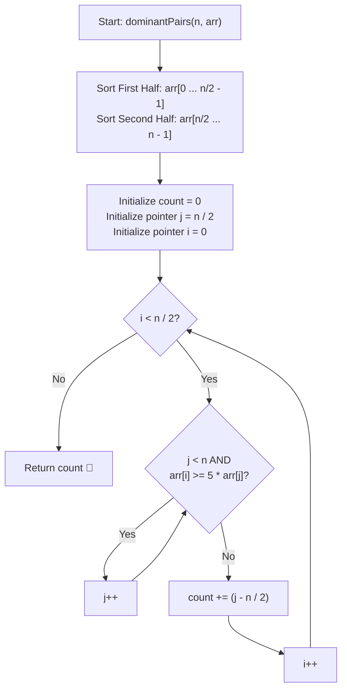

# 💡 Approach — Dominant Pairs

  | 📄 [Problem](./Problem.md) | 💡 [Approach](./Approach.md) | 🧩 [Solution](./Solution.cpp) | 🚀 [Main](./Main.cpp) |
  |:--------------------------:|:-----------------------------:|:------------------------------:|:---------------------:|

## 📊 Metadata

---

> [!TIP]
> **Core Intuition — Independent Halves & Two Pointers:**
> 1. A pair $(i, j)$ is dominant if $0 \le i < \frac{n}{2}$, $\frac{n}{2} \le j < n$, and $\text{arr}[i] \ge 5 \times \text{arr}[j]$.
> 2. The definition depends only on which set of values an index belongs to (first half vs. second half). The exact original relative order of elements within each half **does not matter**.
> 3. By sorting the first half $\text{arr}[0 \dots \frac{n}{2}-1]$ and the second half $\text{arr}[\frac{n}{2} \dots n-1]$ independently in ascending order:
>    - For a fixed $i$ in the first half, if $\text{arr}[i] \ge 5 \times \text{arr}[j]$, then for any $i' > i$ (since $\text{arr}[i'] \ge \text{arr}[i]$), the inequality $\text{arr}[i'] \ge 5 \times \text{arr}[j]$ also holds automatically.
>    - Thus, a second pointer $j$ starting at $\frac{n}{2}$ only needs to move forward across the entire algorithm, yielding an optimal $\mathcal{O}(n)$ scan after sorting.

---

## 🔩 Step-by-Step Breakdown

1. **Sort First Half**:
   - Sort elements in range $[0, \frac{n}{2})$ in ascending order using `std::sort(arr.begin(), arr.begin() + n / 2)`.

2. **Sort Second Half**:
   - Sort elements in range $[\frac{n}{2}, n)$ in ascending order using `std::sort(arr.begin() + n / 2, arr.end())`.

3. **Two-Pointer Traversal**:
   - Initialize `count = 0` and pointer $j = \frac{n}{2}$.
   - Iterate $i$ from $0$ to $\frac{n}{2} - 1$:
     - While $j < n$ and $\text{arr}[i] \ge 5 \times \text{arr}[j]$, increment $j$ (`j++`).
     - At this point, all elements in the second half from index $\frac{n}{2}$ up to $j - 1$ satisfy the condition $\text{arr}[i] \ge 5 \times \text{arr}[k]$.
     - Add $(j - \frac{n}{2})$ to `count`.

4. **Return Answer**:
   - Return `count`.

---

## 🔄 Mermaid Flowchart

---

## 🏃‍♂️ Dry Run

### Example 2: `arr = [10, 8, 2, 1, 1, 2]`, $n = 6$, $n/2 = 3$

- **First Half Sorted:** `[2, 8, 10]`
- **Second Half Sorted:** `[1, 1, 2]`
- Scaled second-half threshold values ($5 \times \text{arr}[j]$): `[5, 5, 10]`
- Pointer $j$ starts at index $3$.

| Step ($i$) | $\text{arr}[i]$ | $j$ scan condition ($\text{arr}[i] \ge 5 \times \text{arr}[j]$) | Final $j$ | Valid Elements ($j - 3$) | Running `count` |
|:---:|:---:|:---|:---:|:---:|:---:|
| $i = 0$ | $2$ | $2 \ge 5$ (False, stops at $j=3$) | 3 | $3 - 3 = 0$ | $0$ |
| $i = 1$ | $8$ | $8 \ge 5$ ($j=3 \to 4$); $8 \ge 5$ ($j=4 \to 5$); $8 \ge 10$ (False, stops at $j=5$) | 5 | $5 - 3 = 2$ | $0 + 2 = 2$ |
| $i = 2$ | $10$ | $10 \ge 10$ ($j=5 \to 6$); $j = 6 = n$ (Done) | 6 | $6 - 3 = 3$ | $2 + 3 = 5$ |

- **Total Dominant Pairs:** `5` ✅

---

## 📊 Complexity Analysis

| Complexity Metric | Estimation | Rationale |
| :--- | :---: | :--- |
| **Time Complexity** | $\mathcal{O}(n \log n)$ | Sorting two halves of size $\frac{n}{2}$ takes $2 \times \mathcal{O}(\frac{n}{2} \log \frac{n}{2}) = \mathcal{O}(n \log n)$. The two-pointer sweep processes each element at most once in $\mathcal{O}(n)$ time. |
| **Auxiliary Space** | $\mathcal{O}(1)$ | In-place sorting and two integer pointer variables require $\mathcal{O}(1)$ auxiliary space (ignoring the $\mathcal{O}(\log n)$ internal recursion stack used by `std::sort`). |

---

> *"Sorting converts a quadratic pair-checking search into a linear monotonic sweep."*

---

<h3>Happy Coding! 🚀</h3>

