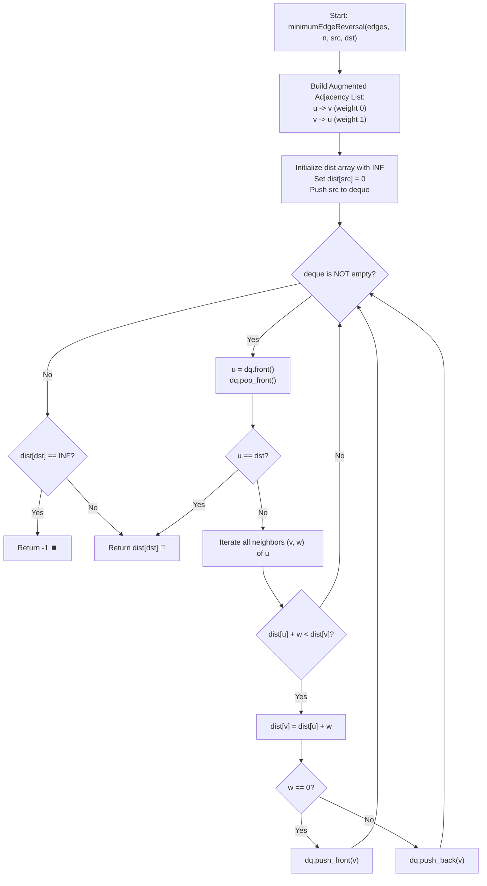

# 💡 Approach — Min Edge Reversals for Path

<div align="center">

  | 📄 [Problem](./Problem.md) | 💡 [Approach](./Approach.md) | 🧩 [Solution](./Solution.cpp) | 🚀 [Main](./Main.cpp) |
  |:--------------------------:|:-----------------------------:|:------------------------------:|:---------------------:|
</div>

## 📊 Metadata


---

> [!TIP]
> **Core Intuition — Graph Transformation & 0-1 BFS:**
> 1. **Problem Reduction:** Finding the minimum number of edge reversals to reach destination `dst` from source `src` is mathematically equivalent to finding the **shortest path in a weighted directed graph** where:
>    - Every original edge $u \to v$ exists with weight $0$ (cost to traverse in existing direction is 0).
>    - An artificial reverse edge $v \to u$ is added with weight $1$ (cost to reverse this edge is 1).
> 2. **0-1 BFS vs Dijkstra:** Standard Dijkstra's algorithm uses a priority queue and runs in $\mathcal{O}((n + m) \log n)$. However, because all edge weights are strictly binary ($\{0, 1\}$), we can replace the priority queue with a double-ended queue (`std::deque`).
> 3. **Queue Invariant:**
>    - Traversal with weight $0$: push neighbor to the **front** of the deque (processed at current distance).
>    - Traversal with weight $1$: push neighbor to the **back** of the deque (processed at distance $+ 1$).
>    - This guarantees that vertices are always popped in non-decreasing order of distance in linear $\mathcal{O}(n + m)$ time.

---

## 🔩 Step-by-Step Breakdown

1. **Build Augmented Graph**:
   - Create an adjacency list `adj` of size $(n + 1)$, where each node stores pairs of `(neighbor, weight)`.
   - For every directed edge $[u, v]$:
     - Add $(v, 0)$ to `adj[u]` (traversing the given edge costs 0).
     - Add $(u, 1)$ to `adj[v]` (traversing backwards costs 1 reversal).

2. **Initialize 0-1 BFS Structures**:
   - Initialize distance array `dist` of size $(n + 1)$ with $\infty$ (`1e9`).
   - Set `dist[src] = 0`.
   - Create a double-ended queue `deque<int> dq` and push `src` into it.

3. **Deque Traversal & Relaxation**:
   - While `dq` is not empty:
     - Pop `u = dq.front()`, `dq.pop_front()`.
     - Early Exit Optimization: If $u == \text{dst}$, we can immediately return `dist[dst]` since 0-1 BFS guarantees optimal distance upon first extraction.
     - For each outgoing edge $(v, w)$ in `adj[u]`:
       - If `dist[u] + w < dist[v]`:
         - Update `dist[v] = dist[u] + w`.
         - If $w == 0$, push $v$ to the **front**: `dq.push_front(v)`.
         - If $w == 1$, push $v$ to the **back**: `dq.push_back(v)`.

4. **Return Answer**:
   - If `dist[dst]` is still $\infty$, return $-1$ (destination is unreachable).
   - Otherwise, return `dist[dst]`.

---

## 🔄 Mermaid Flowchart



---

## 🏃‍♂️ Dry Run

### Example 1: $n = 3$, `edges` = $[[1, 2], [3, 2]]$, `src` = $1$, `dst` = $3$

#### Visual Graph Representation:
```text
Original Graph:
  (1) ----> (2) <---- (3)

Augmented Graph with Reversal Weights:
  (1) --[0]--> (2) --[1]--> (3)
  (1) <--[1]-- (2) <--[0]-- (3)
```

#### Step-by-Step Execution Trace:

1. **Initialization:**
   - `dist = [INF, 0, INF, INF]`
   - `dq = [1]`

| Step | Current Node `u` | `dist[u]` | Neighbor `v` | Edge Weight `w` | Relaxation (`dist[u] + w < dist[v]`) | Updated `dist` | `dq` Operation | Resulting `dq` |
|:---:|:---:|:---:|:---:|:---:|:---:|:---:|:---:|:---:|
| 1 | 1 | 0 | 2 | 0 | $0 + 0 < \infty \implies \text{True}$ | `dist[2] = 0` | `push_front(2)` | `[2]` |
| 2 | 2 | 0 | 1 | 1 | $0 + 1 < 0 \implies \text{False}$ | - | - | `[]` |
| 2 (cont) | 2 | 0 | 3 | 1 | $0 + 1 < \infty \implies \text{True}$ | `dist[3] = 1` | `push_back(3)` | `[3]` |
| 3 | 3 | 1 | - | - | $u == \text{dst} (3 == 3)$ | - | Early Exit | Return `1` ✅ |

- **Minimum Reversals:** `1` (Reverse edge $3 \to 2$ to become $2 \to 3$).

---

## 📊 Complexity Analysis

| Complexity Metric | Estimation | Rationale |
| :--- | :---: | :--- |
| **Time Complexity** | $\mathcal{O}(n + m)$ | Each vertex is popped from the deque at most twice (and processed at its optimal distance once). Each of the $2m$ directed edges in the augmented graph is examined once. Queue insertions and deletions are $\mathcal{O}(1)$. |
| **Auxiliary Space** | $\mathcal{O}(n + m)$ | The augmented adjacency list stores $2m$ edges. The `dist` array requires $\mathcal{O}(n)$ space, and the `deque` stores at most $\mathcal{O}(n)$ vertices at any instant. |

---

> *"By encoding edge orientation costs into binary weights, 0-1 BFS resolves directional impedance at linear speed."*

---

<div align="center">
<h3>Happy Coding! 🚀</h3>
<a href="../232_Day/Approach.md">
  
</a>
<a href="https://x.com/PankajB42550" target="_blank">
  
</a>
<a href="../234_Day/Approach.md">
  
</a>
</div>
