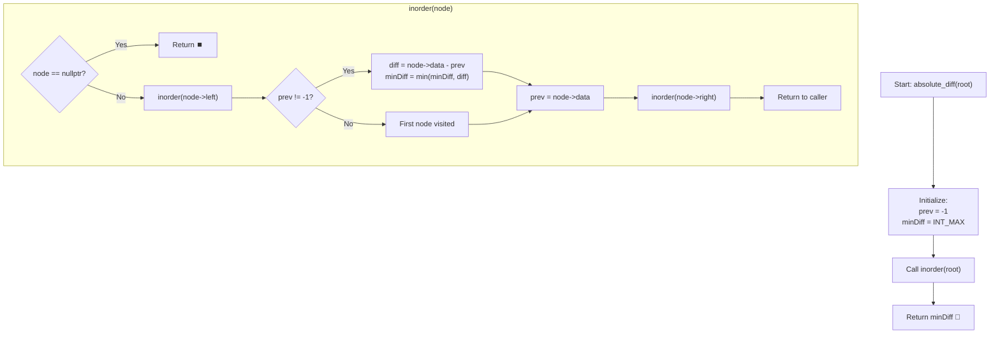

# 💡 Approach — Minimum Absolute Difference In BST

<div align="center">

  | 📄 [Problem](./Problem.md) | 💡 [Approach](./Approach.md) | 🧩 [Solution](./Solution.cpp) | 🚀 [Main](./Main.cpp) |
  |:--------------------------:|:-----------------------------:|:------------------------------:|:---------------------:|
</div>

## 📊 Metadata


---

> [!TIP]
> **Core Intuition — In-Order Traversal Invariant:**
> 1. **BST Ordering Property:** By definition of a Binary Search Tree, for any node $u$, all values in its left subtree are strictly smaller than $u\text{.data}$, and all values in its right subtree are strictly greater than $u\text{.data}$.
> 2. **Monotonicity via In-Order Walk:** An in-order traversal ($\text{Left} \to \text{Node} \to \text{Right}$) visits nodes in strictly monotonically increasing order: $v_1 < v_2 < v_3 < \dots < v_n$.
> 3. **Neighbor Reduction:** For any sorted sequence, the minimum absolute difference between **any** pair of elements is guaranteed to occur between some two **consecutive** adjacent elements:
>    $$\min_{i \ne j} |v_i - v_j| = \min_{1 \le i < n} (v_{i+1} - v_i)$$
> 4. **$\mathcal{O}(h)$ Memory Efficiency:** We do not need an auxiliary array to record the entire in-order traversal. Maintaining a single scalar `prev` (value of the predecessor node) during the traversal reduces extra space from $\mathcal{O}(n)$ to $\mathcal{O}(h)$ call-stack frames.

---

## 🔩 Step-by-Step Breakdown

1. **State Initialization**:
   - Maintain `prev = -1` (or sentinel value indicating no predecessor has been processed yet).
   - Maintain `minDiff = INT_MAX` to store the smallest difference encountered.

2. **In-Order Traversal (`inorder(Node* root)`)**:
   - **Base Case:** If `root == nullptr`, immediately return.
   - **Left Subtree:** Recursively traverse `inorder(root->left)`.
   - **Node Evaluation:**
     - If `prev != -1`, compute current consecutive difference:
       $$\Delta = \text{root}\to\text{data} - \text{prev}$$
     - Update running minimum: `minDiff = min(minDiff, `$\Delta$`)`.
     - Update predecessor: `prev = root->data`.
   - **Right Subtree:** Recursively traverse `inorder(root->right)`.

3. **Termination & Result**:
   - Once all nodes have been visited, return `minDiff`.

---

## 🔄 Mermaid Flowchart



---

## 🏃‍♂️ Dry Run

### Example 1: `root[] = [50, 30, 70, 20, N, 60, 80]`

#### Visual Tree Structure:
```text
          50
        /    \
      30      70
     /       /  \
   20       60   80
```

#### Step-by-Step Traversal Trace:

| Step | Visited Node | Action | `prev` Before | Calculation (`node->data - prev`) | `minDiff` | `prev` After |
| :---: | :---: | :--- | :---: | :---: | :---: | :---: |
| 1 | `20` | First leaf processed (leftmost) | `-1` | (None, first node) | $\infty$ | `20` |
| 2 | `30` | Root of left subtree | `20` | $30 - 20 = 10$ | $\min(\infty, 10) = 10$ | `30` |
| 3 | `50` | Main tree root | `30` | $50 - 30 = 20$ | $\min(10, 20) = 10$ | `50` |
| 4 | `60` | Left child of 70 | `50` | $60 - 50 = 10$ | $\min(10, 10) = 10$ | `60` |
| 5 | `70` | Right child of 50 | `60` | $70 - 60 = 10$ | $\min(10, 10) = 10$ | `70` |
| 6 | `80` | Right child of 70 | `70` | $80 - 70 = 10$ | $\min(10, 10) = 10$ | `80` |

- **Final Answer:** `10` ✅

---

## 📊 Complexity Analysis

| Complexity Metric | Estimation | Rationale |
| :--- | :---: | :--- |
| **Time Complexity** | $\mathcal{O}(n)$ | Every node in the BST is visited exactly once during the in-order traversal. Each comparison and update operation takes constant $\mathcal{O}(1)$ time. |
| **Auxiliary Space** | $\mathcal{O}(h)$ | The call stack depth is bounded by the height of the BST $h$. For a balanced BST, $h = \mathcal{O}(\log n)$; in the worst-case degenerate/skewed BST, $h = \mathcal{O}(n)$. No extra data structures are allocated. |

---

> *"The natural ordering of a Binary Search Tree turns an all-pairs comparison into a linear walk across immediate neighbors."*

---

<div align="center">
<h3>Happy Coding! 🚀</h3>
<a href="../233_Day/Approach.md">
  
</a>
<a href="https://x.com/PankajB42550" target="_blank">
  
</a>
<a href="../235_Day/Approach.md">
  
</a>
</div>
