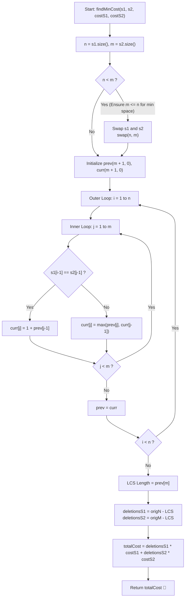

# 💡 Approach — Min Cost To Make Two Strings Identical

  | 📄 [Problem](./Problem.md) | 💡 [Approach](./Approach.md) | 🧩 [Solution](./Solution.cpp) | 🚀 [Main](./Main.cpp) |
  |:--------------------------:|:-----------------------------:|:------------------------------:|:---------------------:|

## 📊 Metadata

---

> [!TIP]
> **Core Intuition — Reduction to Longest Common Subsequence (LCS):**
> 1. **Common Subsequence Invariant:** Deleting characters from both strings without altering the order of remaining characters means any valid identical string produced must be a **common subsequence** of both $s1$ and $s2$.
> 2. **Cost Formula Decomposition:** Let the chosen common subsequence have length $L$.
>    - Number of deletions from $s1 = |s1| - L$
>    - Number of deletions from $s2 = |s2| - L$
>    - Total Cost:
>      $$\text{Total Cost} = (|s1| - L) \times costS1 + (|s2| - L) \times costS2$$
>      $$\text{Total Cost} = (|s1| \times costS1 + |s2| \times costS2) - L \times (costS1 + costS2)$$
> 3. **Maximization vs Minimization:** Since $costS1 \ge 1$ and $costS2 \ge 1$, the term $(costS1 + costS2)$ is strictly positive. Therefore, **minimizing the total cost is mathematically equivalent to maximizing the length $L$ of the common subsequence**.
> 4. **Optimal Substructure:** The maximum $L$ is precisely the **Longest Common Subsequence (LCS)** between $s1$ and $s2$.
> 5. **$\mathcal{O}(\min(|s1|, |s2|))$ Space Optimization:** Computing LCS requires comparing prefix states $dp[i][j]$. Because state $dp[i][j]$ depends strictly on $dp[i-1][j-1]$, $dp[i-1][j]$, and $dp[i][j-1]$, we only ever need the current and previous rows. By picking the shorter string as the inner loop dimension, space is optimized to $\mathcal{O}(\min(|s1|, |s2|))$.

---

## 🔩 Step-by-Step Breakdown

1. **Input Dimensions & Space Setup**:
   - Let $n = |s1|$ and $m = |s2|$.
   - To strictly guarantee $\mathcal{O}(\min(n, m))$ auxiliary space, ensure the inner loop iterates over the shorter string:
     - If $n < m$, we can conceptually swap the strings for the DP table (since $\text{LCS}(s1, s2) = \text{LCS}(s2, s1)$).
   - Allocate two rows: `prev` and `curr` of size $\min(n, m) + 1$, initialized to $0$.

2. **LCS Dynamic Programming Transitions**:
   - For each character $i$ from $1$ to $n$:
     - Reset `curr[0] = 0`.
     - For each character $j$ from $1$ to $m$:
       - If characters match ($s1[i - 1] == s2[j - 1]$):
         $$curr[j] = 1 + prev[j - 1]$$
       - If characters do not match:
         $$curr[j] = \max(prev[j], curr[j - 1])$$
     - Assign `prev = curr`.

3. **Compute Final Deletion Cost**:
   - The length of the Longest Common Subsequence is $L = prev[m]$.
   - Compute total cost:
     $$\text{ans} = (|s1| - L) \times costS1 + (|s2| - L) \times costS2$$
   - Return $\text{ans}$.

---

## 🔄 Mermaid Flowchart

---

## 🏃‍♂️ Dry Run

### Example 1: `s1 = "abcd"`, `s2 = "acdb"`, `costS1 = 10`, `costS2 = 20`

- $|s1| = 4$, $|s2| = 4$, $costS1 = 10$, $costS2 = 20$.
- Initial: `prev = [0, 0, 0, 0, 0]`

#### DP State Evolution:

| $i$ | $s1[i-1]$ | $j=1$ (`'a'`) | $j=2$ (`'c'`) | $j=3$ (`'d'`) | $j=4$ (`'b'`) | `curr` row |
| :-: | :-------: | :-----------: | :-----------: | :-----------: | :-----------: | :--------- |
| $1$ | `'a'` | $1 + 0 = \mathbf{1}$ | $\max(0, 1) = \mathbf{1}$ | $\max(0, 1) = \mathbf{1}$ | $\max(0, 1) = \mathbf{1}$ | `[0, 1, 1, 1, 1]` |
| $2$ | `'b'` | $\max(1, 0) = \mathbf{1}$ | $\max(1, 1) = \mathbf{1}$ | $\max(1, 1) = \mathbf{1}$ | $1 + 1 = \mathbf{2}$ | `[0, 1, 1, 1, 2]` |
| $3$ | `'c'` | $\max(1, 0) = \mathbf{1}$ | $1 + 1 = \mathbf{2}$ | $\max(1, 2) = \mathbf{2}$ | $\max(2, 2) = \mathbf{2}$ | `[0, 1, 2, 2, 2]` |
| $4$ | `'d'` | $\max(1, 0) = \mathbf{1}$ | $\max(2, 1) = \mathbf{2}$ | $1 + 2 = \mathbf{3}$ | $\max(2, 3) = \mathbf{3}$ | `[0, 1, 2, 3, 3]` |

- Longest Common Subsequence length $L = 3$ (subsequence `"acd"`).
- Deletions from $s1 = 4 - 3 = 1$ (character `'b'`).
- Deletions from $s2 = 4 - 3 = 1$ (character `'b'`).
- Total Cost $= 1 \times 10 + 1 \times 20 = 10 + 20 = \mathbf{30}$. ✅

---

## 📊 Complexity Analysis

| Complexity Metric | Estimation | Rationale |
| :--- | :---: | :--- |
| **Time Complexity** | $\mathcal{O}(|s1| \times |s2|)$ | Two nested loops iterate over lengths $|s1|$ and $|s2|$. Each DP cell lookup and update takes constant $\mathcal{O}(1)$ time. |
| **Auxiliary Space** | $\mathcal{O}(\min(|s1|, |s2|))$ | Space-optimized using two rolling 1D arrays (`prev` and `curr`) sized according to the shorter string. |

---

> *"By maximizing what we preserve, we naturally minimize the cost of what we must let go."*

---

<h3>Happy Coding! 🚀</h3>

