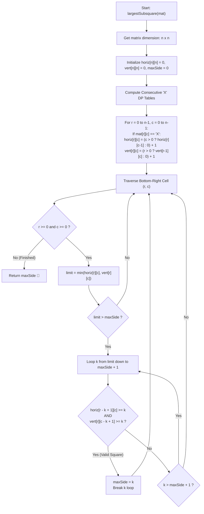

# 💡 Approach — Largest Subsquare Surrounded by X

<div align="center">

  | 📄 [Problem](./Problem.md) | 💡 [Approach](./Approach.md) | 🧩 [Solution](./Solution.cpp) | 🚀 [Main](./Main.cpp) |
  |:--------------------------:|:-----------------------------:|:------------------------------:|:---------------------:|
</div>

## 📊 Metadata


---

> [!TIP]
> **Core Intuition — 2D Prefix Consecutive Runs & Boundary Invariant:**
> 1. **The Brute Force Bottleneck:** A naive approach tests every potential square defined by its top-left corner $(r_1, c_1)$ and side length $k$ ($1 \le k \le n$). Validating that all $4 \times (k - 1)$ perimeter cells are `'X'` requires $\mathcal{O}(k)$ time per square, leading to $\mathcal{O}(n^4)$ total runtime—intractable for $n = 1000$.
> 2. **Precomputing Continuous Runs (Dynamic Programming):** We can determine whether a line segment contains exclusively `'X'` in $\mathcal{O}(1)$ time by precomputing two 2D tables:
>    - `horiz[r][c]`: The count of contiguous `'X'`s ending at $(r, c)$ in row $r$ looking leftwards.
>    - `vert[r][c]`: The count of contiguous `'X'`s ending at $(r, c)$ in column $c$ looking upwards.
> 3. **Four-Boundary Invariant for Bottom-Right Corner $(r, c)$:** For a candidate square of side length $k$ ending at bottom-right cell $(r, c)$:
>    - **Bottom Edge:** Row $r$, from $c - k + 1$ to $c \iff \text{horiz}[r][c] \ge k$.
>    - **Right Edge:** Col $c$, from $r - k + 1$ to $r \iff \text{vert}[r][c] \ge k$.
>    - **Top Edge:** Row $r - k + 1$, from $c - k + 1$ to $c \iff \text{horiz}[r - k + 1][c] \ge k$.
>    - **Left Edge:** Col $c - k + 1$, from $r - k + 1$ to $r \iff \text{vert}[r][c - k + 1] \ge k$.
> 4. **Early Exit / Greedy Pruning:** At any cell $(r, c)$, the maximum possible square side is bounded by $\min(\text{horiz}[r][c], \text{vert}[r][c])$. We search $k$ in descending order down to $\text{maxSide} + 1$. The very first valid $k$ found is guaranteed to be the largest possible for $(r, c)$, allowing an immediate `break`.

---

## 🔩 Step-by-Step Breakdown

1. **Precompute Horizontal and Vertical Consecutive Runs**:
   - Initialize two 2D vectors `horiz[n][n]` and `vert[n][n]` with zeros.
   - Iterate through every cell $(r, c)$ from $0$ to $n - 1$:
     - If $\text{mat}[r][c] == \text{'X'}$:
       $$\text{horiz}[r][c] = (c > 0 \ ? \ \text{horiz}[r][c - 1] : 0) + 1$$
       $$\text{vert}[r][c] = (r > 0 \ ? \ \text{vert}[r - 1][c] : 0) + 1$$
     - Otherwise, both remain $0$.

2. **Iterate Candidate Bottom-Right Corners $(r, c)$**:
   - Traverse rows $r$ from $n - 1$ down to $0$ and columns $c$ from $n - 1$ down to $0$.
   - Compute the upper bound of side length ending at $(r, c)$:
     $$\text{limit} = \min(\text{horiz}[r][c], \text{vert}[r][c])$$
   - If $\text{limit} \le \text{maxSide}$, skip this cell entirely since it cannot improve the best answer.

3. **Check Boundaries in Descending Order**:
   - For $k = \text{limit}$ down to $\text{maxSide} + 1$:
     - Check the top edge: $\text{horiz}[r - k + 1][c] \ge k$
     - Check the left edge: $\text{vert}[r][c - k + 1] \ge k$
     - If both hold, we have found a valid square of size $k$:
       $$\text{maxSide} = k$$
       Break out of the $k$ loop immediately.

4. **Return Final Result**:
   - Return $\text{maxSide}$. If no `'X'` exists, $\text{maxSide}$ remains $0$.

---

## 🔄 Mermaid Flowchart



---

## 🏃‍♂️ Dry Run

### Example 1: `mat` of size $4 \times 4$

```text
Row 0:  X  X  X  O
Row 1:  X  O  X  X
Row 2:  X  X  X  O
Row 3:  X  O  X  X
```

#### Precomputed Consecutive DP Tables:

**`horiz[r][c]` (Consecutive 'X' looking left):**
| Row \ Col | 0 | 1 | 2 | 3 |
| :---: | :-: | :-: | :-: | :-: |
| **0** | 1 | 2 | 3 | 0 |
| **1** | 1 | 0 | 1 | 2 |
| **2** | 1 | 2 | 3 | 0 |
| **3** | 1 | 0 | 1 | 2 |

**`vert[r][c]` (Consecutive 'X' looking up):**
| Row \ Col | 0 | 1 | 2 | 3 |
| :---: | :-: | :-: | :-: | :-: |
| **0** | 1 | 1 | 1 | 0 |
| **1** | 2 | 0 | 2 | 1 |
| **2** | 3 | 1 | 3 | 0 |
| **3** | 4 | 0 | 4 | 1 |

#### Boundary Testing Trace:

1. **At $(r=2, c=2)$:**
   - $\text{horiz}[2][2] = 3$, $\text{vert}[2][2] = 3 \implies \text{limit} = \min(3, 3) = 3$.
   - Testing candidate $k = 3$:
     - Top edge check: $\text{horiz}[2 - 3 + 1][2] = \text{horiz}[0][2] = 3 \ge 3$ ✅
     - Left edge check: $\text{vert}[2][2 - 3 + 1] = \text{vert}[2][0] = 3 \ge 3$ ✅
     - **Result:** Valid square of side $3$ confirmed! $\text{maxSide} = 3$. Break $k$ loop.
2. **At $(r=3, c=3)$:**
   - $\text{horiz}[3][3] = 2$, $\text{vert}[3][3] = 1 \implies \text{limit} = 1 \le \text{maxSide} (3)$ $\rightarrow$ Skipped.
3. **At $(r=3, c=2)$:**
   - $\text{horiz}[3][2] = 1$, $\text{vert}[3][2] = 4 \implies \text{limit} = 1 \le \text{maxSide} (3)$ $\rightarrow$ Skipped.
4. Remaining candidate cells have $\text{limit} \le 3$ and cannot exceed current $\text{maxSide}$.

Final Answer: **`3`** ✅

---

## 📊 Complexity Analysis

| Complexity Metric | Estimation | Rationale |
| :--- | :---: | :--- |
| **Time Complexity** | $\mathcal{O}(n^3)$ | Precomputation takes $\mathcal{O}(n^2)$. Evaluating each of the $n^2$ candidate bottom-right corners tests at most $n$ side lengths in $\mathcal{O}(1)$ time each. With the descending search and early prune ($k > \text{maxSide}$), the average case is significantly faster ($\approx \mathcal{O}(n^2)$). |
| **Auxiliary Space** | $\mathcal{O}(n^2)$ | Two 2D matrices `horiz` and `vert` of size $n \times n$ are maintained to store consecutive counts. |

---

> *"By decomposing a 2D boundary into orthogonal 1D projections, perimeter validation transforms from linear scans into instantaneous constant-time lookups."*

---

<div align="center">
<h3>Happy Coding! 🚀</h3>
<a href="../235_Day/Approach.md">
  
</a>
<a href="https://x.com/PankajB42550" target="_blank">
  
</a>
<a href="../237_Day/Approach.md">
  
</a>
</div>
