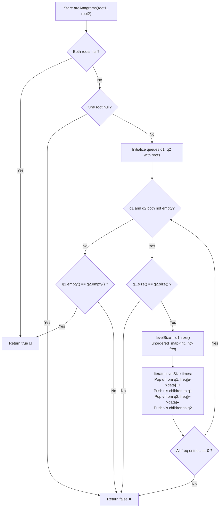

# 💡 Approach — Check Level Anagrams in Binary Trees

<div align="center">

  | 📄 [Problem](./Problem.md) | 💡 [Approach](./Approach.md) | 🧩 [Solution](./Solution.cpp) | 🚀 [Main](./Main.cpp) |
  |:--------------------------:|:-----------------------------:|:------------------------------:|:---------------------:|
</div>

## 📊 Metadata


---

> [!TIP]
> **Core Intuition — Synchronized Level-Order Traversal (BFS) & Multiset Frequency Matching:**
> 1. **Level-by-Level Invariant:** Two trees have anagrammatic levels if and only if at every depth $d \ge 0$, the multiset of values in `root1` matches the multiset of values in `root2`.
> 2. **Synchronous BFS Queues:** We drive a standard Breadth-First Search concurrently using two FIFO queues, `q1` and `q2`.
> 3. **Cardinality Check:** At the start of each level, if `q1.size() != q2.size()`, one tree has more nodes at depth $d$ than the other—an immediate violation.
> 4. **Linear Time Frequency Balance:** To verify that two collections of size $L$ are anagrams in $\mathcal{O}(L)$ time without an $\mathcal{O}(L \log L)$ sort overhead, we use an integer frequency hash map:
>    - For each node from `q1`, increment its count: `freq[val]++`.
>    - For each node from `q2`, decrement its count: `freq[val]--`.
>    - If any key's count becomes negative, or if non-zero counts remain, the levels are not anagrams.
> 5. **Early Termination:** As soon as any level fails the anagram test or one queue empties before the other, the algorithm immediately terminates and returns `false`.

---

## 🔩 Step-by-Step Breakdown

1. **Handle Root Edge Cases**:
   - If both `root1` and `root2` are null (`nullptr`), return `true`.
   - If exactly one is null, return `false`.

2. **Initialize BFS Queues**:
   - Push `root1` into queue `q1` and `root2` into queue `q2`.

3. **Traverse Depth Levels Concurrently**:
   - While neither queue is empty:
     - Record the number of nodes at the current level: $s_1 = \text{q1.size()}$ and $s_2 = \text{q2.size()}$.
     - If $s_1 \ne s_2$, return `false`.
     - Instantiate a local frequency hash map: `unordered_map<int, int> freq`.
     - Loop $s_1$ times:
       - Pop front node $u$ from `q1`, increment `freq[u->data]++`.
       - Push non-null left and right children of $u$ into `q1`.
       - Pop front node $v$ from `q2`, decrement `freq[v->data]--`.
       - Push non-null left and right children of $v$ into `q2`.
     - Validate the frequency map:
       - Iterate through `freq`. If any key has a non-zero count, return `false`.

4. **Verify Both Trees Finished Simultaneously**:
   - After the loop, if both `q1.empty()` and `q2.empty()` hold, return `true`.
   - If one tree still has deeper levels, return `false`.

---

## 🔄 Mermaid Flowchart



---

## 🏃‍♂️ Dry Run

### Example 1:

```text
       Tree 1:                   Tree 2:
          1                         1
        /   \                     /   \
       3     2                   2     3
            / \                 / \
           5   4               4   5
```

#### Synchronous Level Tracing:

1. **Level 0**:
   - `q1 = [1]`, `q2 = [1]`
   - Sizes: $s_1 = 1$, $s_2 = 1$ ✅
   - Frequency map after processing nodes:
     - Node `1` from `q1`: `freq[1] = +1`
     - Node `1` from `q2`: `freq[1] = 0`
   - Child expansion:
     - `q1` receives: `3`, `2`
     - `q2` receives: `2`, `3`
   - All frequencies zero? **Yes** ✅

2. **Level 1**:
   - `q1 = [3, 2]`, `q2 = [2, 3]`
   - Sizes: $s_1 = 2$, $s_2 = 2$ ✅
   - Frequency map:
     - From `q1`: `freq[3] = +1`, `freq[2] = +1`
     - From `q2`: `freq[2] = 0`, `freq[3] = 0`
   - Child expansion:
     - `q1`: `3` has no children, `2` pushes `5`, `4`
     - `q2`: `2` pushes `4`, `5`, `3` has no children
   - All frequencies zero? **Yes** ✅

3. **Level 2**:
   - `q1 = [5, 4]`, `q2 = [4, 5]`
   - Sizes: $s_1 = 2$, $s_2 = 2$ ✅
   - Frequency map:
     - From `q1`: `freq[5] = +1`, `freq[4] = +1`
     - From `q2`: `freq[4] = 0`, `freq[5] = 0`
   - Child expansion: None (all leaf nodes)
   - All frequencies zero? **Yes** ✅

4. **Termination**:
   - `q1` is empty, `q2` is empty.
   - Result: **`true`** ✅

---

## 📊 Complexity Analysis

| Complexity Metric | Estimation | Rationale |
| :--- | :---: | :--- |
| **Time Complexity** | $\mathcal{O}(n)$ | Every node in both trees is enqueued and dequeued exactly once during BFS. For each level $k$, frequency map insertions and lookups take $\mathcal{O}(L_k)$ average time, summing to $\sum \mathcal{O}(L_k) = \mathcal{O}(n)$. |
| **Auxiliary Space** | $\mathcal{O}(n)$ | The maximum width of binary trees governs the queue and map space, which in the worst case (e.g., complete binary tree) is $\mathcal{O}(n)$ at the deepest level. |

---

> *"Structural divergence does not preclude semantic identity; when examined slice by slice, order dissolves into conservation of frequencies."*

---

<div align="center">
<h3>Happy Coding! 🚀</h3>
<a href="../236_Day/Approach.md">
  
</a>
<a href="https://x.com/PankajB42550" target="_blank">
  
</a>
<a href="../238_Day/Approach.md">
  
</a>
</div>
