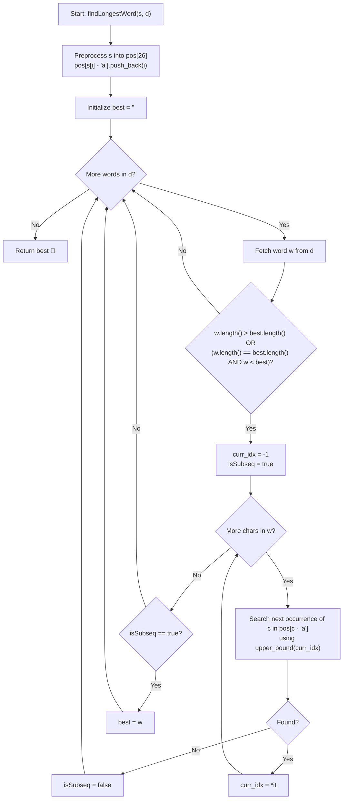

# 💡 Approach — Longest Matching in Dictionary with Removals

  | 📄 [Problem](./Problem.md) | 💡 [Approach](./Approach.md) | 🧩 [Solution](./Solution.cpp) | 🚀 [Main](./Main.cpp) |
  |:--------------------------:|:-----------------------------:|:------------------------------:|:---------------------:|

## 📊 Metadata

---

> [!TIP]
> **Core Intuition — Inverted Index with Binary Search Subsequence Matching:**
> 1. **Subsequence Equivalence:** A word $w$ can be formed by deleting characters from $s$ without reordering if and only if $w$ is a **subsequence** of $s$.
> 2. **Character Inverted Index:** Instead of scanning the entire large string $s$ (where $|s| \le 5 \times 10^5$) linearly for every dictionary word, we pre-process $s$ once by storing the 0-indexed positions of every character `'a'` through `'z'` in sorted vectors: `pos[c - 'a']`.
> 3. **Logarithmic Transition via Upper Bound:** For each character $c \in w$, we need to find its earliest occurrence in $s$ that appears *strictly after* the previous matched index `curr_idx`. Because each list `pos[c - 'a']` is strictly monotonically increasing, we can locate this next occurrence in $\mathcal{O}(\log |s|)$ time using binary search (`std::upper_bound`).
> 4. **Pruning & Candidate Filtering:** A dictionary word $w$ can only replace our current best result if:
>    - $w.\text{length}() > \text{best}.\text{length}()$, OR
>    - $w.\text{length}() == \text{best}.\text{length}()$ AND $w < \text{best}$ (lexicographically smaller).
>    Any word that does not satisfy this criteria can be pruned before even checking if it is a subsequence.

---

## 🔩 Step-by-Step Breakdown

1. **Precompute Character Occurrences**:
   - Create an array of vectors `vector<int> pos[26]`.
   - Iterate through string $s$ with index $i$ from $0$ to $|s| - 1$:
     - Append $i$ to `pos[s[i] - 'a']`.
   - Each list is naturally sorted in ascending order.

2. **Initialize Best Match**:
   - Maintain a string `best = ""`.

3. **Evaluate Each Dictionary Word**:
   - For each word $w \in d$:
     - **Prune check**: If $w.\text{length}() < \text{best}.\text{length}()$ or ($w.\text{length}() == \text{best}.\text{length}()$ and $w \ge \text{best}$), continue to the next word.
     - Check if $w$ is a subsequence of $s$:
       - Initialize `curr_idx = -1`.
       - For each character $c \in w$:
         - Query `it = upper_bound(pos[c - 'a'].begin(), pos[c - 'a'].end(), curr_idx)`.
         - If `it == pos[c - 'a'].end()`, the character $c$ does not exist after `curr_idx` in $s$. Mark as not a subsequence and break early.
         - Otherwise, update `curr_idx = *it`.
     - If all characters in $w$ were successfully matched, update `best = w`.

4. **Return Final Result**:
   - Return `best`. If no dictionary word can be formed, `best` remains `""`.

---

## 🔄 Mermaid Flowchart

---

## 🏃‍♂️ Dry Run

### Example 1:
- Input: `s = "abpcplea"`, `d = ["ale", "apple", "monkey", "plea"]`

#### Character Occurrence Table for $s$:
| Character | Indices in `s` |
| :---: | :--- |
| `'a'` | `[0, 7]` |
| `'b'` | `[1]` |
| `'c'` | `[3]` |
| `'e'` | `[6]` |
| `'l'` | `[5]` |
| `'p'` | `[2, 4]` |
| *Others* | `[]` |

#### Word Processing Trace:

| Word $w$ | Length | Prune Filter | Match Walkthrough | Valid Subsequence? | Best Updated |
| :---: | :---: | :---: | :--- | :---: | :---: |
| `"ale"` | 3 | $3 > 0$ (Pass) | `'a'` at idx 0 $\to$ `'l'` at idx 5 $\to$ `'e'` at idx 6 | **Yes** | `"ale"` |
| `"apple"` | 5 | $5 > 3$ (Pass) | `'a'` (0) $\to$ `'p'` (2) $\to$ `'p'` (4) $\to$ `'l'` (5) $\to$ `'e'` (6) | **Yes** | `"apple"` |
| `"monkey"`| 6 | $6 > 5$ (Pass) | `'m'` not found in `pos['m']` $\to$ fails immediately | **No** | `"apple"` |
| `"plea"` | 4 | $4 < 5$ (Pruned) | Skipped immediately without checking | — | `"apple"` |

- Final Output: **`"apple"`** ✅

---

## 📊 Complexity Analysis

| Complexity Metric | Estimation | Rationale |
| :--- | :---: | :--- |
| **Time Complexity** | $\mathcal{O}(|s| + n \cdot m \cdot \log|s|)$ | Scanning $s$ once takes $\mathcal{O}(|s|)$ time. For each of the $n$ words of length at most $m$, each character requires an `std::upper_bound` binary search over an occurrence list of size at most $|s|$, costing $\mathcal{O}(m \log |s|)$ time. |
| **Auxiliary Space** | $\mathcal{O}(|s|)$ | The inverted index `pos` stores exactly $|s|$ integers across the 26 character buckets. |

---

> *"When a stream is vast and candidates are many, index the terrain once so every search is a logarithmic sprint."*

---

<h3>Happy Coding! 🚀</h3>

