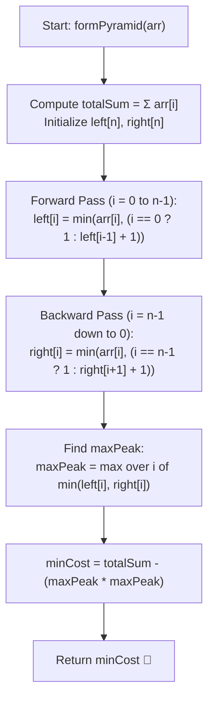

# 💡 Approach — Pyramid Array with Reduce Operations

<div align="center">

  | 📄 [Problem](./Problem.md) | 💡 [Approach](./Approach.md) | 🧩 [Solution](./Solution.cpp) | 🚀 [Main](./Main.cpp) |
  |:--------------------------:|:-----------------------------:|:------------------------------:|:---------------------:|
</div>

## 📊 Metadata


---

> [!TIP]
> **Core Intuition — Dynamic Programming via Bidirectional Slope Invariants:**
> 1. **Mathematical Reduction of Cost:** A pyramid with peak height $x$ spans $2x - 1$ stones with heights $1, 2, \dots, x, \dots, 2, 1$. The sum of elements in such a pyramid is:
>    $$\sum = 2 \times \sum_{k=1}^{x-1} k + x = 2 \times \frac{(x-1)x}{2} + x = x^2$$
>    Since every stone outside this pyramid is reduced to $0$, the total remaining sum of all stones in the entire array is simply $x^2$. Because stones can only be reduced by $1$ at unit cost, the total cost to transform the array is:
>    $$\text{Total Cost} = \sum_{i=0}^{n-1} \text{arr}[i] - x^2$$
>    Since $\sum \text{arr}[i]$ is fixed, **minimizing cost is mathematically identical to maximizing the peak height $x$**.
> 2. **Left Slope Invariant:** If index $i$ is to support a height $h$, index $i-1$ must support at least $h-1$. Thus, the maximum ascending slope height ending at $i$ is bounded by:
>    $$\text{left}[i] = \min(\text{arr}[i], \text{left}[i-1] + 1) \quad (\text{with } \text{left}[0] = 1)$$
> 3. **Right Slope Invariant:** Similarly, for the descending slope from peak $i$, index $i+1$ must support at least $h-1$:
>    $$\text{right}[i] = \min(\text{arr}[i], \text{right}[i+1] + 1) \quad (\text{with } \text{right}[n-1] = 1)$$
> 4. **Optimal Center Selection:** Any index $i$ can serve as the center of a pyramid of height at most $\min(\text{left}[i], \text{right}[i])$. Taking the maximum over all $0 \le i < n$ yields the globally optimal peak $x$.

---

## 🔩 Step-by-Step Breakdown

1. **Calculate Total Original Array Sum**:
   - Compute $S = \sum_{i=0}^{n-1} \text{arr}[i]$ using 64-bit integer (`long long`) to prevent potential integer overflow when $n, \text{arr}[i] \le 10^5$.

2. **Compute Left Slope Array (`left[]`)**:
   - Initialize $\text{left}[0] = 1$ (as at most 1 element exists to the left and $\text{arr}[0] \ge 1$).
   - For $i = 1$ to $n - 1$:
     $$\text{left}[i] = \min(\text{arr}[i], \text{left}[i-1] + 1)$$

3. **Compute Right Slope Array (`right[]`)**:
   - Initialize $\text{right}[n-1] = 1$ (as at most 1 element exists to the right).
   - For $i = n - 2$ down to $0$:
     $$\text{right}[i] = \min(\text{arr}[i], \text{right}[i+1] + 1)$$

4. **Identify the Maximum Peak Height**:
   - Initialize $\text{maxPeak} = 0$.
   - For each index $i \in [0, n-1]$:
     $$\text{maxPeak} = \max(\text{maxPeak}, \min(\text{left}[i], \text{right}[i]))$$

5. **Compute and Return Minimum Cost**:
   - Cost $= S - (\text{maxPeak})^2$.
   - Return Cost as the final result.

---

## 🔄 Mermaid Flowchart



---

## 🏃‍♂️ Dry Run

### Example 1: `arr = [1, 2, 3, 4, 2, 1]`

Total Sum $S = 1 + 2 + 3 + 4 + 2 + 1 = 13$.

| Index $i$ | $\text{arr}[i]$ | $\text{left}[i]$ calculation | $\text{left}[i]$ | $\text{right}[i]$ calculation | $\text{right}[i]$ | $\min(\text{left}[i], \text{right}[i])$ |
| :---: | :---: | :--- | :---: | :--- | :---: | :---: |
| **0** | $1$ | $\min(1, 1)$ | **1** | $\min(1, 2 + 1)$ | **1** | $\min(1, 1) = 1$ |
| **1** | $2$ | $\min(2, 1 + 1)$ | **2** | $\min(2, 3 + 1)$ | **2** | $\min(2, 2) = 2$ |
| **2** | $3$ | $\min(3, 2 + 1)$ | **3** | $\min(3, 3 + 1)$ | **3** | $\min(3, 3) = \mathbf{3}$ |
| **3** | $4$ | $\min(4, 3 + 1)$ | **4** | $\min(4, 2 + 1)$ | **3** | $\min(4, 3) = \mathbf{3}$ |
| **4** | $2$ | $\min(2, 4 + 1)$ | **2** | $\min(2, 1 + 1)$ | **2** | $\min(2, 2) = 2$ |
| **5** | $1$ | $\min(1, 2 + 1)$ | **1** | $\min(1, 1)$ | **1** | $\min(1, 1) = 1$ |

- Global maximum peak: $\text{maxPeak} = \max(1, 2, 3, 3, 2, 1) = 3$.
- Choosing center at index $2$ with peak $x = 3$:
  - Target pyramid: $[1, 2, 3, 2, 1]$ on indices $0 \dots 4$.
  - Index $5$ outside pyramid $\to 0$.
  - Final transformed array: $[1, 2, 3, 2, 1, 0]$.
  - Preserved sum $= 3^2 = 9$.
  - Minimum Cost $= 13 - 9 = 4$.

```text
Visual Pyramid (Peak = 3 at index 2):
          [3]
      [2] [3] [2]
  [1] [2] [3] [2] [1]
  idx: 0   1   2   3   4   (idx 5 -> 0)
```

---

## 📊 Complexity Analysis

| Complexity Metric | Estimation | Rationale |
| :--- | :---: | :--- |
| **Time Complexity** | $\mathcal{O}(n)$ | Three linear traversals of size $n$: forward pass, backward pass, and peak-finding pass. |
| **Auxiliary Space** | $\mathcal{O}(n)$ | Two auxiliary vectors `left` and `right` of size $n$ to store slope boundaries. |

---

> *"To maximize the summit of the pyramid, every stone must respect the slope imposed by its neighbors."*

---

<div align="center">
<h3>Happy Coding! 🚀</h3>
<a href="../238_Day/Approach.md">
  
</a>
<a href="https://x.com/PankajB42550" target="_blank">
  
</a>
<a href="../240_Day/Approach.md">
  
</a>
</div>
