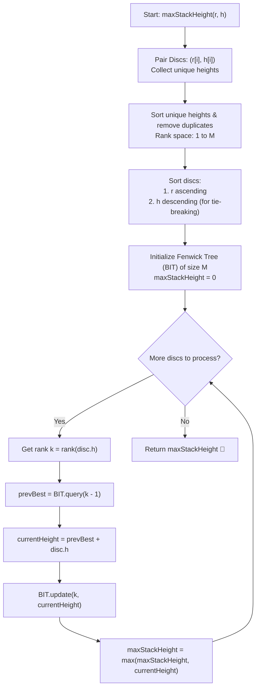

# 💡 Approach — Maximum Height Disc Stack

<div align="center">

  | 📄 [Problem](./Problem.md) | 💡 [Approach](./Approach.md) | 🧩 [Solution](./Solution.cpp) | 🚀 [Main](./Main.cpp) |
  |:--------------------------:|:-----------------------------:|:------------------------------:|:---------------------:|
</div>

## 📊 Metadata


---

> [!TIP]
> **Core Intuition — 2D Maximum Weight Chain via Dual-Key Sorting & Fenwick Tree:**
> 1. **Mathematical Formulation (2D Weighted LIS):** A disc $A = (r_A, h_A)$ can be stacked on top of disc $B = (r_B, h_B)$ if and only if $r_A < r_B$ and $h_A < h_B$. From top to bottom, this defines a strictly increasing chain in two dimensions:
>    $$(r_1 < r_2 < \dots < r_k) \quad \text{and} \quad (h_1 < h_2 < \dots < h_k)$$
>    We wish to maximize the cumulative weight (sum of heights) $\sum_{j=1}^k h_j$.
> 2. **Dual-Key Sorting Invariant:** Sort all discs by:
>    - **Radius ($r$) in Ascending Order**
>    - **Height ($h$) in Descending Order** (for identical radii)
>    - *Why descending on $h$ for equal $r$?* Discs with the same radius cannot be placed in the same stack. By placing larger heights first among discs of equal radius, when a disc with height $h$ queries for strictly smaller heights $< h$, all previously processed discs with the same radius have height $\ge h > h - 1$. Hence, they are completely excluded from the query range, preventing invalid stacking among discs with identical radius!
> 3. **Coordinate Compression & Fenwick Tree (Binary Indexed Tree):**
>    - Collect all unique heights and compress them into 1-based ranks $1 \le \text{rank}(h) \le M$.
>    - Maintain a Fenwick Tree (BIT) storing prefix maximums of accumulated stack heights up to each height rank.
>    - For each disc with height rank $k$:
>      $$\text{bestPrev} = \text{query}(k - 1)$$
>      $$\text{currentBest} = \text{bestPrev} + h$$
>      $$\text{update}(k, \text{currentBest})$$
>    - This reduces the transitions from $\mathcal{O}(n^2)$ dynamic programming to an optimal $\mathcal{O}(n \log n)$ time complexity.

---

## 🔩 Step-by-Step Breakdown

1. **Pair Radii and Heights**:
   - Construct a list of $n$ disc pairs: $\text{discs}[i] = (r[i], h[i])$.

2. **Coordinate Compression on Heights**:
   - Extract all heights $h[i]$, sort them in ascending order, and eliminate duplicates.
   - Let $M$ be the number of unique heights ($M \le n$).
   - For any height $h$, define $\text{rank}(h) = \text{lower\_bound}(h) - \text{start} + 1$.

3. **Dual-Key Sorting**:
   - Sort $\text{discs}$ such that:
     - If $r_A \ne r_B$, sort by $r_A < r_B$ (ascending).
     - If $r_A == r_B$, sort by $h_A > h_B$ (descending).

4. **Initialize Fenwick Tree**:
   - Create a Fenwick Tree of capacity $M$, initialized with zeros.
   - The tree supports:
     - `query(idx)`: Returns $\max_{1 \le j \le idx} \text{tree}[j]$ in $\mathcal{O}(\log M)$.
     - `update(idx, val)`: Updates prefix maximums with $\text{val}$ at position $idx$ in $\mathcal{O}(\log M)$.

5. **Sequential Processing & Maximum Extraction**:
   - Initialize $\text{maxStackHeight} = 0$.
   - For each disc $(r, h)$ in sorted order:
     - Retrieve its height rank $k = \text{rank}(h)$.
     - Query the best predecessor stack height with strictly smaller height:
       $$\text{prevBest} = \text{query}(k - 1)$$
     - Compute height of new stack ending at this disc:
       $$\text{currentHeight} = \text{prevBest} + h$$
     - Update the Fenwick Tree at index $k$ with $\text{currentHeight}$.
     - Update global maximum: $\text{maxStackHeight} = \max(\text{maxStackHeight}, \text{currentHeight})$.

6. **Return Result**:
   - Return $\text{maxStackHeight}$ as the final answer.

---

## 🔄 Mermaid Flowchart



---

## 🏃‍♂️ Dry Run

### Example 1: `r = [5, 7, 3]`, `h = [6, 5, 4]`

Discs: $(5, 6), (7, 5), (3, 4)$

1. **Unique Heights**: `[4, 5, 6]` ($M = 3$)
   - $4 \to \text{rank } 1$
   - $5 \to \text{rank } 2$
   - $6 \to \text{rank } 3$

2. **Sorted Discs ($r$ asc, $h$ desc)**:
   - Disc 1: $(3, 4)$
   - Disc 2: $(5, 6)$
   - Disc 3: $(7, 5)$

| Step | Disc $(r, h)$ | $\text{rank}(h)$ | Query Range $[1, \text{rank}-1]$ | `prevBest` | `currentHeight` | BIT Update | `maxStackHeight` |
| :---: | :---: | :---: | :---: | :---: | :---: | :---: | :---: |
| **1** | $(3, 4)$ | $1$ | $[1, 0]$ (empty) | $0$ | $0 + 4 = 4$ | $\text{update}(1, 4)$ | $4$ |
| **2** | $(5, 6)$ | $3$ | $[1, 2]$ | $4$ (from rank 1) | $4 + 6 = 10$ | $\text{update}(3, 10)$ | $\mathbf{10}$ |
| **3** | $(7, 5)$ | $2$ | $[1, 1]$ | $4$ (from rank 1) | $4 + 5 = 9$ | $\text{update}(2, 9)$ | $\max(10, 9) = \mathbf{10}$ |

```text
Visual Stack Architecture (Total Height = 10):
       ▲ Top
   [ Disc (3, 4) ]  r = 3, h = 4
         │
   [ Disc (5, 6) ]  r = 5, h = 6
       ▼ Base
```

---

## 📊 Complexity Analysis

| Complexity Metric | Estimation | Rationale |
| :--- | :---: | :--- |
| **Time Complexity** | $\mathcal{O}(n \log n)$ | Sorting $n$ discs and unique heights takes $\mathcal{O}(n \log n)$. Each of the $n$ discs performs one binary search ($\mathcal{O}(\log M)$), one BIT query ($\mathcal{O}(\log M)$), and one BIT update ($\mathcal{O}(\log M)$), where $M \le n$. |
| **Auxiliary Space** | $\mathcal{O}(n)$ | $\mathcal{O}(n)$ space for paired discs, compressed unique height array, and Fenwick tree vector of size $M + 1$. |

---

> *"True stability is built when every foundation surpasses the weight and stature of what rests upon it."*

---

<div align="center">
<h3>Happy Coding! 🚀</h3>
<a href="../239_Day/Approach.md">
  
</a>
<a href="https://x.com/PankajB42550" target="_blank">
  
</a>
<a href="../241_Day/Approach.md">
  
</a>
</div>
