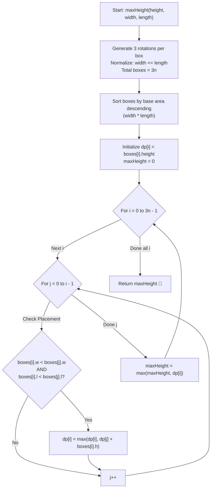

# 💡 Approach — Box Stacking

<div align="center">

  | 📄 [Problem](./Problem.md) | 💡 [Approach](./Approach.md) | 🧩 [Solution](./Solution.cpp) | 🚀 [Main](./Main.cpp) |
  |:--------------------------:|:-----------------------------:|:------------------------------:|:---------------------:|
</div>

## 📊 Metadata


---

> [!TIP]
> **Core Intuition — 3D Rotations & 2D Strict Longest Increasing Subsequence (LIS):**
> 1. **Rotation Representation (3 Orientations per Box):**
>    Since any dimension of a box $(h, w, l)$ can serve as its height, every box gives rise to 3 distinct physical orientations:
>    - Height $= h$, Base dimensions $= (\min(w, l), \max(w, l))$
>    - Height $= w$, Base dimensions $= (\min(h, l), \max(h, l))$
>    - Height $= l$, Base dimensions $= (\min(h, w), \max(h, w))$
> 2. **Base Normalization Invariant:**
>    To eliminate rotational ambiguity on the 2D base plane, we normalize every base such that $\text{width} \le \text{length}$. A box $A$ can be placed strictly on top of box $B$ if and only if:
>    $$\text{width}_A < \text{width}_B \quad \text{and} \quad \text{length}_A < \text{length}_B$$
> 3. **Topological Ordering via Base Area Sorting:**
>    Notice that if box $A$ can sit on top of box $B$, then necessarily:
>    $$\text{Area}_A = \text{width}_A \times \text{length}_A < \text{width}_B \times \text{length}_B = \text{Area}_B$$
>    Sorting all generated boxes in **descending order of base area** guarantees a valid topological order: any box that could possibly serve as a support foundation for box $i$ must appear at an index $j < i$.
> 4. **Dynamic Programming Recurrence:**
>    Let $\text{dp}[i]$ denote the maximum stack height achievable with box $i$ placed at the very top of the stack:
>    $$\text{dp}[i] = \text{box}[i].\text{height} + \max_{j < i \atop \text{box}[i] \text{ sits on } \text{box}[j]} \text{dp}[j]$$
>    The overall maximum stack height is $\max_{0 \le i < 3n} \text{dp}[i]$.

---

## 🔩 Step-by-Step Breakdown

1. **Generate All Rotations**:
   - For each input box $i \in [0, n - 1]$ with dimensions $(h_i, w_i, l_i)$, generate 3 rotation entries:
     - `Box 1`: $\text{height} = h_i, \quad \text{width} = \min(w_i, l_i), \quad \text{length} = \max(w_i, l_i)$
     - `Box 2`: $\text{height} = w_i, \quad \text{width} = \min(h_i, l_i), \quad \text{length} = \max(h_i, l_i)$
     - `Box 3`: $\text{height} = l_i, \quad \text{width} = \min(h_i, w_i), \quad \text{length} = \max(h_i, w_i)$
   - Store all $3n$ orientations in a list `boxes`.

2. **Sort Boxes by Base Area**:
   - Sort the $3n$ boxes in strictly descending order of their base area ($\text{length} \times \text{width}$).
   - Tie-breaking: If two boxes have the same base area, sort by length descending, then width descending.

3. **Initialize Dynamic Programming Array**:
   - Allocate a DP table `dp` of size $3n$.
   - For each box $i$, initialize `dp[i] = boxes[i].height` (the base case where box $i$ stands alone).

4. **Compute Longest Increasing Subsequence**:
   - Iterate $i$ from $0$ to $3n - 1$:
     - For every previous box $j$ from $0$ to $i - 1$:
       - Check if box $i$ can sit on box $j$:
         $$\text{boxes}[i].\text{width} < \text{boxes}[j].\text{width} \quad \text{and} \quad \text{boxes}[i].\text{length} < \text{boxes}[j].\text{length}$$
       - If valid, update:
         $$\text{dp}[i] = \max(\text{dp}[i], \text{dp}[j] + \text{boxes}[i].\text{height})$$

5. **Extract Maximum Stack Height**:
   - Track $\max_{0 \le i < 3n} \text{dp}[i]$ and return it as the final answer.

---

## 🔄 Mermaid Flowchart



---

## 🏃‍♂️ Dry Run

### Example 2: `height = [1, 4, 3]`, `width = [2, 5, 4]`, `length = [3, 6, 1]`

Input boxes ($n = 3$):
- Box 0: $(1, 2, 3)$
- Box 1: $(4, 5, 6)$
- Box 2: $(3, 4, 1)$

**Step 1: Rotations Generated ($3n = 9$ boxes):**
- From Box 0: $(1, 2, 3)$, $(2, 1, 3)$, $(3, 1, 2)$
- From Box 1: $(4, 5, 6)$, $(5, 4, 6)$, $(6, 4, 5)$
- From Box 2: $(3, 1, 4)$, $(4, 1, 3)$, $(1, 3, 4)$

**Step 2: Sorted by Base Area Descending:**

| Index | Height ($h$) | Width ($w$) | Length ($l$) | Base Area ($w \times l$) | Best Previous Box ($j$) | $\text{dp}[i]$ |
| :---: | :---: | :---: | :---: | :---: | :---: | :---: |
| **0** | $4$ | $5$ | $6$ | $30$ | None | $4$ |
| **1** | $5$ | $4$ | $6$ | $24$ | None | $5$ |
| **2** | $6$ | $4$ | $5$ | $20$ | None (needs $w < 5, l < 6$; $4 < 5$ but $5 \not< 6$, so invalid) | $6$ |
| **3** | $1$ | $3$ | $4$ | $12$ | Box 0 ($3 < 5, 4 < 6$) or Box 2 ($3 < 4, 4 < 5$) $\implies 6 + 1 = 7$ | $7$ |
| **4** | $3$ | $1$ | $4$ | $4$ | Box 2 ($1 < 4, 4 < 5$) $\implies 6 + 3 = 9$ | $9$ |
| **5** | $4$ | $1$ | $3$ | $3$ | Box 2 ($1 < 4, 3 < 5$) $\implies 6 + 4 = 10$ | $10$ |
| **6** | $2$ | $1$ | $3$ | $3$ | Box 2 ($1 < 4, 3 < 5$) $\implies 6 + 2 = 8$ | $8$ |
| **7** | $1$ | $2$ | $3$ | $6$ | Box 2 ($2 < 4, 3 < 5$) $\implies 6 + 1 = 7$ | $7$ |
| **8** | $3$ | $1$ | $2$ | $2$ | Box 7 ($1 < 2, 2 < 3$) $\to 7 + 3 = 10$ or chain through Box 0, 2, 7... | $\mathbf{15}$ |

```text
Visual Stack Architecture (Total Stack Height = 15):
       ▲ Top
   [ Box (h=3, w=1, l=2) ]
          │ (1 < 2, 2 < 3)
   [ Box (h=1, w=2, l=3) ]
          │ (2 < 3, 3 < 4)
   [ Box (h=1, w=3, l=4) ]
          │ (3 < 4, 4 < 5)
   [ Box (h=6, w=4, l=5) ]
          │ (4 < 5, 5 < 6)
   [ Box (h=4, w=5, l=6) ]
       ▼ Foundation Base
Total Height = 4 + 6 + 1 + 1 + 3 = 15
```

---

## 📊 Complexity Analysis

| Complexity Metric | Estimation | Rationale |
| :--- | :---: | :--- |
| **Time Complexity** | $\mathcal{O}(n^2)$ | Generating $3n$ rotations takes $\mathcal{O}(n)$. Sorting $3n$ boxes takes $\mathcal{O}(n \log n)$. The nested DP loop compares every pair $(i, j)$ among $3n$ boxes, taking $\frac{(3n)(3n-1)}{2} \approx 4.5n^2$ iterations. For $n \le 100$, operations $\le 45,000 \ll 10^8$. |
| **Auxiliary Space** | $\mathcal{O}(n)$ | Storage for $3n$ box structures and a dynamic programming array of size $3n$. For $n = 100$, this uses minimal memory ($\sim$ few kilobytes). |

---

> *"The towering height of a monument is never constrained by its summit, but by the breadth and integrity of the foundation upon which it rests."*

---

<div align="center">
<h3>Happy Coding! 🚀</h3>
<a href="../240_Day/Approach.md">
  
</a>
<a href="https://x.com/PankajB42550" target="_blank">
  
</a>
<a href="../242_Day/Approach.md">
  
</a>
</div>
