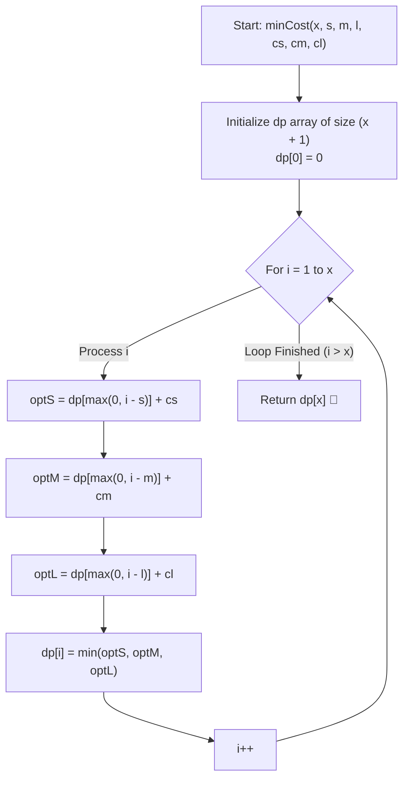

# 💡 Approach — Minimum Cost Pizza Selection

  | 📄 [Problem](./Problem.md) | 💡 [Approach](./Approach.md) | 🧩 [Solution](./Solution.cpp) | 🚀 [Main](./Main.cpp) |
  |:--------------------------:|:-----------------------------:|:------------------------------:|:---------------------:|

## 📊 Metadata

---

> [!TIP]
> **Core Intuition — Unbounded Knapsack with "At Least" Capacity:**
> 1. **Problem Formulation**:
>    We need to satisfy an area threshold of *at least* $x$ using any combination of 3 pizza sizes: $(s, cs)$, $(m, cm)$, and $(l, cl)$. Unlike standard knapsack where capacity is an upper bound $\le W$, here capacity is a lower bound $\ge x$.
> 2. **State Definition**:
>    Let $\text{dp}[i]$ represent the minimum cost required to purchase pizzas whose total cumulative area is **at least** $i$ units, for $0 \le i \le x$.
> 3. **Base Case**:
>    $\text{dp}[0] = 0$ — achieving an area of at least $0$ units costs nothing.
> 4. **Optimal Substructure & Clamping**:
>    When considering purchasing a pizza of size $\text{sz}$ with cost $\text{cost}$, the remaining area deficit is $\max(0, i - \text{sz})$.
>    If $i - \text{sz} \le 0$, purchasing this single pizza already meets or exceeds the required target $i$, reducing the remaining cost to $\text{dp}[0] = 0$.
>    Thus, the Bellman recurrence relation is:
>    $$\text{dp}[i] = \min \begin{cases} 
>    \text{dp}[\max(0, i - s)] + cs \\ 
>    \text{dp}[\max(0, i - m)] + cm \\ 
>    \text{dp}[\max(0, i - l)] + cl 
>    \end{cases}$$
> 5. **Monotonic Invariant**:
>    Because $\max(0, i - \text{sz})$ is non-decreasing with respect to $i$, $\text{dp}[i]$ is strictly non-decreasing ($\text{dp}[i] \le \text{dp}[i + 1]$). Every subproblem depends solely on strictly earlier states ($i - \text{sz} < i$ since $s, m, l \ge 1$), enabling a clean $\mathcal{O}(x)$ 1D DP tabulation.

---

## 🔩 Step-by-Step Breakdown

1. **Table Initialization**:
   - Create a 1D DP array `dp` of size $x + 1$, initialized with $0$.
   - Set base case: `dp[0] = 0`.

2. **Iterative Tabulation**:
   - For each target area $i$ from $1$ up to $x$:
     - Compute the three candidate costs:
       - `optS = dp[max(0, i - s)] + cs`
       - `optM = dp[max(0, i - m)] + cm`
       - `optL = dp[max(0, i - l)] + cl`
     - Update $\text{dp}[i] = \min(\{ \text{optS}, \text{optM}, \text{optL} \})$.

3. **Final Result**:
   - Return `dp[x]`, which directly yields the minimum cost to achieve an area $\ge x$.

---

## 🔄 Mermaid Flowchart

---

## 🏃‍♂️ Dry Run

### Example 1: $x = 16, s = 3, m = 6, l = 9, cs = 50, cm = 150, cl = 300$

- **Small**: size $3$, cost $50$ ($\approx 16.67$ / unit area)
- **Medium**: size $6$, cost $150$ ($25.00$ / unit area)
- **Large**: size $9$, cost $300$ ($\approx 33.33$ / unit area)

| Target Area $i$ | $\text{dp}[\max(0, i-3)] + 50$ | $\text{dp}[\max(0, i-6)] + 150$ | $\text{dp}[\max(0, i-9)] + 300$ | $\text{dp}[i]$ |
| :---: | :---: | :---: | :---: | :---: |
| **0** | — | — | — | **0** |
| **1** | $\text{dp}[0] + 50 = 50$ | $\text{dp}[0] + 150 = 150$ | $\text{dp}[0] + 300 = 300$ | **50** |
| **2** | $\text{dp}[0] + 50 = 50$ | $\text{dp}[0] + 150 = 150$ | $\text{dp}[0] + 300 = 300$ | **50** |
| **3** | $\text{dp}[0] + 50 = 50$ | $\text{dp}[0] + 150 = 150$ | $\text{dp}[0] + 300 = 300$ | **50** |
| **4** | $\text{dp}[1] + 50 = 100$ | $\text{dp}[0] + 150 = 150$ | $\text{dp}[0] + 300 = 300$ | **100** |
| **5** | $\text{dp}[2] + 50 = 100$ | $\text{dp}[0] + 150 = 150$ | $\text{dp}[0] + 300 = 300$ | **100** |
| **6** | $\text{dp}[3] + 50 = 100$ | $\text{dp}[0] + 150 = 150$ | $\text{dp}[0] + 300 = 300$ | **100** |
| **7** | $\text{dp}[4] + 50 = 150$ | $\text{dp}[1] + 150 = 200$ | $\text{dp}[0] + 300 = 300$ | **150** |
| **9** | $\text{dp}[6] + 50 = 150$ | $\text{dp}[3] + 150 = 200$ | $\text{dp}[0] + 300 = 300$ | **150** |
| **10** | $\text{dp}[7] + 50 = 200$ | $\text{dp}[4] + 150 = 250$ | $\text{dp}[1] + 300 = 350$ | **200** |
| **12** | $\text{dp}[9] + 50 = 200$ | $\text{dp}[6] + 150 = 250$ | $\text{dp}[3] + 300 = 350$ | **200** |
| **13** | $\text{dp}[10] + 50 = 250$ | $\text{dp}[7] + 150 = 300$ | $\text{dp}[4] + 300 = 400$ | **250** |
| **15** | $\text{dp}[12] + 50 = 250$ | $\text{dp}[9] + 150 = 300$ | $\text{dp}[6] + 300 = 400$ | **250** |
| **16** | $\text{dp}[13] + 50 = 300$ | $\text{dp}[10] + 150 = 350$ | $\text{dp}[7] + 300 = 450$ | **300** |

**Result for $x = 16$**: $\mathbf{300}$ (achieved with $6$ Small pizzas giving area $18 \ge 16$).

---

## 📊 Complexity Analysis

| Complexity Metric | Estimation | Rationale |
| :--- | :---: | :--- |
| **Time Complexity** | $\mathcal{O}(x)$ | A single loop iterates from $1$ to $x$. At each step, $3$ candidate transitions are evaluated in $\mathcal{O}(1)$ time. With $x \le 500$, total operations $\approx 1500$, running in $< 0.1$ ms. |
| **Auxiliary Space** | $\mathcal{O}(x)$ | The DP array stores $x + 1$ integer values. For $x \le 500$, memory consumption is less than $2$ KB. |

---

> *"Optimization is not merely finding the cheapest item, but composing the most economical combination to overcome the threshold of need."*

---

<h3>Happy Coding! 🚀</h3>

