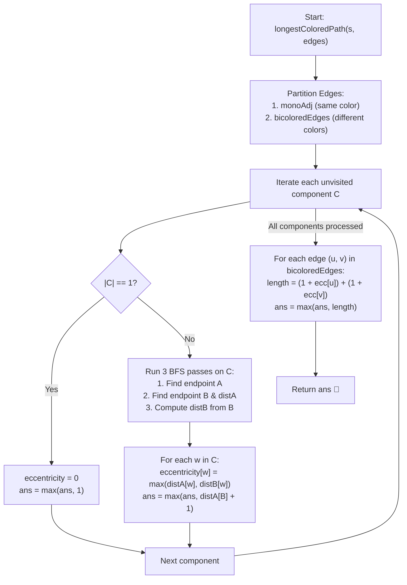

# 💡 Approach — Longest Colored Path

  | 📄 [Problem](./Problem.md) | 💡 [Approach](./Approach.md) | 🧩 [Solution](./Solution.cpp) | 🚀 [Main](./Main.cpp) |
  |:--------------------------:|:-----------------------------:|:------------------------------:|:---------------------:|

## 📊 Metadata

---

> [!TIP]
> **Core Intuition — Monochromatic Component Decomposition & Bicolored Bridging:**
> 1. **Path Structure Analysis**:
>    A path is valid if its color sequence along the traversal order belongs to one of three types:
>    - Monochromatic Red: $R \dots R$
>    - Monochromatic Blue: $B \dots B$
>    - Bipartite Monotonic: $R \dots R \to B \dots B$ (at least one Red followed by at least one Blue)
> 2. **Forest Decomposition**:
>    If we temporarily remove all **bi-colored edges** (edges connecting an $'R'$ node and a $'B'$ node), the tree decomposes into a forest of disjoint monochromatic trees:
>    - Red components ($C_R$) containing only $'R'$ vertices.
>    - Blue components ($C_B$) containing only $'B'$ vertices.
> 3. **Component Properties & Tree Eccentricity**:
>    - Any monochromatic path is completely contained within a single component. The longest such path in component $C$ is simply the **tree diameter (in vertices)** of $C$.
>    - Any mixed path $R\dots R \to B\dots B$ MUST transition across exactly one bi-colored edge $(u, v)$ where $u \in C_R$ and $v \in C_B$.
>    - Once a path enters $C_B$, it can never leave $C_B$ because any outgoing edge from $C_B$ leads back to an $'R'$ node, which would create an invalid $B \to R$ transition!
>    - Hence, across a bi-colored edge $(u, v)$, the maximum valid path length is:
>      $$\text{PathLength}(u, v) = (\text{longest } R \text{-path ending at } u) + (\text{longest } B \text{-path starting at } v)$$
> 4. **Linear Time Eccentricity via Diameter Endpoints**:
>    In any tree component $C$:
>    - The longest path starting at a given node $w$ is $1 + \text{eccentricity}(w)$, where $\text{eccentricity}(w) = \max_{x \in C} \text{dist}(w, x)$.
>    - By the fundamental tree diameter theorem, for any node $w \in C$, its furthest node is always one of the two diameter endpoints, $A$ or $B$:
>      $$\text{eccentricity}(w) = \max(\text{dist}(w, A), \text{dist}(w, B))$$
>    - Running 3 lightweight BFS passes per component computes the diameter and all vertex eccentricities in $\mathcal{O}(|C|)$ time, achieving an optimal $\mathcal{O}(n)$ overall complexity.

---

## 🔩 Step-by-Step Breakdown

1. **Graph Partitioning**:
   - Construct an adjacency list `monoAdj` containing only monochromatic edges where $s[u-1] == s[v-1]$.
   - Collect all edges connecting nodes of different colors into a list `bicoloredEdges`.

2. **Monochromatic Component Analysis**:
   - For each unvisited node $i \in [1, n]$:
     - Identify all nodes in its component `compNodes` via BFS.
     - If $|compNodes| = 1$:
       - `eccentricity[compNodes[0]] = 0`.
       - Update candidate answer: `ans = max(ans, 1)`.
     - Otherwise:
       - Run BFS from an arbitrary node to find diameter endpoint $A$.
       - Run BFS from $A$ to find diameter endpoint $B$ and record distances `distA`.
       - The component's diameter in vertices is $\text{distA}[B] + 1$. Update `ans = max(ans, distA[B] + 1)`.
       - Run BFS from $B$ to record distances `distB`.
       - For every node $w \in compNodes$:
         $$\text{eccentricity}[w] = \max(\text{distA}[w], \text{distB}[w])$$

3. **Bi-Colored Edge Evaluation**:
   - For every edge $(u, v) \in bicoloredEdges$:
     - Let $u$ be the Red node and $v$ be the Blue node.
     - The longest valid path traversing through $(u, v)$ has length:
       $$(1 + \text{eccentricity}[u]) + (1 + \text{eccentricity}[v])$$
     - Update `ans = max(ans, (1 + eccentricity[u]) + (1 + eccentricity[v]))`.

4. **Return Answer**:
   - Return `ans`, which is guaranteed to be the maximum number of nodes in any valid path.

---

## 🔄 Mermaid Flowchart

---

## 🏃‍♂️ Dry Run

### Example 1: $s = \text{"RBB"}, edges = [[1, 2], [1, 3]]$

- Node colors: $1 \to \text{'R'}, 2 \to \text{'B'}, 3 \to \text{'B'}$
- Edges: $(1, 2)$ connects $R$ and $B$; $(1, 3)$ connects $R$ and $B$.
- Monochromatic edges: None! All monochromatic components are singletons:
  - Component $\{1\}$ (Red): $\text{eccentricity}[1] = 0$.
  - Component $\{2\}$ (Blue): $\text{eccentricity}[2] = 0$.
  - Component $\{3\}$ (Blue): $\text{eccentricity}[3] = 0$.
- Bi-colored edges evaluation:
  - Edge $(1, 2)$: $(1 + \text{ecc}[1]) + (1 + \text{ecc}[2]) = (1 + 0) + (1 + 0) = 2$.
  - Edge $(1, 3)$: $(1 + \text{ecc}[1]) + (1 + \text{ecc}[3]) = (1 + 0) + (1 + 0) = 2$.
- Maximum length: $\mathbf{2}$.

### Example 2: $s = \text{"BB"}, edges = [[1, 2]]$

- Node colors: $1 \to \text{'B'}, 2 \to \text{'B'}$.
- Edge $(1, 2)$ is monochromatic Blue.
- Component $\{1, 2\}$:
  - Diameter endpoints: $A = 1, B = 2$.
  - $\text{dist}(1, 2) = 1$ edge $\implies 2$ nodes.
  - Diameter in nodes: $2$.
- Bi-colored edges: None.
- Maximum length: $\mathbf{2}$.

---

## 📊 Complexity Analysis

| Complexity Metric | Estimation | Rationale |
| :--- | :---: | :--- |
| **Time Complexity** | $\mathcal{O}(n)$ | Finding components and executing BFS on each monochromatic component visits each vertex and edge at most 3 times. Evaluating the list of bi-colored edges takes $\mathcal{O}(n)$ time. Total time is strictly linear $\mathcal{O}(n)$. |
| **Auxiliary Space** | $\mathcal{O}(n)$ | The monochromatic adjacency list, distance vectors, queue, and eccentricity array each consume $\mathcal{O}(n)$ space. |

---

<h3>Happy Coding! 🚀</h3>

