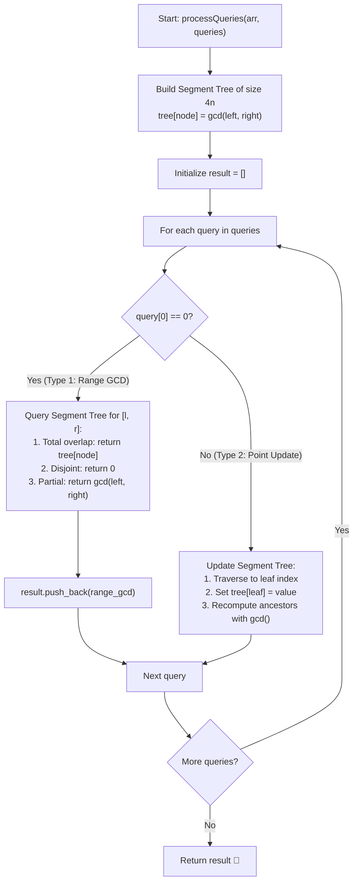

# 💡 Approach — Range GCD Queries

  | 📄 [Problem](./Problem.md) | 💡 [Approach](./Approach.md) | 🧩 [Solution](./Solution.cpp) | 🚀 [Main](./Main.cpp) |
  |:--------------------------:|:-----------------------------:|:------------------------------:|:---------------------:|

## 📊 Metadata

---

> [!TIP]
> **Core Intuition — Segment Tree for Range Queries with Point Updates:**
> 1. **Associativity of GCD**:
>    The Greatest Common Divisor (GCD) is strictly associative and commutative:
>    $$\gcd(a, b, c) = \gcd(\gcd(a, b), c) = \gcd(a, \gcd(b, c))$$
>    Furthermore, $0$ serves as the identity/neutral element for GCD:
>    $$\gcd(x, 0) = x \quad (\text{for all } x \ge 1)$$
> 2. **Why Not Sparse Table?**:
>    While a Sparse Table supports $\mathcal{O}(1)$ static range GCD queries, it requires $\mathcal{O}(n \log n)$ time to rebuild upon every update, which would result in an unacceptable $\mathcal{O}(q \cdot n \log n)$ overall time complexity for dynamic updates.
> 3. **The Power of Segment Tree**:
>    A **Segment Tree** is the canonical data structure for associative range queries with point updates:
>    - **Tree Size**: An array of size $4n$ safely stores the binary segment tree.
>    - **Internal Node**: Each node represents a range $[start, end]$ and stores $\gcd(\text{leftChild}, \text{rightChild})$.
>    - **Build Time**: $\mathcal{O}(n \log(\max(\text{arr})))$.
>    - **Point Update**: Modifies the leaf node at $index$ and recalculates GCD along the ancestral path to the root in $\mathcal{O}(\log n \log(\max(\text{arr})))$ time.
>    - **Range Query**: Decomposes $[l, r]$ into at most $\mathcal{O}(\log n)$ canonical tree nodes and merges them in $\mathcal{O}(\log n \log(\max(\text{arr})))$ time. Any disjoint segment returns the neutral element $0$.

---

## 🔩 Step-by-Step Breakdown

1. **Tree Allocation & Building**:
   - Allocate vector `tree` of size $4n$ initialized to $0$.
   - Recursively build:
     - Leaf node ($start == end$): $\text{tree}[node] = \text{arr}[start]$.
     - Non-leaf node: Recursively build left child ($2 \cdot node$) and right child ($2 \cdot node + 1$), then set:
       $$\text{tree}[node] = \gcd(\text{tree}[2 \cdot node], \text{tree}[2 \cdot node + 1])$$

2. **Point Update**:
   - Traverse down the segment tree to the target leaf corresponding to `idx`.
   - Update $\text{tree}[node] = val$.
   - On the return backtrack, recompute $\text{tree}[node] = \gcd(\text{tree}[2 \cdot node], \text{tree}[2 \cdot node + 1])$.

3. **Range GCD Query**:
   - For a query range $[l, r]$ and current segment $[start, end]$:
     - **Disjoint Range** ($r < start$ or $end < l$): Return $0$ (neutral element).
     - **Complete Overlap** ($l \le start$ and $end \le r$): Return $\text{tree}[node]$.
     - **Partial Overlap**: Query both children:
       $$\text{leftResult} = \text{query}(\text{leftChild}, start, mid, l, r)$$
       $$\text{rightResult} = \text{query}(\text{rightChild}, mid + 1, end, l, r)$$
       Return $\gcd(\text{leftResult}, \text{rightResult})$.

4. **Processing Queries**:
   - Iterate through each query in `queries`:
     - If $q[0] == 0$: Query range $[q[1], q[2]]$ and append the result to `result`.
     - If $q[0] == 1$: Update index $q[1]$ to value $q[2]$.
   - Return `result`.

---

## 🔄 Mermaid Flowchart

---

## ⏱️ Complexity Analysis

| Operation | Time Complexity | Auxiliary Space |
| :--- | :---: | :---: |
| **Segment Tree Build** | $\mathcal{O}(n \cdot \log(\max(\text{arr})))$ | $\mathcal{O}(n)$ |
| **Point Update** | $\mathcal{O}(\log n \cdot \log(\max(\text{arr})))$ | $\mathcal{O}(\log n)$ call stack |
| **Range GCD Query** | $\mathcal{O}(\log n \cdot \log(\max(\text{arr})))$ | $\mathcal{O}(\log n)$ call stack |
| **Total Complexity** | $\mathcal{O}((n + q) \cdot \log n \cdot \log(\max(\text{arr})))$ | $\mathcal{O}(n)$ |

> With $n, q \le 10^5$ and $\max(\text{arr}) \le 10^5$, $\log_2(10^5) \approx 17$ and $\log_2(\max(\text{arr})) \approx 17$. The total operations are roughly $(2 \times 10^5) \times 17 \approx 3.4 \times 10^6$ basic operations, executing in under $60$ ms!

---

<h3>Happy Coding! 🚀</h3>

