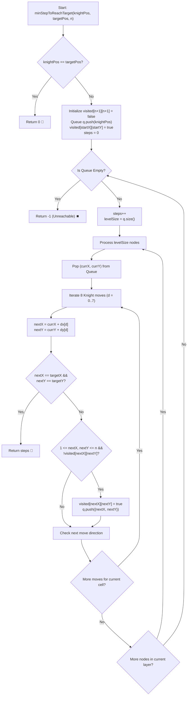

# 💡 Approach — Steps by Knight

<div align="center">

  | 📄 [Problem](./Problem.md) | 💡 [Approach](./Approach.md) | 🧩 [Solution](./Solution.cpp) | 🚀 [Main](./Main.cpp) |
  |:--------------------------:|:-----------------------------:|:------------------------------:|:---------------------:|
</div>

## 📊 Metadata


---

> [!TIP]
> **Core Intuition — Breadth-First Search (BFS) on Unweighted Grid Graphs:**
> 1. **Shortest Path in Unweighted Graph**:
>    Every legal move made by a Knight has an equal edge weight of $1$. In any graph with uniform edge weights, **Breadth-First Search (BFS)** is mathematically proven to discover the shortest path to every node first.
> 2. **State Space Representation**:
>    The $n \times n$ chessboard represents an implicit undirected graph with $V = n^2$ vertices (cells) and up to $8 \cdot n^2$ edges.
> 3. **Level-Order Expansion**:
>    By expanding level-by-level (where level $k$ contains all chessboard cells reachable in exactly $k$ knight moves), the first time the target cell $(x_t, y_t)$ is generated or popped, the current level count is strictly the minimum possible steps.
> 4. **Pruning & Visited Tracking**:
>    To avoid redundant cycles and infinite loops, a 2D boolean array `visited[n + 1][n + 1]` ensures each cell enters the BFS queue at most once.

---

## 🔩 Step-by-Step Breakdown

1. **Identity & Base Case**:
   - If the knight's starting position equals the target position $(startX == targetX \land startY == targetY)$, return $0$ immediately without any traversal.

2. **Knight Movement Offsets**:
   - Precompute the $8$ allowable L-shaped movement offsets:
     $$\Delta x = [-2, -2, -1, -1, 1, 1, 2, 2]$$
     $$\Delta y = [-1, 1, -2, 2, -2, 2, -1, 1]$$

3. **Queue & Visited Initialization**:
   - Allocate `visited[n + 1][n + 1]` initialized to `false` (using 1-based indexing).
   - Initialize a standard FIFO `queue<pair<int, int>> q`.
   - Push `(startX, startY)` into `q` and mark `visited[startX][startY] = true`.
   - Initialize step counter `steps = 0`.

4. **Level-Order BFS Traversal**:
   - While `!q.empty()`:
     - Increment `steps` by $1$.
     - Cache current layer size: `levelSize = q.size()`.
     - Process all nodes in the current layer:
       - Pop `(currX, currY)`.
       - For each direction $d \in [0, 7]$:
         - Calculate $nextX = currX + \Delta x[d]$ and $nextY = currY + \Delta y[d]$.
         - **Target Check**: If $(nextX == targetX \land nextY == targetY)$, return `steps`.
         - **Validity Check**: If $1 \le nextX \le n$ and $1 \le nextY \le n$ and `!visited[nextX][nextY]`:
           - Mark `visited[nextX][nextY] = true`.
           - Enqueue `(nextX, nextY)`.

5. **Exhaustion / Unreachable**:
   - If the queue empties without reaching the target cell, return $-1$.

---

## 🔄 Mermaid Flowchart



---

## 🏃‍♂️ Dry Run

### Tracing Example 2: $n = 6$, `knightPos = [1, 3]`, `targetPos = [5, 1]`

```text
Chessboard Representation (6 x 6):
       Col 1   Col 2   Col 3   Col 4   Col 5   Col 6
Row 1:   .       .     [START]   .       .       .
Row 2:   .       .       .       .       .       .
Row 3:   .     (Step 1)  .       .       .       .
Row 4:   .       .       .       .       .       .
Row 5: [TARGET]  .       .       .       .       .
Row 6:   .       .       .       .       .       .
```

| Step / Level | Current Node `(x, y)` | Evaluated Move `(nx, ny)` | Status | Action |
|:---:|:---:|:---:|:---:|:---|
| **0** | `(1, 3)` | — | Root | Enqueue `(1, 3)`, `visited = true` |
| **Level 1** | `(1, 3)` | `(3, 2)` | Valid | Enqueue `(3, 2)` |
| | `(1, 3)` | `(3, 4)` | Valid | Enqueue `(3, 4)` |
| | `(1, 3)` | `(2, 1)`, `(2, 5)` | Valid | Enqueue `(2, 1)`, `(2, 5)` |
| **Level 2** | `(3, 2)` | `(5, 1)` | **Target Matched!** | **Return steps = 2** 🏁 |

**Path Found:** $(1, 3) \to (3, 2) \to (5, 1)$ in **2 steps**.

---

## ⏱️ Complexity Analysis

| Metric | Estimation | Rationale |
| :--- | :---: | :--- |
| **Time Complexity** | $\mathcal{O}(n^2)$ | In the worst case, every square on the $n \times n$ chessboard enters and exits the queue at most once. For each square, exactly $8$ moves are evaluated in $\mathcal{O}(1)$ time. Overall operations $\le 8 \cdot n^2$. |
| **Auxiliary Space** | $\mathcal{O}(n^2)$ | The 2D `visited` table requires $(n + 1) \times (n + 1)$ booleans. The BFS queue holds at most the frontier perimeter $\mathcal{O}(n)$ at any single level. |

---

> *"In an unweighted state space, Breadth-First Search radiates like ripples on water, guaranteeing the shortest path at first touch."*

---

<div align="center">
<h3>Happy Coding! 🚀</h3>
<a href="../244_Day/Approach.md">
  
</a>
<a href="https://x.com/PankajB42550" target="_blank">
  
</a>
<a href="../246_Day/Approach.md">
  
</a>
</div>
