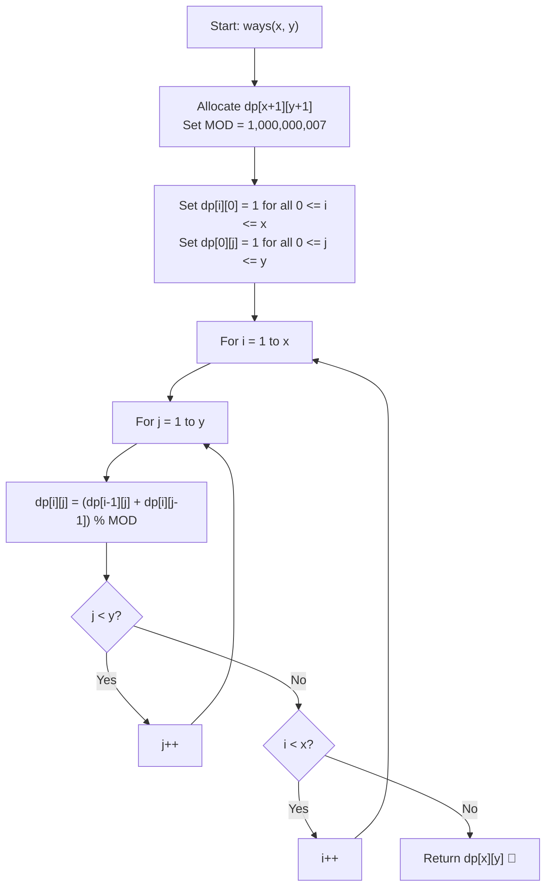

# 💡 Approach — Ways to Reach Origin

  | 📄 [Problem](./Problem.md) | 💡 [Approach](./Approach.md) | 🧩 [Solution](./Solution.cpp) | 🚀 [Main](./Main.cpp) |
  |:--------------------------:|:-----------------------------:|:------------------------------:|:---------------------:|

## 📊 Metadata

---

> [!TIP]
> **Core Intuition — Dynamic Programming over a 2D Grid:**
> 1. **Overlapping Subproblems**:
>    To reach $(0, 0)$ from $(i, j)$, the first move can either be:
>    - Left to $(i - 1, j)$
>    - Down to $(i, j - 1)$
>    Hence, the total paths from $(i, j)$ is the sum of paths from $(i - 1, j)$ and $(i, j - 1)$.
> 2. **Base Cases**:
>    - When $i = 0$, Geek is already on the $y$-axis; the only legal moves are downwards to $(0, 0)$. There is exactly $1$ path.
>    - When $j = 0$, Geek is already on the $x$-axis; the only legal moves are leftwards to $(0, 0)$. There is exactly $1$ path.
> 3. **Optimal Substructure**:
>    Every subproblem $(i, j)$ depends solely on $(i - 1, j)$ and $(i, j - 1)$, both of which have strictly smaller coordinate sums, guaranteeing a Directed Acyclic Graph (DAG) structure that can be computed iteratively in row-major or column-major order.
> 4. **Modulo Arithmetic**:
>    Additions must be taken modulo $10^9 + 7$ at each step to prevent integer overflow.

---

## 🔩 Step-by-Step Breakdown

1. **State Definition**:
   - Let $dp[i][j]$ represent the number of distinct valid paths to travel from coordinate $(i, j)$ to $(0, 0)$ under the rules of only left and down movements.

2. **Base Case Setup**:
   - Initialize a 2D table `dp` of dimensions $(x + 1) \times (y + 1)$ with zeros.
   - For all $0 \le j \le y$, set $dp[0][j] = 1$ because only downward moves are possible when $x = 0$.
   - For all $0 \le i \le x$, set $dp[i][0] = 1$ because only leftward moves are possible when $y = 0$.

3. **Bottom-Up DP Transition**:
   - Iterate $i$ from $1$ to $x$:
     - Iterate $j$ from $1$ to $y$:
       $$dp[i][j] = (dp[i - 1][j] + dp[i][j - 1]) \pmod{10^9 + 7}$$

4. **Return Result**:
   - The value stored at $dp[x][y]$ gives the total number of distinct paths from $(x, y)$ to $(0, 0)$.

5. **Space Optimization (Optional Variant)**:
   - Since $dp[i][j]$ only relies on the current row's previous cell $dp[i][j - 1]$ and the previous row's cell at the same column $dp[i - 1][j]$, we can maintain a single 1D array of size $y + 1$:
     $$dp[j] = (dp[j] + dp[j - 1]) \pmod{10^9 + 7}$$
   - This reduces auxiliary space from $\mathcal{O}(x \cdot y)$ to $\mathcal{O}(y)$.

---

## 🔄 Mermaid Flowchart

---

## 🏃‍♂️ Dry Run

### Tracing Example 2: $x = 3, y = 6$

We construct the DP table iteratively. Below is a subset showing values up to $x = 3, y = 6$:

| $i \backslash j$ | $j = 0$ | $j = 1$ | $j = 2$ | $j = 3$ | $j = 4$ | $j = 5$ | $j = 6$ |
| :---: | :---: | :---: | :---: | :---: | :---: | :---: | :---: |
| **$i = 0$** | $1$ | $1$ | $1$ | $1$ | $1$ | $1$ | $1$ |
| **$i = 1$** | $1$ | $2$ | $3$ | $4$ | $5$ | $6$ | $7$ |
| **$i = 2$** | $1$ | $3$ | $6$ | $10$ | $15$ | $21$ | $28$ |
| **$i = 3$** | $1$ | $4$ | $10$ | $20$ | $35$ | $56$ | **$84$** |

**Calculations for row $i = 3$:**
- $dp[3][1] = dp[2][1] + dp[3][0] = 3 + 1 = 4$
- $dp[3][2] = dp[2][2] + dp[3][1] = 6 + 4 = 10$
- $dp[3][3] = dp[2][3] + dp[3][2] = 10 + 10 = 20$
- $dp[3][4] = dp[2][4] + dp[3][3] = 15 + 20 = 35$
- $dp[3][5] = dp[2][5] + dp[3][4] = 21 + 35 = 56$
- $dp[3][6] = dp[2][6] + dp[3][5] = 28 + 56 = \mathbf{84}$

Result matches Example 2: **$84$**.

---

## ⏱️ Complexity Analysis

| Metric | Complexity | Rationale |
| :--- | :---: | :--- |
| **Time Complexity** | $\mathcal{O}(x \cdot y)$ | The nested loops execute $(x + 1) \times (y + 1)$ times, each taking $\mathcal{O}(1)$ basic arithmetic operations. For maximum constraints $500 \times 500$, operations $\approx 2.5 \times 10^5$, running in $< 2\text{ ms}$. |
| **Auxiliary Space** | $\mathcal{O}(x \cdot y)$ | The 2D DP matrix requires $(x + 1) \times (y + 1)$ integer storage ($\approx 1\text{ MB}$ for $500 \times 500$). With 1D space optimization, this can be reduced to $\mathcal{O}(y)$. |

---

> *"Every path from $(x, y)$ to $(0, 0)$ mirrors the Pascal's triangle symmetry, where every step down or left merges previous possibilities."*

---

<h3>Happy Coding! 🚀</h3>

