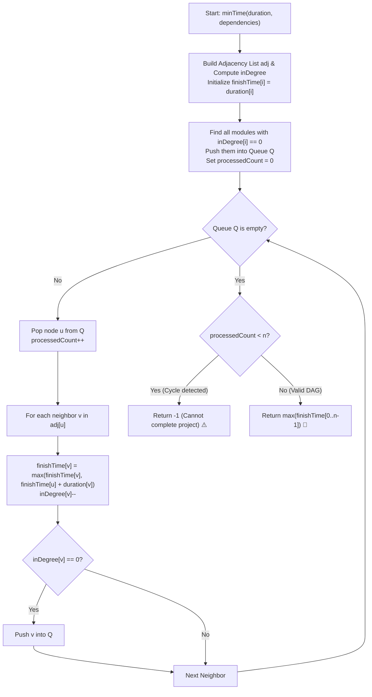

# 💡 Approach — Minimum Time to Finish Project

  | 📄 [Problem](./Problem.md) | 💡 [Approach](./Approach.md) | 🧩 [Solution](./Solution.cpp) | 🚀 [Main](./Main.cpp) |
  |:--------------------------:|:-----------------------------:|:------------------------------:|:---------------------:|

## 📊 Metadata

---

> [!TIP]
> **Core Intuition — Topological Sort (Kahn's Algorithm) & Longest Path in DAG:**
> 1. **Directed Dependency Graph**:
>    Each dependency `[u, v]` specifies that task $u$ must finish before task $v$ can start. This translates directly to a directed edge $u \to v$.
> 2. **Earliest Start & Completion Times**:
>    Because tasks with no mutual dependencies can run in parallel, task $v$ starts as soon as *all* its prerequisites finish:
>    $$\text{startTime}[v] = \max_{(u, v) \in E} (\text{finishTime}[u])$$
>    $$\text{finishTime}[v] = \text{startTime}[v] + \text{duration}[v]$$
> 3. **Topological Order Processing (Kahn's BFS)**:
>    By maintaining in-degrees and using a FIFO queue, we only process a node after all its incoming dependencies have already been resolved.
> 4. **Cycle Detection**:
>    If there is a cycle anywhere among the dependencies, nodes within the cycle will never have their in-degrees decremented to 0. If the total number of processed nodes is strictly less than $n$, a deadlock exists, and we immediately return `-1`.
> 5. **Global Answer**:
>    The project is completed when every single module is finished:
>    $$\text{Total Project Time} = \max_{0 \le i < n} (\text{finishTime}[i])$$

---

## 🔩 Step-by-Step Breakdown

1. **Graph Construction & In-Degree Initialization**:
   - Let $n = \text{duration.size()}$.
   - Initialize an adjacency list `adj` of size $n$.
   - Initialize an array `inDegree` of size $n$ filled with $0$.
   - For every dependency `[u, v]`:
     - Add directed edge $u \to v$ in `adj[u]`.
     - Increment `inDegree[v]++`.

2. **Initialize Finish Times & Queue**:
   - Create a `finishTime` array of size $n$ where `finishTime[i] = duration[i]`.
   - Create a standard queue `q`.
   - For every node $i \in [0, n - 1]$:
     - If `inDegree[i] == 0`, push $i$ into `q`. (These modules have no blockers and begin at time $0$).

3. **Kahn's Algorithm Traversal**:
   - Initialize `processedCount = 0`.
   - While `q` is not empty:
     - Dequeue front element $u$.
     - Increment `processedCount++`.
     - For each outgoing neighbor $v$ of $u$:
       - Relax the earliest finish time of $v$:
         $$\text{finishTime}[v] = \max(\text{finishTime}[v], \text{finishTime}[u] + \text{duration}[v])$$
       - Decrement `inDegree[v]--`.
       - If `inDegree[v] == 0`, enqueue $v$ into `q`.

4. **Cycle Verification**:
   - If `processedCount < n`:
     - At least one cycle exists (deadlock among remaining modules).
     - Return `-1`.

5. **Compute Overall Completion Time**:
   - Find and return the maximum value in `finishTime`:
     $$\max_{0 \le i < n} (\text{finishTime}[i])$$

---

## 🔄 Mermaid Flowchart

---

## 🏃‍♂️ Dry Run

### Tracing Example 1:
- `duration = [10, 20, 30, 10, 30, 20]` ($n = 6$)
- `dependencies = [[5, 2], [5, 0], [4, 0], [4, 1], [2, 3], [3, 1]]`

#### Graph Representation:
- $5 \to 2, 0$
- $4 \to 0, 1$
- $2 \to 3$
- $3 \to 1$

#### Initial State:
- `inDegree = [2, 2, 1, 1, 0, 0]`
- Initial `finishTime = [10, 20, 30, 10, 30, 20]`
- `Queue Q = [4, 5]`, `processedCount = 0`

| Step | Pop $u$ | Neighbors $v$ | Relaxation Formula | `finishTime` State | `inDegree` State | New Queue Elements |
| :---: | :---: | :---: | :--- | :--- | :--- | :---: |
| **1** | $4$ | $0, 1$ | $v=0: \max(10, 30+10)=40$ $v=1: \max(20, 30+20)=50$ | $[40, 50, 30, 10, 30, 20]$ | $[1, 1, 1, 1, 0, 0]$ | None |
| **2** | $5$ | $2, 0$ | $v=2: \max(30, 20+30)=50$ $v=0: \max(40, 20+10)=40$ | $[40, 50, 50, 10, 30, 20]$ | $[0, 1, 0, 1, 0, 0]$ | Push $2$, Push $0$ |
| **3** | $2$ | $3$ | $v=3: \max(10, 50+10)=60$ | $[40, 50, 50, 60, 30, 20]$ | $[0, 1, 0, 0, 0, 0]$ | Push $3$ |
| **4** | $0$ | — | No outgoing edges | $[40, 50, 50, 60, 30, 20]$ | $[0, 1, 0, 0, 0, 0]$ | None |
| **5** | $3$ | $1$ | $v=1: \max(50, 60+20)=80$ | $[40, 80, 50, 60, 30, 20]$ | $[0, 0, 0, 0, 0, 0]$ | Push $1$ |
| **6** | $1$ | — | No outgoing edges | $[40, 80, 50, 60, 30, 20]$ | $[0, 0, 0, 0, 0, 0]$ | None |

- Queue becomes empty.
- Total processed count $= 6 = n$.
- Overall Project Finish Time $= \max(40, 80, 50, 60, 30, 20) = \mathbf{80}$.

---

## ⏱️ Complexity Analysis

| Metric | Complexity | Rationale |
| :--- | :---: | :--- |
| **Time Complexity** | $\mathcal{O}(n + m)$ | Building the graph takes $\mathcal{O}(m)$ time. In Kahn's algorithm, each node is pushed and popped from the queue exactly once ($\mathcal{O}(n)$), and each directed edge is relaxed exactly once ($\mathcal{O}(m)$). Total runtime is strictly linear. |
| **Auxiliary Space** | $\mathcal{O}(n + m)$ | Adjacency list stores $m$ directed edges across $n$ vertices. The `inDegree`, `finishTime`, and queue each require $\mathcal{O}(n)$ memory. |

---

> *"In parallel task scheduling, the timeline is not bound by the sum of all efforts, but solely by the longest un-parallelizable chain of dependencies — the Critical Path."*

---

<h3>Happy Coding! 🚀</h3>

