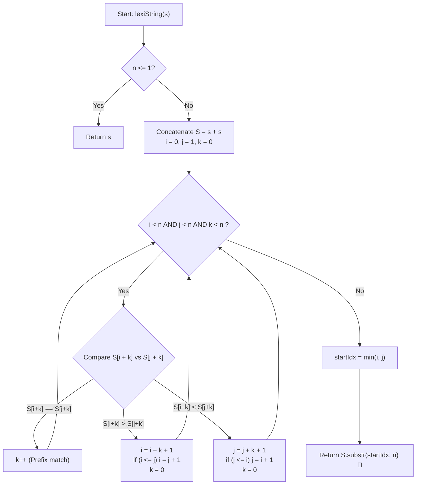

# 💡 Approach — Lexicographically Smallest Rotation

  | 📄 [Problem](./Problem.md) | 💡 [Approach](./Approach.md) | 🧩 [Solution](./Solution.cpp) | 🚀 [Main](./Main.cpp) |
  |:--------------------------:|:-----------------------------:|:------------------------------:|:---------------------:|

## 📊 Metadata

---

> [!TIP]
> **Core Intuition — The Two-Pointer Minimal String Rotation Principle:**
> 1. **String Doubling ($S = s + s$)**:
>    Every cyclic left-rotation of a string $s$ of length $n$ is simply a contiguous substring of length $n$ in the concatenated string $S = s + s$, starting at an index $i \in [0, n - 1]$.
> 2. **Candidate Elimination**:
>    Suppose we compare candidate rotations starting at index $i$ and index $j$ ($i < j$). We compare characters $S[i + k]$ and $S[j + k]$ starting from offset $k = 0$:
>    - While $S[i + k] == S[j + k]$, the prefixes of length $k + 1$ are identical. We increment $k++$.
>    - If $S[i + k] > S[j + k]$, rotation $i$ is lexicographically larger than rotation $j$. More importantly, for every offset $p \in [0, k]$, rotation $i + p$ is also beaten by rotation $j + p$ because their prefixes prior to mismatch were identical. Hence, we can safely skip all start positions from $i$ up to $i + k$, jumping to $i = i + k + 1$.
>    - If $i \le j$ after the jump, we advance $i = j + 1$ to keep $i \ne j$.
>    - Symmetric logic applies if $S[i + k] < S[j + k]$: we jump $j = j + k + 1$.
> 3. **Guaranteed $\mathcal{O}(n)$ Time**:
>    Every comparison either increments $k$ or advances one pointer by at least $k + 1$ and resets $k = 0$. Since both $i$ and $j$ can only advance up to $n$, the total number of character inspections is strictly bounded by $2n$.
> 4. **Extracting the Minimum**:
>    When the loop finishes (either pointer reaches $n$ or $k = n$), the minimum index $\min(i, j)$ holds the starting position of the lexicographically smallest rotation.

---

## 🔩 Step-by-Step Breakdown

1. **Edge Case Handling**:
   - Let $n = |s|$. If $n \le 1$, the string is already its sole rotation; return $s$.

2. **String Doubling**:
   - Construct $S = s + s$ of length $2n$. Substring $S[k \dots k + n - 1]$ corresponds to the left-rotation by $k$ positions.

3. **Two-Pointer Initialization**:
   - Initialize pointer $i = 0$ (first candidate).
   - Initialize pointer $j = 1$ (second candidate).
   - Initialize offset $k = 0$ (number of matched characters so far).

4. **Linear Comparison Loop**:
   - While $i < n$, $j < n$, and $k < n$:
     - If $S[i + k] == S[j + k]$:
       - Both candidates match at this position; increment $k++$.
     - Else if $S[i + k] > S[j + k]$:
       - Candidate $i$ is inferior. Advance $i = i + k + 1$.
       - Ensure distinct pointers: if $i \le j$, set $i = j + 1$.
       - Reset $k = 0$.
     - Else ($S[i + k] < S[j + k]$):
       - Candidate $j$ is inferior. Advance $j = j + k + 1$.
       - Ensure distinct pointers: if $j \le i$, set $j = i + 1$.
       - Reset $k = 0$.

5. **Sub-string Extraction**:
   - The starting index of the minimal rotation is $\text{startIdx} = \min(i, j)$.
   - Return $S\text{.substr}(\text{startIdx}, n)$.

---

## 🔄 Mermaid Flowchart

---

## 🏃‍♂️ Dry Run

### Tracing Example 2: $s = \text{"baca"}$ ($n = 4$)
Concatenated string: $S = \text{"bacabaca"}$.

| Step | $i$ | $j$ | $k$ | $S[i + k]$ | $S[j + k]$ | Comparison | Action Taken | Next State $(i, j, k)$ |
| :---: | :---: | :---: | :---: | :---: | :---: | :---: | :--- | :---: |
| **1** | $0$ | $1$ | $0$ | $S[0] = \text{'b'}$ | $S[1] = \text{'a'}$ | $\text{'b'} > \text{'a'}$ | $i = 0 + 0 + 1 = 1 \le j \implies i = 2$, $k = 0$ | $i = 2, j = 1, k = 0$ |
| **2** | $2$ | $1$ | $0$ | $S[2] = \text{'c'}$ | $S[1] = \text{'a'}$ | $\text{'c'} > \text{'a'}$ | $i = 2 + 0 + 1 = 3$, $k = 0$ | $i = 3, j = 1, k = 0$ |
| **3** | $3$ | $1$ | $0$ | $S[3] = \text{'a'}$ | $S[1] = \text{'a'}$ | $\text{'a'} == \text{'a'}$ | Increment $k++$ | $i = 3, j = 1, k = 1$ |
| **4** | $3$ | $1$ | $1$ | $S[4] = \text{'b'}$ | $S[2] = \text{'c'}$ | $\text{'b'} < \text{'c'}$ | $j = 1 + 1 + 1 = 3 \le i \implies j = 4$, $k = 0$ | $i = 3, j = 4, k = 0$ |

- Loop condition check: $j = 4 \ge n \implies$ loop terminates!
- Optimal start index $= \min(i, j) = \min(3, 4) = \mathbf{3}$.
- Substring $S[3 \dots 3 + 4 - 1] = S[3 \dots 6] = \mathbf{\text{"abac"}}$.

---

## ⏱️ Complexity Analysis

| Metric | Complexity | Rationale |
| :--- | :---: | :--- |
| **Time Complexity** | $\mathcal{O}(n)$ | Each character comparison either increments $k$ or triggers a jump of $i$ or $j$ by at least $k + 1$. Because $i < n$ and $j < n$, at most $2n$ total comparisons are ever performed. |
| **Auxiliary Space** | $\mathcal{O}(n)$ | Concatenating $S = s + s$ and allocating the result substring requires $\mathcal{O}(n)$ memory. If performed using modular indexing without string concatenation, auxiliary space can be reduced to $\mathcal{O}(1)$. |

---

> *"By treating circular strings as doubling windows, we convert complex modular topology into linear skipping, turning an otherwise $\mathcal{O}(n^2)$ search into a deterministic $\mathcal{O}(n)$ scan."*

---

<h3>Happy Coding! 🚀</h3>

