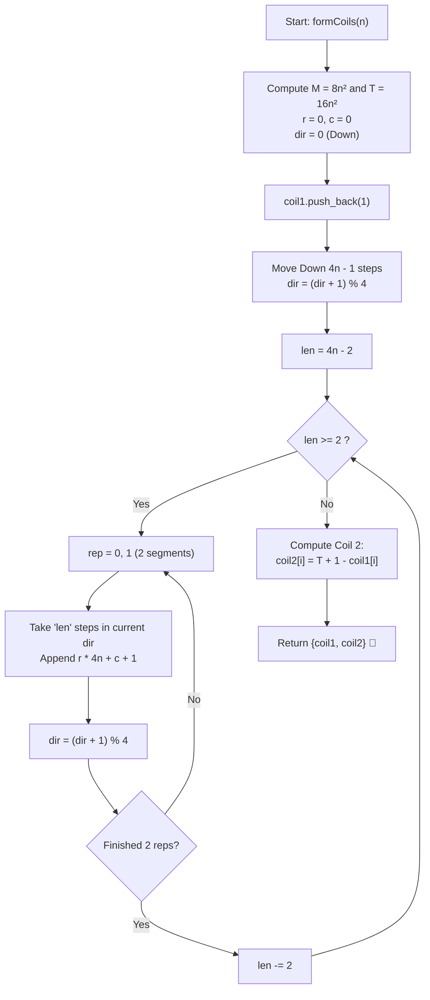

# 💡 Approach — Coils in a Matrix

<div align="center">

  | 📄 [Problem](./Problem.md) | 💡 [Approach](./Approach.md) | 🧩 [Solution](./Solution.cpp) | 🚀 [Main](./Main.cpp) |
  |:--------------------------:|:-----------------------------:|:------------------------------:|:---------------------:|
</div>

## 📊 Metadata


---

> [!TIP]
> **Core Intuition — Segment Decomposition & Central Point Symmetry:**
> 1. **Coil 1 Trajectory & Step Length Invariant**:
>    The matrix dimension is $N = 4n$, with indices from $0$ to $4n - 1$.
>    - Coil 1 starts at cell $(0, 0)$.
>    - It first steps **Down** through row $4n - 1$, taking $4n - 1$ steps ($4n$ cells total).
>    - Thereafter, the spiral makes turns in a repeating 4-direction cycle:
>      $$\text{Down} \to \text{Right} \to \text{Up} \to \text{Left} \to \text{Down} \dots$$
>    - For each step length $L \in \{4n - 2, 4n - 4, \dots, 2\}$, exactly **two** consecutive segments of length $L$ are traversed before decrementing $L$ by $2$.
>    - The total cells traversed is:
>      $$4n + 2 \sum_{k=1}^{2n-1} 2k = 4n + 4 \cdot \frac{(2n - 1)(2n)}{2} = 8n^2$$
> 2. **Deriving Coil 2 via $180^\circ$ Rotational Symmetry**:
>    Every entry in row $r$, col $c$ (0-indexed) has value:
>    $$\text{val}(r, c) = r \cdot 4n + c + 1$$
>    The centrally symmetric counterpart $(4n - 1 - r, 4n - 1 - c)$ evaluates to:
>    $$\text{val}(4n - 1 - r, 4n - 1 - c) = (4n - 1 - r) \cdot 4n + (4n - 1 - c) + 1 = 16n^2 + 1 - \text{val}(r, c)$$
>    Since Coil 2 starts at $(4n - 1, 4n - 1)$ and performs the identical spiral inward from the opposite end, the $i$-th element of Coil 2 is simply:
>    $$\text{coil2}[i] = (16n^2 + 1) - \text{coil1}[i]$$
>    This enables generating Coil 2 in $\mathcal{O}(n^2)$ time with zero additional matrix traversal!

---

## 🔩 Step-by-Step Breakdown

1. **Calculate Dimensions & Pre-allocate**:
   - Total matrix size is $4n \times 4n$.
   - Number of elements per coil is $M = 8n^2$.
   - Total elements across matrix is $T = 16n^2$.
   - Pre-allocate `coil1` with capacity $M$.

2. **Initialize Coordinates and Directions**:
   - Start position: $r = 0, c = 0$.
   - Append initial cell value: $\text{val}(0, 0) = 0 \cdot 4n + 0 + 1 = 1$.
   - Define directional offsets:
     - `dr = {1, 0, -1, 0}`
     - `dc = {0, 1, 0, -1}`
     - Directions represent: $0 \to \text{Down}$, $1 \to \text{Right}$, $2 \to \text{Up}$, $3 \to \text{Left}$.
     - Initial direction index `dir = 0` (Down).

3. **Traverse Segment 1 (Initial Downward Run)**:
   - Perform $4n - 1$ steps in direction Down.
   - At each step: $r \leftarrow r + 1$, append $r \cdot 4n + c + 1$ to `coil1`.
   - Update direction: `dir = (dir + 1) % 4` (now Right).

4. **Iterate Through Decreasing Segment Pairs**:
   - Loop segment length `len` from $4n - 2$ down to $2$, decreasing by $2$:
     - Repeat $2$ times (for the pair of orthogonal turns of length `len`):
       - For `step = 0` to `len - 1`:
         - $r \leftarrow r + \text{dr}[\text{dir}]$
         - $c \leftarrow c + \text{dc}[\text{dir}]$
         - Append $r \cdot 4n + c + 1$ to `coil1`.
       - Turn $90^\circ$: `dir = (dir + 1) % 4`.

5. **Construct Coil 2 via Complement Formula**:
   - Initialize `coil2` of size $M$.
   - For each index $i \in [0, M - 1]$:
     $$\text{coil2}[i] = (16n^2 + 1) - \text{coil1}[i]$$

6. **Return Result**:
   - Return 2D vector `{coil1, coil2}`.

---

## 🔄 Mermaid Flowchart



---

## 🏃‍♂️ Dry Run

### Tracing $n = 1$ ($4 \times 4$ Matrix, $T = 16$, $M = 8$)

Matrix layout:
```text
  c=0  c=1  c=2  c=3
r=0   1    2    3    4
r=1   5    6    7    8
r=2   9   10   11   12
r=3  13   14   15   16
```

| Segment | Direction | Steps | Cells Visited $(r, c)$ | Values Appended |
| :---: | :---: | :---: | :---: | :---: |
| **Start** | — | — | $(0, 0)$ | `1` |
| **1** | Down | 3 | $(1, 0), (2, 0), (3, 0)$ | `5, 9, 13` |
| **2** | Right | 2 | $(3, 1), (3, 2)$ | `14, 15` |
| **3** | Up | 2 | $(2, 2), (1, 2)$ | `11, 7` |

**Coil 1 result:** `[1, 5, 9, 13, 14, 15, 11, 7]`

**Coil 2 calculation ($17 - x$):**
- $17 - 1 = 16$
- $17 - 5 = 12$
- $17 - 9 = 8$
- $17 - 13 = 4$
- $17 - 14 = 3$
- $17 - 15 = 2$
- $17 - 11 = 6$
- $17 - 7 = 10$

**Coil 2 result:** `[16, 12, 8, 4, 3, 2, 6, 10]` ✅ Matches Example 1!

---

## 📊 Complexity Analysis

| Complexity Metric | Estimation | Rationale |
| :--- | :---: | :--- |
| **Time Complexity** | $\mathcal{O}(n^2)$ | Generating Coil 1 takes exactly $8n^2$ constant-time cell appends. Generating Coil 2 takes $8n^2$ arithmetic inversions. Total operations = $\Theta(n^2)$. |
| **Auxiliary Space** | $\mathcal{O}(n^2)$ | Exactly $2 \times 8n^2 = 16n^2$ integers are stored for the returned 2D vector. Only $\mathcal{O}(1)$ additional scalars are used during traversal. |

---

> *"Geometric spirals mirror nature's balance: every path inward has a symmetric twin reflecting from the edge."*

---

<div align="center">
<h3>Happy Coding! 🚀</h3>
<a href="../248_Day/Approach.md">
  
</a>
<a href="https://x.com/PankajB42550" target="_blank">
  
</a>
<a href="../250_Day/Approach.md">
  
</a>
</div>
