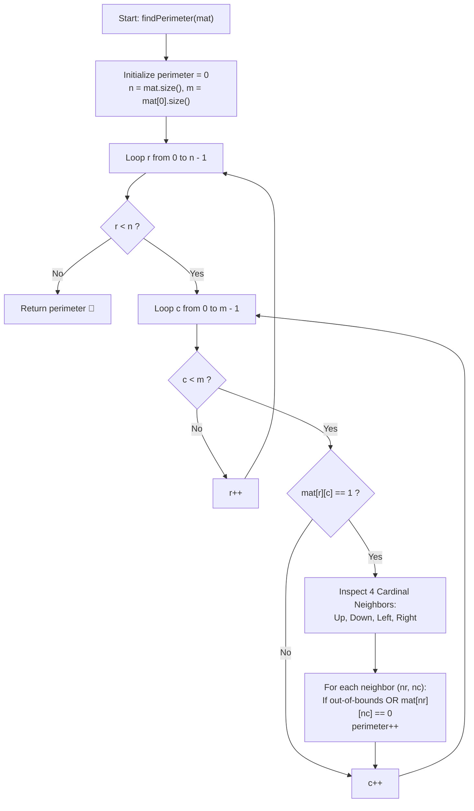

# 💡 Approach — Perimeter of Shapes in Binary Matrix

<div align="center">

  | 📄 [Problem](./Problem.md) | 💡 [Approach](./Approach.md) | 🧩 [Solution](./Solution.cpp) | 🚀 [Main](./Main.cpp) |
  |:--------------------------:|:-----------------------------:|:------------------------------:|:---------------------:|
</div>

## 📊 Metadata


---

> [!TIP]
> **Core Intuition — Boundary Edge Counting & Shared Side Cancellation:**
> 1. **Cell Edge Decomposition**:
>    Each isolated unit cell with $\text{mat}[r][c] = 1$ has $4$ edges of unit length $1$.
> 2. **Exposed Boundary Invariant**:
>    A side of cell $(r, c)$ contributes to the perimeter if and only if it touches:
>    - The matrix outer boundary ($nr < 0 \lor nr \ge n \lor nc < 0 \lor nc \ge m$), or
>    - A water/empty cell with $\text{mat}[nr][nc] == 0$.
> 3. **Shared Boundary Cancellation ($\mathcal{O}(1)$ Math Alternative)**:
>    Every time two cells containing $1$ are adjacent, they share a side. That single contact eliminates $2$ outer edges ($1$ from each cell).
>    Thus, if we add $4$ for every $1$-cell and subtract $2$ for every adjacent pair (e.g., checking only top and left neighbors to avoid double-counting), the exact same perimeter is obtained without checking all 4 directions repeatedly.

---

## 🔩 Step-by-Step Breakdown

### Method 1: 4-Directional Neighbor Inspection ($\mathcal{O}(n \times m)$ Time, $\mathcal{O}(1)$ Space) — Primary

1. **Matrix Dimensions & Accumulator Initialization**:
   - Determine $n = \text{mat.size()}$ and $m = \text{mat}[0]\text{.size()}$.
   - Initialize total perimeter counter `perimeter = 0`.

2. **Full Grid Traversal**:
   - Iterate through every row $r \in [0, n - 1]$ and every column $c \in [0, m - 1]$.
   - If $\text{mat}[r][c] == 0$, continue immediately.

3. **Check 4 Cardinal Neighbors**:
   - For each active cell where $\text{mat}[r][c] == 1$:
     - Check **Up** $(r - 1, c)$: If $r == 0$ or $\text{mat}[r - 1][c] == 0$, increment `perimeter++`.
     - Check **Down** $(r + 1, c)$: If $r == n - 1$ or $\text{mat}[r + 1][c] == 0$, increment `perimeter++`.
     - Check **Left** $(r, c - 1)$: If $c == 0$ or $\text{mat}[r][c - 1] == 0$, increment `perimeter++`.
     - Check **Right** $(r, c + 1)$: If $c == m - 1$ or $\text{mat}[r][c + 1] == 0$, increment `perimeter++`.

4. **Return Total Perimeter**:
   - Return the accumulated integer `perimeter`.

---

## 🔄 Mermaid Flowchart



---

## 🏃‍♂️ Dry Run

### Tracing Example 1: Matrix $3 \times 5$

```text
mat = [
  [0, 1, 0, 0, 0],
  [1, 1, 1, 0, 0],
  [1, 0, 0, 0, 0]
]
```

#### ASCII Visual Representation of Exposed Edges:

```text
       (c=1)
       ┌───┐
       │ 1 │  <- Up, Left, Right exposed (3)
   ┌───┼───┼───┐
   │ 1 │ 1 │ 1 │  <- (1,0): Up, Left (2); (1,1): Down (1); (1,2): Up, Down, Right (3)
   ├───┴───┴───┘
   │ 1 │          <- (2,0): Left, Down, Right (3)
   └───┘
```

#### Detailed Cell Contribution Table:

| Cell $(r, c)$ | Up Neighbor | Down Neighbor | Left Neighbor | Right Neighbor | Exposed Sides | Running Perimeter |
| :---: | :---: | :---: | :---: | :---: | :---: | :---: |
| **$(0, 1)$** | Out of bounds (`+1`) | $\text{mat}[1][1]=1$ (`+0`) | $\text{mat}[0][0]=0$ (`+1`) | $\text{mat}[0][2]=0$ (`+1`) | $3$ | $3$ |
| **$(1, 0)$** | $\text{mat}[0][0]=0$ (`+1`) | $\text{mat}[2][0]=1$ (`+0`) | Out of bounds (`+1`) | $\text{mat}[1][1]=1$ (`+0`) | $2$ | $5$ |
| **$(1, 1)$** | $\text{mat}[0][1]=1$ (`+0`) | $\text{mat}[2][1]=0$ (`+1`) | $\text{mat}[1][0]=1$ (`+0`) | $\text{mat}[1][2]=1$ (`+0`) | $1$ | $6$ |
| **$(1, 2)$** | $\text{mat}[0][2]=0$ (`+1`) | $\text{mat}[2][2]=0$ (`+1`) | $\text{mat}[1][1]=1$ (`+0`) | $\text{mat}[1][3]=0$ (`+1`) | $3$ | $9$ |
| **$(2, 0)$** | $\text{mat}[1][0]=1$ (`+0`) | Out of bounds (`+1`) | Out of bounds (`+1`) | $\text{mat}[2][1]=0$ (`+1`) | $3$ | **$12$** |

**Total Perimeter = $12$** ✅

---

## 📊 Complexity Analysis

| Complexity Metric | Estimation | Rationale |
| :--- | :---: | :--- |
| **Time Complexity** | $\mathcal{O}(n \times m)$ | Each cell in the $n \times m$ grid is visited once. For each active cell, at most $4$ constant-time boundary checks are performed. |
| **Auxiliary Space** | $\mathcal{O}(1)$ | Only a few scalar variables (`perimeter`, `r`, `c`, `dr`, `dc`) are used. No additional memory or recursion stack is required. |

---

> *"Perimeter measures the boundary between what is and what is not; every internal connection dissolves an edge to create a whole."*

---

<div align="center">
<h3>Happy Coding! 🚀</h3>
<a href="../249_Day/Approach.md">
  
</a>
<a href="https://x.com/PankajB42550" target="_blank">
  
</a>
<a href="../251_Day/Approach.md">
  
</a>
</div>
