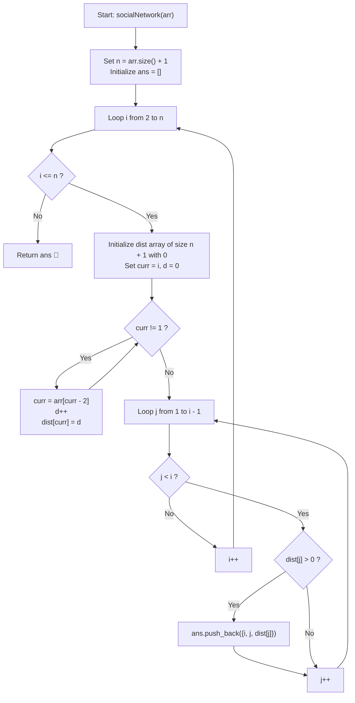

# 💡 Approach — Your Social Network

<div align="center">

  | 📄 [Problem](./Problem.md) | 💡 [Approach](./Approach.md) | 🧩 [Solution](./Solution.cpp) | 🚀 [Main](./Main.cpp) |
  |:--------------------------:|:-----------------------------:|:------------------------------:|:---------------------:|
</div>

## 📊 Metadata


---

> [!TIP]
> **Core Intuition — Directed Acyclic Forest & Ancestor Distance Propagation:**
> 1. **DAG / Tree Structure**:
>    Each user $i \ge 2$ has exactly one direct outgoing edge to a strictly smaller user $\text{arr}[i - 2] < i$. Since edges always point to smaller indices, the network forms a cycle-free directed tree/forest converging towards user $1$.
> 2. **Reachability Path Invariant**:
>    Because out-degree of every node $i \ge 2$ is exactly $1$, there is a unique simple directed path from $i$ terminating at user $1$. The users reachable from $i$ are precisely the ancestors along this chain.
> 3. **Ascending Order Requirement**:
>    For each user $i$, the output triplets $[i, j, k]$ must be sorted by user $j$ in ascending order ($1 \le j < i$). By storing computed distances in a direct address array `dist[j]` and scanning $j \in [1, i - 1]$, we guarantee natural sorted order without any post-processing sort.

---

## 🔩 Step-by-Step Breakdown

### Method 1: Iterative Path Tracing with Direct Indexing ($\mathcal{O}(n^2)$ Time, $\mathcal{O}(n)$ Auxiliary Space) — Primary

1. **Graph Dimensions & Result Storage**:
   - Determine total users $n = \text{arr.size()} + 1$.
   - Initialize 2D result vector `ans` to hold all $[i, j, k]$ triplets.

2. **Iterate Through Each User $i$**:
   - Loop $i$ from $2$ to $n$.
   - Maintain a local distance array `dist` of size $n + 1$ initialized to $0$.

3. **Follow Directed Friend Links to Root (User 1)**:
   - Start from `curr = i` with counter `distance = 0`.
   - While `curr != 1`:
     - Jump to friend: `curr = arr[curr - 2]`.
     - Increment `distance++`.
     - Record reachability: `dist[curr] = distance`.

4. **Collect Reachable Pairs in Natural Ascending Order**:
   - Loop $j$ from $1$ to $i - 1$:
     - If `dist[j] > 0`, append the triplet `{i, j, dist[j]}` to `ans`.

5. **Return Accumulated Result**:
   - Return `ans`.

---

### Method 2: Dynamic Programming / Ancestor Inheritance ($\mathcal{O}(n^2)$ Time, $\mathcal{O}(n^2)$ Auxiliary Space) — Alternative

1. **State Definition**:
   - Let `dist[i][j]` denote the directed distance from user $i$ to user $j$ ($0$ if unreachable).
2. **Base Transition**:
   - For user $i$, direct friend is $p = \text{arr}[i - 2]$.
   - `dist[i][p] = 1`.
   - For every $j < p$: if `dist[p][j] > 0`, then user $i$ reaches user $j$ via $p$ with distance:
     $$\text{dist}[i][j] = \text{dist}[p][j] + 1$$
3. **Ascending Extraction**:
   - Scan $j$ from $1$ to $i - 1$, appending `{i, j, dist[i][j]}` if `dist[i][j] > 0`.

---

## 🔄 Mermaid Flowchart



---

## 🏃‍♂️ Dry Run

### Tracing Example 1: `arr = [1, 2]` ($n = 3$)

Friend links:
- User 2's friend: `arr[0] = 1` ($2 \to 1$)
- User 3's friend: `arr[1] = 2` ($3 \to 2$)

```text
       (3)
        │
        │ link 1
        ▼
       (2)
        │
        │ link 1
        ▼
       (1)
```

| User $i$ | Traversal Step | `curr` | Friend `arr[curr-2]` | Distance $d$ | Recorded `dist` | Check $j \in [1, i-1]$ | Output Added |
| :---: | :---: | :---: | :---: | :---: | :---: | :---: | :---: |
| **$2$** | Step 1 | $2$ | $1$ | $1$ | `dist[1] = 1` | $j = 1$ (`dist[1] = 1`) | `[2, 1, 1]` |
| **$3$** | Step 1 | $3$ | $2$ | $1$ | `dist[2] = 1` | — | — |
| | Step 2 | $2$ | $1$ | $2$ | `dist[1] = 2` | $j = 1$ (`dist[1] = 2`)<br/>$j = 2$ (`dist[2] = 1`) | `[3, 1, 2]`<br/>`[3, 2, 1]` |

**Final Output:** `[[2, 1, 1], [3, 1, 2], [3, 2, 1]]` ✅

---

### Tracing Example 2: `arr = [1, 1]` ($n = 3$)

Friend links:
- User 2's friend: `arr[0] = 1` ($2 \to 1$)
- User 3's friend: `arr[1] = 1` ($3 \to 1$)

```text
       (2)     (3)
        │       │
        └───┬───┘
            ▼
           (1)
```

| User $i$ | Traversal Path | Recorded `dist` | Check $j \in [1, i-1]$ | Output Added |
| :---: | :---: | :---: | :---: | :---: |
| **$2$** | $2 \to 1$ ($d=1$) | `dist[1] = 1` | $j = 1$: reachable ($d=1$) | `[2, 1, 1]` |
| **$3$** | $3 \to 1$ ($d=1$) | `dist[1] = 1` | $j = 1$: reachable ($d=1$)<br/>$j = 2$: unreachable ($d=0$) | `[3, 1, 1]` |

**Final Output:** `[[2, 1, 1], [3, 1, 1]]` ✅

---

## 📊 Complexity Analysis

| Complexity Metric | Estimation | Rationale |
| :--- | :---: | :--- |
| **Time Complexity** | $\mathcal{O}(n^2)$ | For each user $i \in [2, n]$, following the path to user $1$ takes at most $i - 1 \le n$ hops. Scanning $j \in [1, i - 1]$ takes $i - 1 \le n$ steps. Total operations: $\sum_{i=2}^n \mathcal{O}(i) = \mathcal{O}(n^2)$. |
| **Auxiliary Space** | $\mathcal{O}(n^2)$ | The output array contains up to $\frac{n(n - 1)}{2} = \mathcal{O}(n^2)$ reachable triplets. The auxiliary distance lookup array uses $\mathcal{O}(n)$ per iteration. |

---

> *"In every hierarchy, looking upward reveals one's lineage; by tracing each single step, the entire constellation of connections becomes clear."*

---

<div align="center">
<h3>Happy Coding! 🚀</h3>
<a href="../250_Day/Approach.md">
  
</a>
<a href="https://x.com/PankajB42550" target="_blank">
  
</a>
<a href="../252_Day/Approach.md">
  
</a>
</div>
