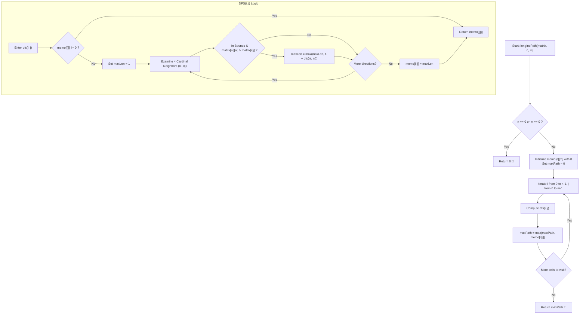

# 💡 Approach — Longest Increasing Path in Matrix

<div align="center">

  | 📄 [Problem](./Problem.md) | 💡 [Approach](./Approach.md) | 🧩 [Solution](./Solution.cpp) | 🚀 [Main](./Main.cpp) |
  |:--------------------------:|:-----------------------------:|:------------------------------:|:---------------------:|
</div>

## 📊 Metadata


---

> [!TIP]
> **Core Intuition — Directed Acyclic Graph (DAG) & Memoized DFS:**
> 1. **Implicit Topological Order**:
>    Because movement is strictly constrained to strictly greater neighbors ($\text{matrix}[ni][nj] > \text{matrix}[i][j]$), cycles are fundamentally impossible. The matrix naturally behaves as a Directed Acyclic Graph (DAG).
> 2. **Optimal Substructure**:
>    For any cell $(i, j)$, its longest increasing path length $\text{LIP}(i, j)$ depends solely on the longest increasing path lengths of its strictly greater 4-directional neighbors:
>    $$\text{LIP}(i, j) = 1 + \max_{(ni, nj) \in \text{Neighbors}, \text{matrix}[ni][nj] > \text{matrix}[i][j]} \text{LIP}(ni, nj)$$
>    If no strictly greater neighbor exists, $(i, j)$ is a peak with $\text{LIP}(i, j) = 1$.
> 3. **Memoization Avoids Redundant Work**:
>    Without memoization, overlapping paths cause exponential $\mathcal{O}(4^{n \times m})$ time complexity. With a $2\text{D}$ lookup table `memo[n][m]` initialized to $0$, each state is computed once and reused in $\mathcal{O}(1)$ time.

---

## 🔩 Step-by-Step Breakdown

### Method 1: Depth-First Search with 2D Memoization ($\mathcal{O}(n \times m)$ Time, $\mathcal{O}(n \times m)$ Auxiliary Space) — Primary

1. **Grid Validation & Memoization Initialization**:
   - Check if $n == 0$ or $m == 0$. If so, return $0$.
   - Allocate a 2D integer table `memo[n][m]` initialized to $0$. A value of $0$ indicates an uncomputed cell.
   - Maintain a variable `maxPath = 0` to record the global maximum path length found across all starting cells.

2. **DFS Function with Memoized Lookups**:
   - For a given cell $(i, j)$:
     - If `memo[i][j] != 0`, immediately return `memo[i][j]`.
     - Initialize `maxLen = 1` (a path consisting only of the current cell).
     - Traverse the 4 cardinal directions using offset vectors:
       $$\text{dx} = \{-1, 1, 0, 0\}, \quad \text{dy} = \{0, 0, -1, 1\}$$
     - For each neighbor $(ni, nj) = (i + \text{dx}[k], j + \text{dy}[k])$:
       - Validate boundary conditions: $0 \le ni < n$ and $0 \le nj < m$.
       - Check strictly increasing criterion: $\text{matrix}[ni][nj] > \text{matrix}[i][j]$.
       - If valid, update:
         $$\text{maxLen} = \max(\text{maxLen}, 1 + \text{dfs}(ni, nj))$$
     - Save `memo[i][j] = maxLen` and return `maxLen`.

3. **Global Scan Over All Matrix Cells**:
   - Iterate $i$ from $0$ to $n - 1$ and $j$ from $0$ to $m - 1$:
     - Update $\text{maxPath} = \max(\text{maxPath}, \text{dfs}(i, j))$.

4. **Return Result**:
   - Return `maxPath`.

---

### Method 2: Topological Sort / Out-Degree Layer Peeling ($\mathcal{O}(n \times m)$ Time, $\mathcal{O}(n \times m)$ Auxiliary Space) — Alternative

1. **DAG Out-Degree Computation**:
   - For every cell $(i, j)$, calculate its `outDegree[i][j]` as the number of adjacent cells $(ni, nj)$ strictly greater than `matrix[i][j]`.
   - Cells with `outDegree == 0` represent local peaks / sink nodes (cannot extend any further).

2. **Queue Initialization with Sink Nodes**:
   - Enqueue all cells with `outDegree[i][j] == 0` into a FIFO queue.

3. **Layer-by-Layer Peeling (Reverse Topological BFS)**:
   - While the queue is not empty:
     - Increment `pathLen` by $1$.
     - For all elements currently in the queue:
       - Pop $(ci, cj)$.
       - Inspect all 4 neighbors $(pi, pj)$ that are strictly smaller ($\text{matrix}[ci][cj] > \text{matrix}[pi][pj]$).
       - Decrement $\text{outDegree}[pi][pj]$ by $1$.
       - If $\text{outDegree}[pi][pj] == 0$, enqueue $(pi, pj)$.

4. **Return Topological Depth**:
   - The total number of peeled layers equals the longest increasing path length.

---

## 🔄 Mermaid Flowchart



---

## 🏃‍♂️ Dry Run

### Tracing Example 2: `matrix = [[3, 4, 5], [6, 2, 6], [2, 2, 1]]` ($n = 3, m = 3$)

```text
Input Grid:
┌───┬───┬───┐
│ 3 │ 4 │ 5 │
├───┼───┼───┤
│ 6 │ 2 │ 6 │
├───┼───┼───┤
│ 2 │ 2 │ 1 │
└───┴───┴───┘
```

#### Step-by-Step Traversal from Cell $(0, 0)$ (`val = 3`):
1. **At $(0, 0)$ (`val = 3`)**:
   - Up: out of bounds.
   - Down: $(1, 0)$ (`val = 6 > 3`) -> Valid! Recurse on $(1, 0)$.
     - **At $(1, 0)$ (`val = 6`)**:
       - No neighbor has value $> 6$.
       - `memo[1][0] = 1`.
   - Right: $(0, 1)$ (`val = 4 > 3`) -> Valid! Recurse on $(0, 1)$.
     - **At $(0, 1)$ (`val = 4`)**:
       - Right: $(0, 2)$ (`val = 5 > 4`) -> Valid! Recurse on $(0, 2)$.
         - **At $(0, 2)$ (`val = 5`)**:
           - Down: $(1, 2)$ (`val = 6 > 5`) -> Valid! Recurse on $(1, 2)$.
             - **At $(1, 2)$ (`val = 6`)**:
               - No neighbor has value $> 6$.
               - `memo[1][2] = 1`.
           - `memo[0][2] = 1 + memo[1][2] = 1 + 1 = 2`.
       - Down: $(1, 1)$ (`val = 2 < 4`) -> Invalid.
       - `memo[0][1] = 1 + memo[0][2] = 1 + 2 = 3`.
   - Path through $(0, 1)$ gives $1 + 3 = 4$.
   - `memo[0][0] = 4`.

#### Final Computed `memo` Grid:
```text
┌───┬───┬───┐
│ 4 │ 3 │ 2 │
├───┼───┼───┤
│ 1 │ 2 │ 1 │
├───┼───┼───┤
│ 2 │ 2 │ 3 │
└───┴───┴───┘
```

Longest increasing path: $(0, 0) \to (0, 1) \to (0, 2) \to (1, 2)$ (values: $3 \to 4 \to 5 \to 6$) of length **$4$** ✅.

---

## 📊 Complexity Analysis

| Complexity Metric | Estimation | Rationale |
| :--- | :---: | :--- |
| **Time Complexity** | $\mathcal{O}(n \times m)$ | Each cell is visited and its optimal path computed exactly once thanks to memoization. For each cell, we check at most $4$ adjacent neighbors ($\mathcal{O}(1)$ transitions). |
| **Auxiliary Space** | $\mathcal{O}(n \times m)$ | The `memo` grid requires $\mathcal{O}(n \times m)$ storage. The recursion stack in the worst case (a snake-like path visiting every cell) reaches depth $\mathcal{O}(n \times m)$. |

---

> *"In an ascending landscape, every peak is an endpoint, and every valley is an invitation. By remembering the height of every summit, the longest climb is found without taking a single repeated step."*

---

<div align="center">
<h3>Happy Coding! 🚀</h3>
<a href="../251_Day/Approach.md">
  
</a>
<a href="https://x.com/PankajB42550" target="_blank">
  
</a>
<a href="../253_Day/Approach.md">
  
</a>
</div>
