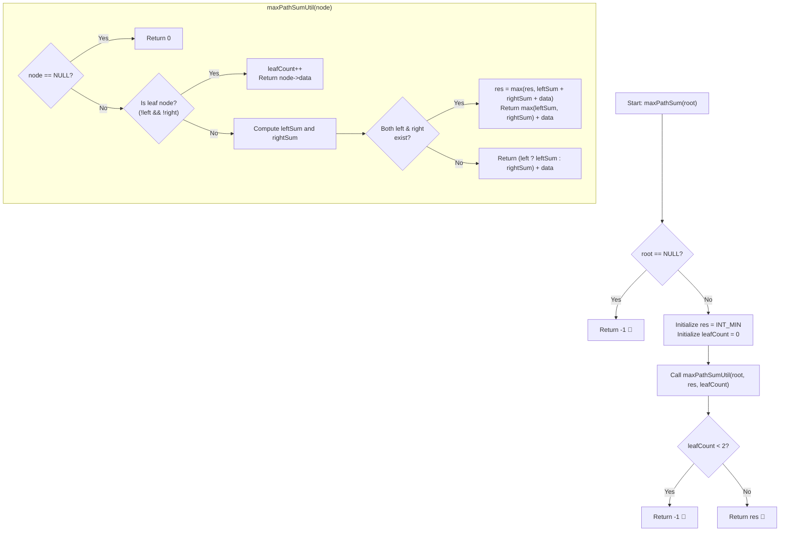

# 💡 Approach — Max Path Sum Between Two Leaves

<div align="center">

  | 📄 [Problem](./Problem.md) | 💡 [Approach](./Approach.md) | 🧩 [Solution](./Solution.cpp) | 🚀 [Main](./Main.cpp) |
  |:--------------------------:|:-----------------------------:|:------------------------------:|:---------------------:|
</div>

## 📊 Metadata


---

> [!TIP]
> **Core Intuition — Bottom-Up Post-Order Traversal & Junction Evaluation:**
> 1. **Structural Invariant of a Leaf-to-Leaf Path**:
>    A valid leaf-to-leaf path originates at some leaf $L_1$, ascends through ancestors until reaching their Lowest Common Ancestor (LCA), and descends to another leaf $L_2$. Thus, the apex of every valid path is an internal node possessing **both** non-null left and right subtrees.
> 2. **Branch Contribution vs. Complete Path**:
>    - When returning to its parent, a node can only extend a path downwards along **one** trajectory (either through its left child or its right child). The optimal contribution of a subtree is $\max(\text{leftSubtree}, \text{rightSubtree}) + \text{node}\to\text{data}$.
>    - At any node where **both** children exist, a complete leaf-to-leaf path is formed by joining the optimal downward paths from both sides:
>      $$\text{CandidateSum} = \text{leftSubtree} + \text{rightSubtree} + \text{node}\to\text{data}$$
>      We greedily update our global result with this candidate sum.
> 3. **Handling Trees with Insufficient Leaves**:
>    If a binary tree has fewer than 2 leaf nodes (e.g. empty tree, single root node, or a linear degenerate chain where every node has $\le 1$ child), no two leaves exist. The algorithm must detect this structural deficit and return `-1`.

---

## 🔩 Step-by-Step Breakdown

### Method 1: Single-Pass Post-Order DFS with Leaf Tracking ($\mathcal{O}(n)$ Time, $\mathcal{O}(h)$ Auxiliary Space) — Primary

1. **State Tracking**:
   - Maintain a global or referenced variable `res = INT_MIN` to track the maximum leaf-to-leaf path sum discovered.
   - Maintain a counter `leafCount = 0` to record the total number of valid leaves traversed.

2. **Recursive Traversal (`maxPathSumUtil(node, res, leafCount)`)**:
   - **Base Case (Null Pointer)**: If `node == NULL`, return `0`.
   - **Base Case (Leaf Node)**: If `!node->left && !node->right`:
     - Increment `leafCount++`.
     - Return `node->data`.
   - **Recursive Step**:
     - Compute optimal downward path from left child: `leftSum = node->left ? maxPathSumUtil(node->left, ...) : 0`.
     - Compute optimal downward path from right child: `rightSum = node->right ? maxPathSumUtil(node->right, ...) : 0`.
   - **Junction Evaluation (Both Children Present)**:
     - If `node->left && node->right`:
       - Update global result: `res = max(res, leftSum + rightSum + node->data)`.
       - Return `max(leftSum, rightSum) + node->data` to the parent.
   - **Single Child Propagation**:
     - If only one child exists, a path between two leaves cannot turn at this node; it must continue upwards. Return `(node->left ? leftSum : rightSum) + node->data`.

3. **Validation and Final Result**:
   - If `!root || leafCount < 2`, return `-1`.
   - Otherwise, return `res`.

---

### Method 2: Two-Phase Traversal (Leaf Counting + Recursive Path Maximization) — Alternative

1. **Phase 1 (Leaf Count Validation)**:
   - Perform a quick recursive traversal counting the number of nodes where `!node->left && !node->right`.
   - If count is $< 2$, immediately short-circuit and return `-1`.

2. **Phase 2 (Subtree Path DP)**:
   - Execute the post-order depth-first search knowing with certainty that at least one junction node exists (since in any binary tree, $\text{Leaves} = 1 + N_2$, where $N_2$ is the number of nodes with two children).
   - Return the calculated `res`.

---

## 🔄 Mermaid Flowchart



---

## 🏃‍♂️ Dry Run

### Detailed Walkthrough: Example 1 (`root = [3, 4, 5, -10, 4, N, N]`)

#### Tree Structure:
```text
          3
         / \
        4   5
       / \
     -10  4
```

#### Step-by-Step Execution Table:

| Step | Visited Node | Node Type | Left Child Sum | Right Child Sum | Both Children? | Candidate Path Sum (`L + R + Val`) | Global `res` | Return to Parent |
| :---: | :---: | :---: | :---: | :---: | :---: | :---: | :---: | :---: |
| 1 | `node(-10)` | Leaf | `0` | `0` | No | — | `INT_MIN` | `-10` |
| 2 | `node(4)` (right) | Leaf | `0` | `0` | No | — | `INT_MIN` | `4` |
| 3 | `node(4)` (parent) | Junction | `-10` | `4` | **Yes** | `-10 + 4 + 4 = -2` | `-2` | `max(-10, 4) + 4 = 8` |
| 4 | `node(5)` | Leaf | `0` | `0` | No | — | `-2` | `5` |
| 5 | `node(3)` (root) | Junction | `8` | `5` | **Yes** | `8 + 5 + 3 = 16` | **`16`** | `max(8, 5) + 3 = 11` |

- **Total leaves encountered**: `3` (nodes `-10`, `4`, `5`).
- **Final Result**: Since `leafCount = 3 >= 2`, returns `res = 16`.
- **Optimal Path**: Leaf `4` $\to$ `4` $\to$ `3` $\to$ `5` = $4 + 4 + 3 + 5 = 16$.

---

### Detailed Walkthrough: Example 3 (`root = [3, 4, 1, -10, 4, N, N]`)

#### Tree Structure:
```text
          3
         / \
        4   1
       / \
     -10  4
```

- Node `-10` returns `-10` (leaf).
- Node `4` (right of 4) returns `4` (leaf).
- Node `4` (left child of 3) evaluates `-10 + 4 + 4 = -2`, `res` becomes `-2`. Returns `max(-10, 4) + 4 = 8`.
- Node `1` returns `1` (leaf).
- Node `3` evaluates `8 + 1 + 3 = 12`, `res` becomes `max(-2, 12) = 12`. Returns `8 + 3 = 11`.
- **Final Result**: `12`.

---

## 📊 Complexity Analysis

| Complexity Metric | Estimation | Rationale |
| :--- | :---: | :--- |
| **Time Complexity** | $\mathcal{O}(n)$ | Every node in the binary tree is visited exactly once in a standard post-order depth-first traversal. All operations at each node take $\mathcal{O}(1)$ time. |
| **Auxiliary Space** | $\mathcal{O}(h)$ | The call stack depth is determined by the maximum tree height $h$. For a balanced binary tree, $h = \mathcal{O}(\log n)$; in the worst-case skewed tree, $h = \mathcal{O}(n)$. |

---

> *"A leaf cannot choose its branch, but together two leaves can span the greatest heights of the tree."*

---

<div align="center">
<h3>Happy Coding! 🚀</h3>
<a href="../252_Day/Approach.md">
  
</a>
<a href="https://x.com/PankajB42550" target="_blank">
  
</a>
<a href="../254_Day/Approach.md">
  
</a>
</div>
