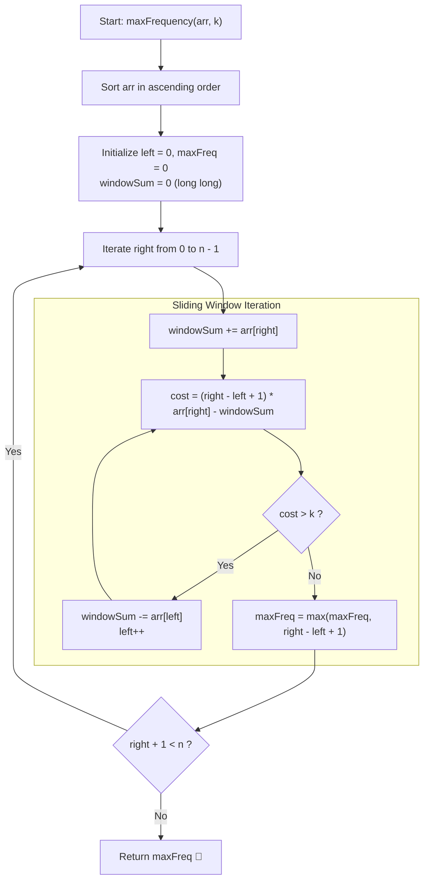

# 💡 Approach — Maximum Frequency with K Increments

  | 📄 [Problem](./Problem.md) | 💡 [Approach](./Approach.md) | 🧩 [Solution](./Solution.cpp) | 🚀 [Main](./Main.cpp) |
  |:--------------------------:|:-----------------------------:|:------------------------------:|:---------------------:|

## 📊 Metadata

---

> [!TIP]
> **Core Intuition — Monotonic Sorting & Dynamic Sliding Window:**
> 1. **Greedy Target Choice**:
>    Because our only permitted operation is incrementing by $+1$, we can never decrease a larger number to match a smaller one. Thus, to make a group of elements equal to some value $X$, all elements in that group must initially be $\le X$. To minimize total increments, $X$ should be one of the array elements. In a sorted array, for any candidate subarray $\text{arr}[L \dots R]$, the optimal target is the maximum element in that range, which is $\text{arr}[R]$.
> 2. **Window Cost Formulation**:
>    To elevate every element in $\text{arr}[L \dots R]$ to equal $\text{arr}[R]$, the total number of operations required is:
>    $$\text{Cost}(L, R) = (R - L + 1) \times \text{arr}[R] - \sum_{i=L}^{R} \text{arr}[i]$$
> 3. **Sliding Window Invariant**:
>    Sorting ensures that as right pointer $R$ moves right, $\text{arr}[R]$ is non-decreasing. If the required cost to equalize window $[L \dots R]$ exceeds our budget $k$, incrementing $L$ strictly decreases the window cost. Since both $L$ and $R$ advance at most $n$ times, we achieve optimal $\mathcal{O}(n)$ time after sorting.

---

## 🔩 Step-by-Step Breakdown

### Method 1: Sorting + Sliding Window ($\mathcal{O}(n \log n)$ Time, $\mathcal{O}(1)$ Auxiliary Space) — Primary

1. **Sort the Array**:
   - Sort $\text{arr}$ in ascending numerical order so that elements in any contiguous range $[L \dots R]$ are bounded above by $\text{arr}[R]$.

2. **Initialize Pointers & Running Sum**:
   - Let `left = 0`, `maxFreq = 0`, and `windowSum = 0` (using a 64-bit integer `long long` to prevent arithmetic overflow since $n \le 10^5$ and $\text{arr}[i] \le 10^6$, meaning sum can reach $10^{11}$).

3. **Expand the Window (Right Pointer $R$)**:
   - For each index $R$ from $0$ to $n - 1$:
     - Add $\text{arr}[R]$ to `windowSum`.
     - Calculate the required operations:
       $$\text{cost} = (R - L + 1) \times \text{arr}[R] - \text{windowSum}$$

4. **Shrink the Window (Left Pointer $L$)**:
   - While $\text{cost} > k$:
     - Subtract $\text{arr}[L]$ from `windowSum`.
     - Increment $L$ by $1$.
     - Recompute `cost`.

5. **Update Answer**:
   - Update $\text{maxFreq} = \max(\text{maxFreq}, R - L + 1)$.

6. **Final Return**:
   - Return `maxFreq` as the maximum frequency achievable.

---

### Method 2: Sorting + Prefix Sums + Binary Search on Answer ($\mathcal{O}(n \log n)$ Time, $\mathcal{O}(n)$ Space) — Alternative

1. **Binary Search Range**:
   - The possible answer for maximum frequency lies in the range $[1, n]$.
2. **Feasibility Predicate (`canAchieve(len, k)`)**:
   - For a candidate frequency `len`, check if there exists any contiguous window of size `len` in the sorted array such that:
     $$\text{len} \times \text{arr}[i] - (\text{prefix}[i + 1] - \text{prefix}[i - \text{len} + 1]) \le k$$
   - Using prefix sums, this check takes $\mathcal{O}(n)$ time.
3. **Binary Search Transition**:
   - If `canAchieve(mid, k)` is true, try larger frequencies (`low = mid + 1`).
   - Otherwise, shrink search range (`high = mid - 1`).

---

## 🔄 Mermaid Flowchart

---

## 🏃‍♂️ Dry Run

### Detailed Walkthrough: Example 1 (`arr = [2, 2, 4], k = 4`)

1. **Initial Sorted Array**: `arr = [2, 2, 4]`, $n = 3$, $k = 4$.
2. **Initialization**: `left = 0`, `maxFreq = 0`, `windowSum = 0`.

| Step | `right` | `arr[right]` | `windowSum` | Window $[L \dots R]$ | Window Length | Operations Needed: $(R - L + 1) \times \text{arr}[R] - \text{Sum}$ | Condition $(\le k)$ | Action | `maxFreq` |
|:---:|:---:|:---:|:---:|:---:|:---:|:---:|:---:|:---:|:---:|
| 1 | `0` | `2` | `2` | `[2]` | `1` | $1 \times 2 - 2 = 0$ | $0 \le 4$ ✅ | Keep $L = 0$ | $1$ |
| 2 | `1` | `2` | `4` | `[2, 2]` | `2` | $2 \times 2 - 4 = 0$ | $0 \le 4$ ✅ | Keep $L = 0$ | $2$ |
| 3 | `2` | `4` | `8` | `[2, 2, 4]` | `3` | $3 \times 4 - 8 = 4$ | $4 \le 4$ ✅ | Keep $L = 0$ | $3$ |

- **Final Answer**: `maxFreq = 3`.

---

## 📊 Complexity Analysis

| Complexity Metric | Estimation | Rationale |
| :--- | :---: | :--- |
| **Time Complexity** | $\mathcal{O}(n \log n)$ | Sorting the array of $n$ elements dominates with $\mathcal{O}(n \log n)$. During the two-pointer sliding window, both `left` and `right` advance from $0$ to $n - 1$ at most once, performing $\mathcal{O}(1)$ operations per step, giving $\mathcal{O}(n)$ window traversal time. |
| **Auxiliary Space** | $\mathcal{O}(1)$ | The sliding window executes purely in-place on the sorted vector using primitive scalar variables (`left`, `right`, `windowSum`, `maxFreq`). Standard in-place sort uses $\mathcal{O}(\log n)$ stack space. |

---

> *"Progress is made not by pulling the highest peaks down, but by lifting every valley up to meet them."*

---

<h3>Happy Coding! 🚀</h3>

