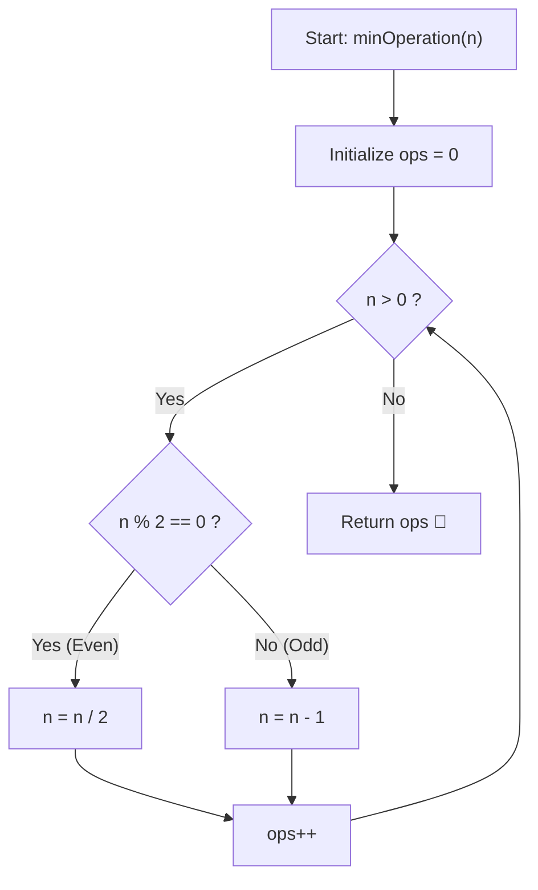

# 💡 Approach — Minimum Operations to Reach n

  | 📄 [Problem](./Problem.md) | 💡 [Approach](./Approach.md) | 🧩 [Solution](./Solution.cpp) | 🚀 [Main](./Main.cpp) |
  |:--------------------------:|:-----------------------------:|:------------------------------:|:---------------------:|

## 📊 Metadata

---

> [!TIP]
> **Core Intuition — Reverse Reduction Strategy:**
> 1. **Reverse Invariant**:
>    Moving forward from $0$ to $n$:
>    - Doubling: $x \to 2x$
>    - Increment: $x \to x + 1$
>    In reverse, starting from $n$ and reducing down to $0$:
>    - Halving: $n \to n / 2$ (only valid when $n$ is even)
>    - Decrement: $n \to n - 1$
> 2. **Greedy Superiority**:
>    Dividing by $2$ cuts the value in half in a single operation, which is exponentially faster than subtracting $1$. Therefore, whenever $n$ is even, halving is always strictly optimal.
>    When $n$ is odd, the previous number could not have been created via doubling (since $2x$ is always even), so the preceding operation *must* have been an addition of $1$. Hence, we subtract $1$.
> 3. **Binary Representation Insight**:
>    In binary, dividing an even number by $2$ corresponds to a right bit-shift (`>> 1`), and subtracting $1$ from an odd number clears the least significant bit ($1 \to 0$).
>    Thus, the total operations needed equals:
>    $$\text{Operations} = (\text{Bit Length of } n - 1) + (\text{Count of Set Bits in } n)$$

---

## 🔩 Step-by-Step Breakdown

### Method 1: Greedy Backward Simulation ($\mathcal{O}(\log n)$ Time, $\mathcal{O}(1)$ Space) — Primary

1. **Initialize Operation Counter**:
   - Set `ops = 0`.
2. **Iterate While $n > 0$**:
   - If $n$ is even ($n \pmod 2 == 0$):
     - Halve the number: $n = n / 2$.
   - Else ($n$ is odd):
     - Decrement the number: $n = n - 1$.
   - Increment `ops++`.
3. **Terminate & Return**:
   - Once $n == 0$, return `ops`.

---

### Method 2: Bit Manipulation Formula ($\mathcal{O}(\log n)$ Time, $\mathcal{O}(1)$ Space) — Mathematical

1. **Bit Length & Popcount**:
   - Let $L$ be the bit length of $n$ (position of the most significant bit $+ 1$).
   - Let $S$ be the count of set bits (`1`s) in the binary representation of $n$.
2. **Operations Derivation**:
   - To reduce $n$ to $0$:
     - Each `1` bit in the binary representation requires a subtraction (except that each non-terminal state shifts right).
     - Each bit position shift to the right requires one division by $2$, totaling $L - 1$ divisions.
     - Each `1` bit encountered requires one subtraction of $1$, totaling $S$ subtractions.
   - Total operations:
     $$\text{Total Ops} = (L - 1) + S$$

---

### Method 3: Dynamic Programming ($\mathcal{O}(n)$ Time, $\mathcal{O}(n)$ Space) — Conceptual Verification

1. **State Definition**:
   - Let `dp[i]` denote the minimum operations required to reach integer `i` from `0`.
2. **Base Cases**:
   - `dp[0] = 0`
   - `dp[1] = 1`
3. **Transition**:
   - For $i \ge 2$:
     - If $i$ is even: `dp[i] = min(dp[i - 1] + 1, dp[i / 2] + 1)`
     - If $i$ is odd: `dp[i] = dp[i - 1] + 1`
4. **Result**:
   - Return `dp[n]`.

---

## 🔄 Mermaid Flowchart

---

## 🏃‍♂️ Dry Run

### Detailed Walkthrough: Example 2 (`n = 7`)

- **Target**: $n = 7$
- **Binary Representation**: $7 = 111_2$ (Bit Length $L = 3$, Set Bits $S = 3$)
- **Formula Expectation**: $(3 - 1) + 3 = 5$

| Step | Current $n$ | Parity | Action Taken | Next $n$ | `ops` Counter | Operations So Far |
|:---:|:---:|:---:|:---:|:---:|:---:|:---:|
| 1 | 7 | Odd | Subtract 1 ($7 - 1$) | 6 | 1 | `-1` |
| 2 | 6 | Even | Divide by 2 ($6 / 2$) | 3 | 2 | `-1, /2` |
| 3 | 3 | Odd | Subtract 1 ($3 - 1$) | 2 | 3 | `-1, /2, -1` |
| 4 | 2 | Even | Divide by 2 ($2 / 2$) | 1 | 4 | `-1, /2, -1, /2` |
| 5 | 1 | Odd | Subtract 1 ($1 - 1$) | 0 | 5 | `-1, /2, -1, /2, -1` |

- **Reversed Sequence (0 to 7)**:
  $0 \xrightarrow{+1} 1 \xrightarrow{\times 2} 2 \xrightarrow{+1} 3 \xrightarrow{\times 2} 6 \xrightarrow{+1} 7$ (Total 5 operations).
- **Result**: `ops = 5`.

---

## 📊 Complexity Analysis

| Complexity Metric | Estimation | Rationale |
| :--- | :---: | :--- |
| **Time Complexity** | $\mathcal{O}(\log n)$ | At each step, if $n$ is odd, subtracting $1$ produces an even number. The subsequent step always divides $n$ by $2$. Thus, $n$ is halved at least once every two steps, running in $\le 2 \log_2 n$ operations. |
| **Auxiliary Space** | $\mathcal{O}(1)$ | Only a single scalar integer variable `ops` is maintained across iterations without extra data structures. |

---

> *"When a path from start to finish seems scattered with possibilities, reverse the flow: the destination often holds the singular key."*

---

<h3>Happy Coding! 🚀</h3>

