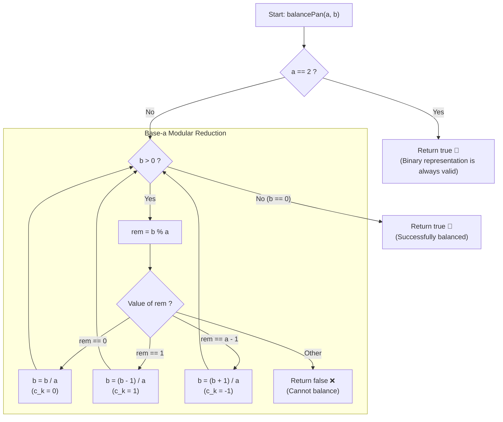

# 💡 Approach — Balancing with Distinct Powers

  | 📄 [Problem](./Problem.md) | 💡 [Approach](./Approach.md) | 🧩 [Solution](./Solution.cpp) | 🚀 [Main](./Main.cpp) |
  |:--------------------------:|:-----------------------------:|:------------------------------:|:---------------------:|

## 📊 Metadata

---

> [!TIP]
> **Core Intuition — Reduction via Balanced Base Modular Arithmetic:**
> 1. **Mathematical Equivalence**:
>    Placing distinct powers of $a$ on either pan to balance target $b$ can be rewritten as:
>    $$b + \sum_{i \in S_1} a^i = \sum_{j \in S_2} a^j \iff b = \sum_{j \in S_2} a^j - \sum_{i \in S_1} a^i$$
>    Since $S_1 \cap S_2 = \emptyset$, each power $a^k$ is assigned a ternary coefficient $c_k \in \{-1, 0, 1\}$.
> 2. **Modular Invariant & Greedy Elimination**:
>    At power $a^0 = 1$, only $c_0$ can alter $b$'s remainder modulo $a$:
>    - $b \pmod a == 0 \implies c_0 = 0$: no weight of $a^0$ needed. Advance $b = b / a$.
>    - $b \pmod a == 1 \implies c_0 = 1$: weight $a^0$ placed on the opposite pan. Advance $b = (b - 1) / a$.
>    - $b \pmod a == a - 1 \implies c_0 = -1$: weight $a^0$ placed on the same pan as $b$, effectively adding $1$ to make $b + 1$ divisible by $a$. Advance $b = (b + 1) / a$.
>    - Any other remainder: impossible to neutralize with coefficient $\in \{-1, 0, 1\}$. Return `false`.
> 3. **The $a = 2$ Edge Invariant**:
>    When $a = 2$, every positive integer has a valid binary representation using only $\{0, 1\}$, so it can always be balanced ($S_1 = \emptyset$) without placing any weights on $b$'s side.

---

## 🔩 Step-by-Step Breakdown

### Method 1: Iterative Balanced Base-$a$ Simulation ($\mathcal{O}(\log_a b)$ Time, $\mathcal{O}(1)$ Space) — Primary

1. **Handle Base $a = 2$**:
   - If $a == 2$, return `true` immediately, as any integer can be expressed in standard binary base-$2$ using coefficients $\{0, 1\}$.
2. **Iterate While $b > 0$**:
   - Compute current residue: `rem = b % a`.
   - **Case 1 (`rem == 0`)**:
     - The current power $a^k$ is not used. Set `b /= a`.
   - **Case 2 (`rem == 1`)**:
     - Weight $a^k$ placed on the opposite pan ($c_k = 1$). Set `b = (b - 1) / a` (or `b /= a`).
   - **Case 3 (`rem == a - 1`)**:
     - Weight $a^k$ placed with $b$ on the same pan ($c_k = -1$). Set `b = (b + 1) / a`.
   - **Case 4 (Any other remainder)**:
     - No valid single power can satisfy the modular equation. Return `false`.
3. **Completion**:
   - If loop exits with $b == 0$, return `true`.

---

### Method 2: Recursive Balanced Base Reduction ($\mathcal{O}(\log_a b)$ Time, $\mathcal{O}(\log_a b)$ Space) — Alternative

1. **Base Cases**:
   - If $b == 0$, return `true`.
   - If $a == 2$, return `true`.
2. **Recursive Step**:
   - `rem = b % a`.
   - If `rem == 0 || rem == 1`: return `balancePan(a, b / a)`.
   - If `rem == a - 1`: return `balancePan(a, (b + 1) / a)`.
   - Otherwise: return `false`.

---

## 🔄 Mermaid Flowchart

---

## 🏃‍♂️ Dry Run

### Detailed Walkthrough: Example 1 ($a = 4, b = 11$)

- **Inputs**: $a = 4, b = 11$
- **Target**: Balance $11 + \sum 4^i = \sum 4^j$

| Step | Current $b$ | `b % a` | Condition | Pan Placement | Action on $b$ | Next $b$ |
|:---:|:---:|:---:|:---:|:---:|:---:|:---:|
| 1 | 11 | $11 \pmod 4 = 3 = a - 1$ | $c_0 = -1$ | Place $4^0 = 1$ with $b$ | $b \leftarrow (11 + 1) / 4$ | 3 |
| 2 | 3 | $3 \pmod 4 = 3 = a - 1$ | $c_1 = -1$ | Place $4^1 = 4$ with $b$ | $b \leftarrow (3 + 1) / 4$ | 1 |
| 3 | 1 | $1 \pmod 4 = 1$ | $c_2 = 1$ | Place $4^2 = 16$ on opposite pan | $b \leftarrow (1 - 1) / 4$ | 0 |

- **Verification**:
  - Pan 1 (with $b$): $11 + 4^0 + 4^1 = 11 + 1 + 4 = 16$.
  - Pan 2 (opposite): $4^2 = 16$.
  - Result: Scale balances perfectly! Returns `true`.

---

### Detailed Walkthrough: Counter-Example ($a = 4, b = 7$)

- **Inputs**: $a = 4, b = 7$

| Step | Current $b$ | `b % a` | Condition | Action on $b$ | Next $b$ | Outcome |
|:---:|:---:|:---:|:---:|:---:|:---:|:---:|
| 1 | 7 | $7 \pmod 4 = 3 = a - 1$ | $c_0 = -1$ | $b \leftarrow (7 + 1) / 4$ | 2 | Continue |
| 2 | 2 | $2 \pmod 4 = 2$ | Neither $0, 1,$ nor $3$ | Cannot eliminate $2$ | — | **Returns `false`** |

- **Verification**:
  - $7 = 4^1 + 3$, which requires two $4^0$ weights to balance against $4^2 - 4^1 - 2$, but each power can only be used at most once.

---

## 📊 Complexity Analysis

| Complexity Metric | Estimation | Rationale |
| :--- | :---: | :--- |
| **Time Complexity** | $\mathcal{O}(\log_a b)$ | In every step, $b$ is divided by $a \ge 2$ (with an addition/subtraction of at most $1$). The loop terminates in at most $\lceil\log_a b\rceil + 1$ iterations. |
| **Auxiliary Space** | $\mathcal{O}(1)$ | The iterative method uses only $\mathcal{O}(1)$ space, operating directly with scalar variables `rem` and `b`. |

---

> *"Equilibrium is not found by adding force to one side alone, but by discerning the harmony between what is given and what is opposed."*

---

<h3>Happy Coding! 🚀</h3>

