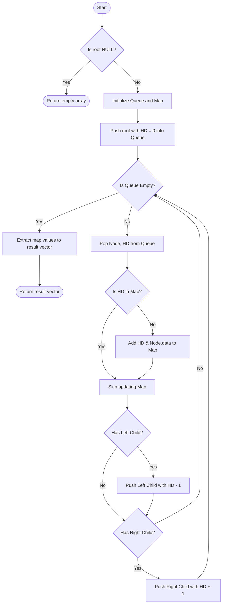

# 💡 Approach — Top View of Binary Tree

<div align="center">

| 📄 [Problem](./Problem.md) | 💡 [Approach](./Approach.md) | 🧩 [Solution](./Solution.cpp) | 🚀 [Main](./Main.cpp) |
|:--------------------------:|:-----------------------------:|:------------------------------:|:---------------------:|

</div>

---

## 📊 Metadata


---

> [!TIP]
> **Technical Insight:** The top view of a binary tree is conceptually equivalent to observing the topmost nodes mapped on a 1D horizontal axis. Using Breadth-First Search (BFS) combined with a hash map to track the horizontal distance (HD) ensures we capture the first (and therefore topmost) node at each horizontal position efficiently.

---

## 🎯 Logic & Intuition

To determine the top view, we need a way to track the horizontal alignment of each node relative to the root. We can assign a horizontal distance (HD) to each node:
- The **root** has an `HD = 0`.
- Moving to the **left child** decreases the HD by `1` (`HD - 1`).
- Moving to the **right child** increases the HD by `1` (`HD + 1`).

If multiple nodes fall onto the same horizontal distance, only the one closest to the root is visible from the top. A **Breadth-First Search (BFS)** ensures we traverse the tree level by level. By keeping track of the first node we encounter for each HD using a `map`, we automatically filter out the shadowed nodes. Since `std::map` in C++ keeps its keys sorted, iterating through it at the end will give us the nodes perfectly ordered from left to right.

---

## 🔩 Step-by-Step Breakdown

### Step 1 — Initialization
Create a queue to hold pairs of `(Node*, HD)` for the BFS traversal.
Create a `std::map<int, int>` to store the first node's data at each HD. The key is the HD, and the value is the node's data.
Push the root node into the queue with an `HD = 0`.

### Step 2 — BFS Traversal
While the queue is not empty, pop the front element `(currNode, hd)`.
Check if the current `hd` is already present in the map. If it's not, insert `(hd, currNode->data)` into the map. Since we traverse level by level, the first node inserted at any `hd` is guaranteed to be the topmost.
- If `currNode` has a left child, push `(currNode->left, hd - 1)` into the queue.
- If `currNode` has a right child, push `(currNode->right, hd + 1)` into the queue.

### Step 3 — Result Compilation
Iterate over the map. Because it's an ordered map, it naturally iterates from the minimum (leftmost) HD to the maximum (rightmost) HD.
Append the values to a result vector and return it.

---

## 🔄 Mermaid Flowchart



---

## 🖼️ Premium Visualization

```
Tree Structure:
      1
    /   \
   2     3
    \
     4
      \
       5
        \
         6

Horizontal Distances (HD):
  HD(-1) : 2
  HD( 0) : 1, 4
  HD( 1) : 3, 5
  HD( 2) : 6

Map Tracking (Topmost First):
  HD(-1) -> 2
  HD( 0) -> 1  (4 is skipped)
  HD( 1) -> 3  (5 is skipped)
  HD( 2) -> 6

Result Compilation: [2, 1, 3, 6]
```

---

## 📊 Complexity Analysis

| Phase | Time Complexity | Space Complexity |
|---|---|---|
| BFS Traversal | $\mathcal{O}(N)$ | $\mathcal{O}(N)$ |
| Map Operations | $\mathcal{O}(N \log N)$ | $\mathcal{O}(N)$ |
| Result Compilation | $\mathcal{O}(N)$ | $\mathcal{O}(1)$ |
| **Overall** | $\mathcal{O}(N \log N)$ | $\mathcal{O}(N)$ |

---

## ⚙️ Key Implementation Notes

1. **Breadth-First Search (BFS):** Crucial to ensure we encounter nodes level by level from the top downwards. Depth-First Search (DFS) would require maintaining heights for each HD to correctly override nodes.
2. **`std::map`:** Used natively to keep horizontal distances perfectly sorted in $\mathcal{O}(\log N)$ per insertion.
3. **Queue Elements:** We track both the `Node*` and its associated `HD` simultaneously.

---

> *"Perspective is everything; sometimes looking at a problem from the top reveals the clearest solution."*  
> — **DSA Enthusiast**

---
<div align="center">
Happy Coding! 🚀 <br>
<a href="https://x.com/PankajB42550" target="_blank">
  
</a>
</div>
