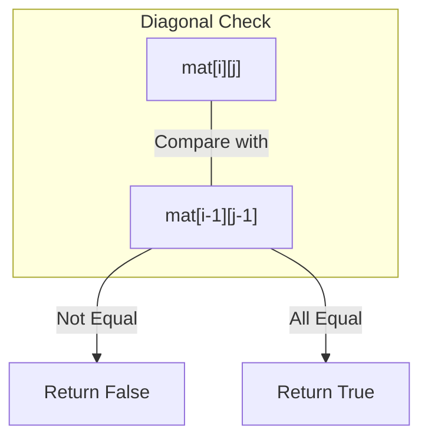

# Approach - Toeplitz Matrix

## Problem Analysis

A **Toeplitz Matrix** (or diagonal-constant matrix) is a matrix where every diagonal from top-left to bottom-right has constant elements. 

### Key Property

For any element $mat[i][j]$, its predecessor in the same diagonal is $mat[i-1][j-1]$. Therefore, for the matrix to be Toeplitz, the following condition must hold for all $i > 0$ and $j > 0$:
$$mat[i][j] = mat[i-1][j-1]$$

---

## Visual Representation

Consider a $3 \times 3$ matrix:

| Index | 0 | 1 | 2 |
| :---: | :---: | :---: | :---: |
| **0** | $A$ | $B$ | $C$ |
| **1** | $D$ | $A$ | $B$ |
| **2** | $E$ | $D$ | $A$ |

**Diagonals:**
- $(0,0), (1,1), (2,2) \rightarrow A, A, A$ (Constant)
- $(0,1), (1,2) \rightarrow B, B$ (Constant)
- $(0,2) \rightarrow C$ (Constant)
- $(1,0), (2,1) \rightarrow D, D$ (Constant)
- $(2,0) \rightarrow E$ (Constant)

### Diagonal Comparison Flow



---

## Implementation Steps

1.  **Dimensions:** Get the number of rows $N$ and columns $M$.
2.  **Iterate:** Start iterating from the second row ($i=1$) and second column ($j=1$).
3.  **Check Condition:** For each element $mat[i][j]$, compare it with its top-left neighbor $mat[i-1][j-1]$.
4.  **Early Exit:** If any pair is found where $mat[i][j] \neq mat[i-1][j-1]$, return `false`.
5.  **Final Result:** If the loops complete without finding any mismatch, return `true`.

## Complexity Analysis

-   **Time Complexity:** $O(N \times M)$ where $N$ is the number of rows and $M$ is the number of columns. We visit each element (except the first row and first column) exactly once.
-   **Space Complexity:** $O(1)$ as we only use a few integer variables for iteration and no extra data structures are required.

## Solution Code

```cpp
class Solution {
  public:
    bool isToeplitz(vector<vector<int>>& mat) {
        int n = mat.size();
        int m = mat[0].size();

        for (int i = 1; i < n; i++) {
            for (int j = 1; j < m; j++) {
                if (mat[i][j] != mat[i - 1][j - 1]) {
                    return false;
                }
            }
        }

        return true;
    }
};
```

---
**GeeksForGeeks Interface Style**
- **Difficulty:** Easy
- **Topic:** Matrix, Two Pointers / Traversal
