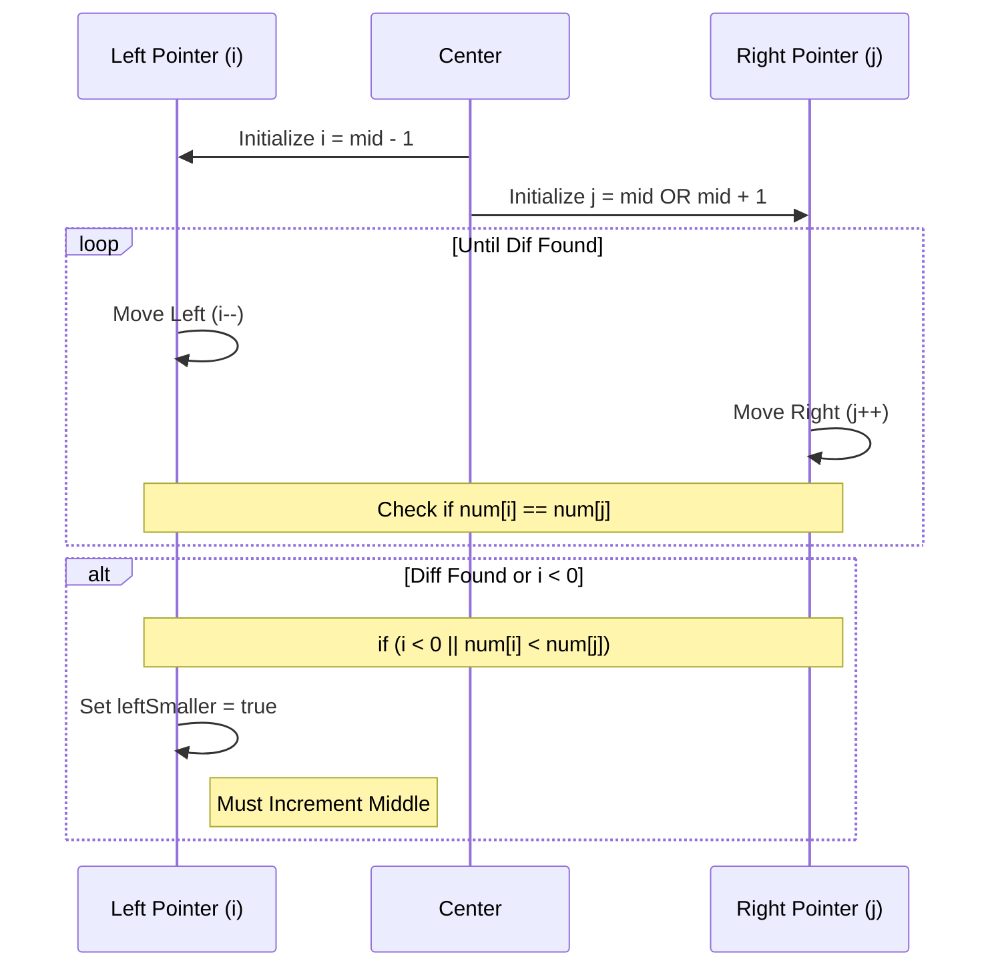
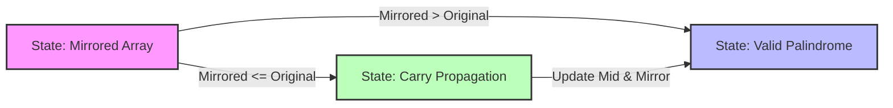
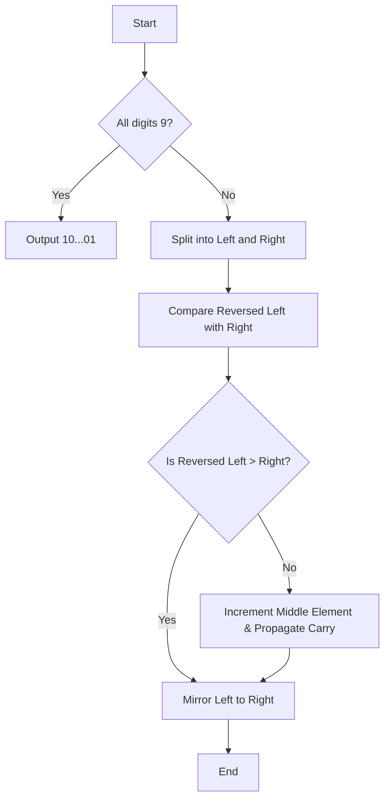

# Next Smallest Palindrome - Approach

## Problem Analysis
The goal is to find the smallest palindrome strictly greater than a given number represented as an array of digits. Since the input size can be up to $10^5$, an $O(n)$ solution is required.

---

## Algorithm Logic

### Case 1: All digits are 9
If the number is $999$, the next smallest palindrome is $1001$.
- **Action:** Create a vector of size $n+1$, set the first and last digits to $1$, and all others to $0$.

### Case 2: Not all digits are 9
We follow these steps:
1. **Split the number** into two halves. If $n$ is odd, the middle element belongs to the "pivot" section.
2. **Mirror** the left half onto the right half.
3. **Compare** the mirrored number with the original number.
4. **Decide:**
   - If **Mirrored > Original**: The mirrored number is our answer.
   - If **Mirrored <= Original**:
     - Increment the middle element(s).
     - Propagate the carry to the left and update the mirrored right side accordingly.

---

## Visual Representation

### 1. Mirroring Logic


### 2. Carry Propagation (The "Middle Increment" Case)


### 3. Case Decision (Center-Outward Comparison)


This is the **CRITICAL** logic. We move two pointers `i` and `j` from the center outwards to find the first place where the mirrored number differs from the original.



```cpp
while (i >= 0 && res[i] == res[j]) {
    i--;
    j++;
}
// Condition: If i < 0 (Already Palindrome) OR res[i] < res[j] (Mirrored is Smaller)
if (i < 0 || res[i] < res[j]) {
    leftSmaller = true; // We MUST increment the middle
}
```

### 4. Core State Transitions


### Logic Flow


### Dry Run: `[9, 4, 1, 8, 7, 9, 7, 8, 3, 2, 2]`

| Phase | Description | Visual / Action | State |
| :--- | :--- | :--- | :--- |
| 📥 **Input** | Original Array | `[9, 4, 1, 8, 7, 9, 7, 8, 3, 2, 2]` | Initial |
| ✂️ **Split** | Divide at center | `[9, 4, 1, 8, 7]` < **[9]** > `[7, 8, 3, 2, 2]` | Split |
| 🔄 **Mirror** | Copy Left to Right | `[9, 4, 1, 8, 7]` < **[9]** > `[7, 8, 1, 4, 9]` | `...149` |
| ⚖️ **Compare** | Is `149` > `322`? | ❌ `149` is smaller | **FAIL** |
| ➕ **Increment** | Increment Mid (9) | `9 + 1 = 10` (Carry `1`) | `...[10]...` |
| 🌊 **Propagate**| Carry to Index 4 | `7 + 1 = 8` (Carry `0`) | `...8 0 8...` |
| ✅ **Final** | Mirror updated Left | `9 4 1 8 8` < **0** > `8 8 1 4 9` | **Success** |

---

## Corner Cases - Visual Comparison

| Scenario | Input | Logic | Output |
| :--- | :--- | :--- | :--- |
| **All Nines** | `[9, 9, 9]` | $999 \rightarrow 1001$ | `[1, 0, 0, 1]` |
| **Already Palindrome** | `[1, 2, 1]` | Increment middle $\rightarrow 131$ | `[1, 3, 1]` |
| **Even Length** | `[1, 2, 3, 4]` | Mirror $\rightarrow 1221$ (Smaller) $\rightarrow 1331$ | `[1, 3, 3, 1]` |
| **Large Middle Carry** | `[1, 9, 9, 1]` | Mirror fixed, needs increment $\rightarrow 2002$ | `[2, 0, 0, 2]` |

---

## Performance Benchmark
- **Time Complexity:** $O(n)$ ⚡ (Single pass for comparison + Single pass for carry)
- **Space Complexity:** $O(n)$ 💾 (Result array storage)

---

## Implementation (C++)

```cpp
vector<int> nextPalindrome(vector<int> num) {
    int n = num.size();
    
    // 1. Check for all 9s
    if (isAllNine(num, n)) {
        return handleAllNines(n);
    }

    // 2. Mirror Left to Right
    vector<int> res = mirror(num, n);

    // 3. Handle case where mirrored is not larger
    if (isSmallerOrEqual(res, num, n)) {
        incrementMiddle(res, n);
    }

    return res;
}
```
*(Refer to [Solution.cpp](file:///c:/Users/Pankaj%20Kumar/OneDrive/Desktop/DSA/GeeksForGeeks/76_Day/Solution.cpp) for the full implementation)*
