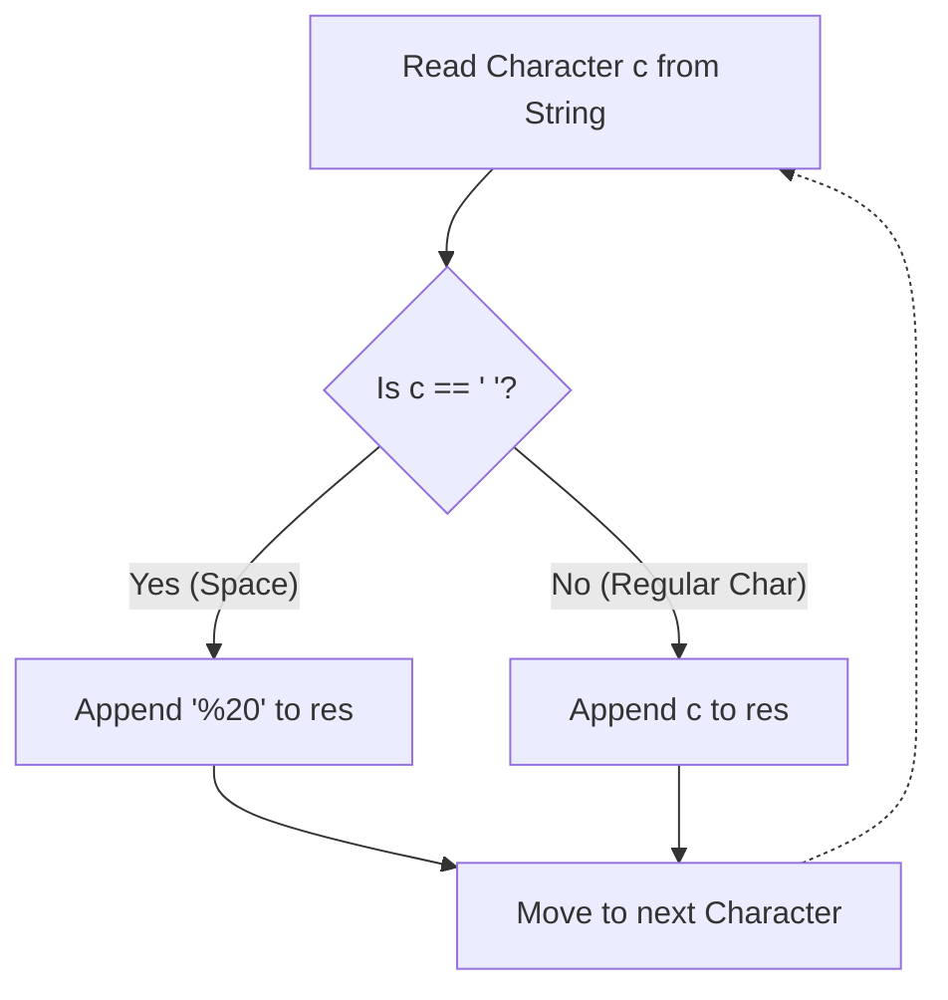

# URLify a Given String

## 📝 Overview
We are given a string `s` that may contain spaces. Our task is to replace each space character (`' '`) within the string with the sequence `"%20"`.

## 💡 Approach: Linear Iteration 

The most straightforward and optimal way to solve this is to iterate through the characters of the original string one by one. As we iterate, we construct a new result string. When we encounter a space `' '`, we append `"%20"` to the result. For any other character, we simply append the character itself.

### 🔍 Step-by-Step Algorithm
1. **Declare** an empty string `res` to hold our final transformed string. 
   > *Tip:* Pre-reserve memory (`res.reserve(s.size() * 3)`) to prevent multiple capacity reallocations as the string expands.
2. **Loop** through each character `c` in the given input string `s`.
3. **Check Condition:**
   - **If** `c == ' '` (character is a blank space), then append the 3-character string `"%20"` to `res`.
   - **Else** (character is any standard letter or symbol), just append the regular character `c` to `res`.
4. **Return** the newly populated `res` string.

### 🧠 Condition Flow Visualization



### 💻 Code Implementation (C++)

```cpp
class Solution {
public:
    string replaceSpaces(string s) {
        string res;
        
        // Optional: Optimize allocation since we know max length could triple
        res.reserve(s.size() * 3);
        
        for (char c : s) {
            // Condition 1: When space is encountered
            if (c == ' ') {
                res += "%20";
            } 
            // Condition 2: Regular characters
            else {
                res += c;
            }
        }
        
        return res;
    }
};
```

### 📊 Complexity Analysis

- **Time Complexity:** $\mathcal{O}(N)$
  We iterate through the given string of length $N$ exactly once. Each character comparison and append operation takes $\mathcal{O}(1)$ time. Hence, the overall time complexity is linear.

- **Space/Auxiliary Complexity:** $\mathcal{O}(N)$
  In the worst-case scenario (a string entirely made of spaces), the newly constructed string will hold $3 \times N$ characters. Thus, the auxiliary memory used is proportional to $N$.

### 🎨 Visual Dry-Run
Let `s = "i love"`

| `c` (Char) | Is `c == ' '`? | Action Performed | `res` String state |
| :---: | :---: | :--- | :--- |
| `'i'` | ❌ False | Append `'i'` | `"i"` |
| `' '` | ✅ True | Append `"%20"` | `"i%20"` |
| `'l'` | ❌ False | Append `'l'` | `"i%20l"` |
| `'o'` | ❌ False | Append `'o'` | `"i%20lo"` |
| `'v'` | ❌ False | Append `'v'` | `"i%20lov"` |
| `'e'` | ❌ False | Append `'e'` | `"i%20love"` |

Final output string will be `"i%20love"`.
