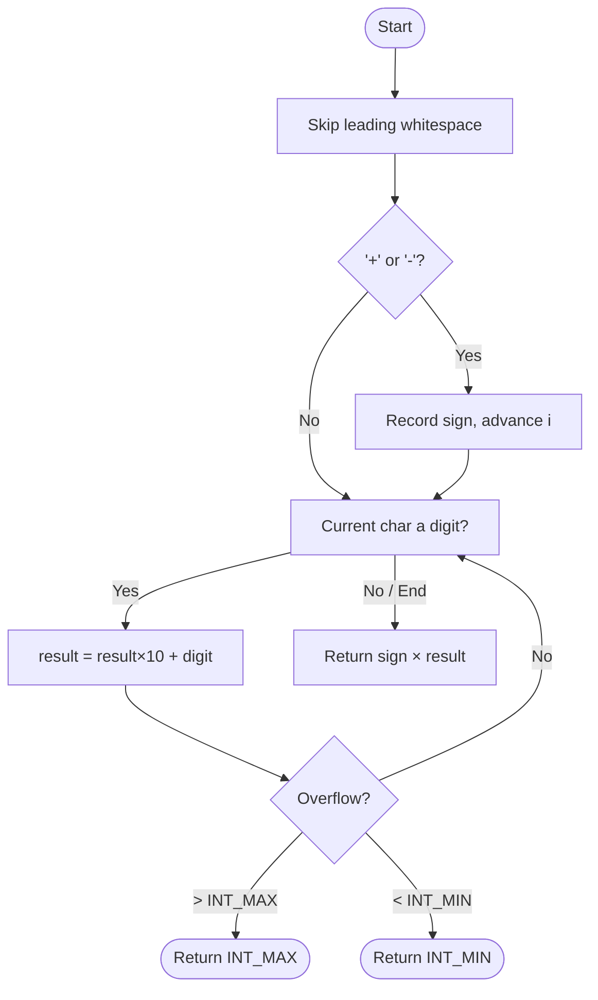

# Implement Atoi

---

## 🏷️ Problem Info

| Field        | Details                                                                                              |
| :----------- | :--------------------------------------------------------------------------------------------------- |
| 🌐 Platform  |  |
| 📌 Difficulty |                                     |
| 📂 Topic     | Strings / Parsing                                                                                    |
| 🔗 Link      | [Implement Atoi – GFG](https://www.geeksforgeeks.org/problems/implement-atoi/1)                     |
| ⏱️ Avg Time  | 15 minutes                                                                                           |
| 🎯 Accuracy  | 32.58%                                                                                               |

---

## 📝 Overview

Given a string `s`, we must manually parse it into a **32-bit signed integer** — mimicking the behaviour of C's `atoi()` — without using any built-in conversion functions.

The four-step pipeline is:
1. **Skip** leading whitespace
2. **Detect** an optional `+` / `-` sign
3. **Accumulate** digit characters until a non-digit (or end-of-string) is reached
4. **Clamp** the result to `[INT_MIN, INT_MAX]` if overflow occurs

---

## 💡 Approach: Single-Pass Linear Scan

We walk through the string **once**, maintaining a running total in a `long long` to safely detect overflow before casting back to `int`.

### 🔍 Step-by-Step Algorithm

1. **Skip Whitespace** — advance index `i` while `s[i] == ' '`.
2. **Read Sign** — if the current character is `'+'` or `'-'`, record the multiplier (`sign = +1 / -1`) and advance `i`.
3. **Read Digits** — loop while `isdigit(s[i])`:
   - `result = result * 10 + (s[i] - '0')`
   - After each digit, check overflow:
     - `sign * result ≥ INT_MAX` → return `INT_MAX` immediately
     - `sign * result ≤ INT_MIN` → return `INT_MIN` immediately
4. **Return** `(int)(sign * result)`.

---

### 🧠 Control-Flow Diagram



---

### 💻 Code Implementation (C++)

#### 🗺️ Four-Phase Pipeline at a Glance

```
Input string s:   "  -0012gfg4"
                   ↑↑ ↑ ↑↑↑↑ ↑
                   ││ │ ││││ └─── ❌ STOP  (non-digit)
                   ││ │ └┴┴┴──── ✅ DIGITS accumulate
                   ││ └────────── ✅ SIGN   detected
                   └┴──────────── ✅ SPACES skipped
```

---

#### 📦 Variables Initialised

```
┌──────────────────────────────────────────┐
│  int i      = 0       ← current index   │
│  int n      = s.size()← string length   │
│  long long result = 0 ← running total   │
│  int sign   = 1       ← +1 by default  │
└──────────────────────────────────────────┘
```

---

#### 🔢 Annotated Source Code

```cpp
class Solution {
public:
    int myAtoi(string s) {

        int i = 0, n = s.size();   // ← index pointer + length
        long long result = 0;       // ← use long long to catch overflow
        int sign = 1;               // ← default: positive

        // ╔══════════════════════════════════════╗
        // ║  PHASE 1 — Skip Leading Whitespace  ║
        // ╚══════════════════════════════════════╝
        //
        //   s = "   -42"
        //        ^^^  skip these, land on '-'
        //
        while (i < n && s[i] == ' ') i++;

        // ╔══════════════════════════════════════╗
        // ║  PHASE 2 — Detect Sign Character    ║
        // ╚══════════════════════════════════════╝
        //
        //   s[i] == '-'  →  sign = -1,  i++
        //   s[i] == '+'  →  sign = +1,  i++
        //   anything else→  sign stays  +1
        //
        if (i < n && (s[i] == '+' || s[i] == '-')) {
            sign = (s[i] == '-') ? -1 : 1;
            i++;
        }

        // ╔══════════════════════════════════════╗
        // ║  PHASE 3 — Accumulate Digit Chars   ║
        // ╚══════════════════════════════════════╝
        //
        //   Each iteration:
        //   result = result × 10  +  (s[i] − '0')
        //            ──────────     ─────────────
        //            shift left       new digit
        //
        //   Example for "123":
        //   i=0 → result =  0×10 + 1 =   1
        //   i=1 → result =  1×10 + 2 =  12
        //   i=2 → result = 12×10 + 3 = 123
        //
        while (i < n && isdigit(s[i])) {
            result = result * 10 + (s[i] - '0');

            // ╔══════════════════════════════════════╗
            // ║  PHASE 4 — Early Overflow Clamp     ║
            // ╚══════════════════════════════════════╝
            //
            //   INT_MAX =  2147483647  ( 2³¹ − 1 )
            //   INT_MIN = −2147483648  (−2³¹    )
            //
            //   Check BEFORE i++ to exit the moment a
            //   boundary is crossed — no UB in long long.
            //
            if (sign * result >= INT_MAX) return INT_MAX;  // ← ceiling clamp
            if (sign * result <= INT_MIN) return INT_MIN;  // ← floor   clamp

            i++;
        }

        // ─── Non-digit hit (or end of string) ───
        // Cast the accumulated long long back to int
        return (int)(sign * result);
    }
};
```

---

#### 🔬 Digit Accumulation — Memory Snapshot

For `"  -0012gfg4"` after skipping spaces + sign:

```
Char processed │ Calculation           │ result  │ sign×result
───────────────┼───────────────────────┼─────────┼────────────
  '0'          │  0  × 10 + 0  =   0  │       0 │          0
  '0'          │  0  × 10 + 0  =   0  │       0 │          0
  '1'          │  0  × 10 + 1  =   1  │       1 │         -1
  '2'          │  1  × 10 + 2  =  12  │      12 │        -12
  'g'          │  ← NOT a digit → STOP │         │
───────────────┴───────────────────────┴─────────┴────────────
  Final return │ (int)(-1 × 12)        │         │    ✅ -12
```

---

### 📊 Complexity Analysis

| Metric               | Value                | Reason                                               |
| :------------------- | :------------------- | :--------------------------------------------------- |
| ⏰ Time Complexity   | $\mathcal{O}(N)$     | Single left-to-right pass over the string of length $N$ |
| 💾 Space Complexity  | $\mathcal{O}(1)$     | Only a handful of integer variables; no extra storage |

---

### 🎨 Visual Dry-Runs

#### Example 1 — `s = "  -0012gfg4"`

| Phase         | Action                            | State                  |
| :------------ | :-------------------------------- | :--------------------- |
| Whitespace    | Skip 2 spaces                     | `i = 2`                |
| Sign          | Read `'-'`, `sign = -1`           | `i = 3`                |
| Digits        | `'0'` → result = 0                | `i = 4`, result = 0    |
| Digits        | `'0'` → result = 0                | `i = 5`, result = 0    |
| Digits        | `'1'` → result = 1                | `i = 6`, result = 1    |
| Digits        | `'2'` → result = 12               | `i = 7`, result = 12   |
| Stop          | `'g'` is non-digit → **stop**     | —                      |
| **Output**    | `sign × result = -1 × 12 = -12`  | ✅ **-12**             |

---

#### Example 2 — `s = " 1231231231311133"` *(Overflow Case)*

| Phase         | Action                                    | State                           |
| :------------ | :---------------------------------------- | :------------------------------ |
| Whitespace    | Skip 1 space                              | `i = 1`                         |
| Sign          | No sign character, `sign = +1`            | `i = 1`                         |
| Digits        | Accumulate … result grows large           | —                               |
| Overflow ✅  | `result ≥ INT_MAX` detected mid-loop      | **return 2147483647**           |
| **Output**    | `2147483647` (INT_MAX)                    | ✅ **2147483647**               |

---

#### Example 3 — `s = "-999999999999"` *(Underflow Case)*

| Phase         | Action                                    | State                           |
| :------------ | :---------------------------------------- | :------------------------------ |
| Whitespace    | Nothing to skip                           | `i = 0`                         |
| Sign          | `'-'`, `sign = -1`                        | `i = 1`                         |
| Digits        | Accumulate …  `sign×result ≤ INT_MIN`    | **return -2147483648**          |
| **Output**    | `-2147483648` (INT_MIN)                   | ✅ **-2147483648**              |

---

### ⚡ Edge Cases Handled

| Input        | Expected Output | Reason                          |
| :----------- | :-------------- | :------------------------------ |
| `" -"`       | `0`             | No digits after sign            |
| `"+42"`      | `42`            | Explicit positive sign          |
| `"00123"`    | `123`           | Leading zeros ignored naturally |
| `"21474836470"` | `2147483647` | Overflow → clamp to INT_MAX     |
| `"abc"`      | `0`             | No digits at all                |
