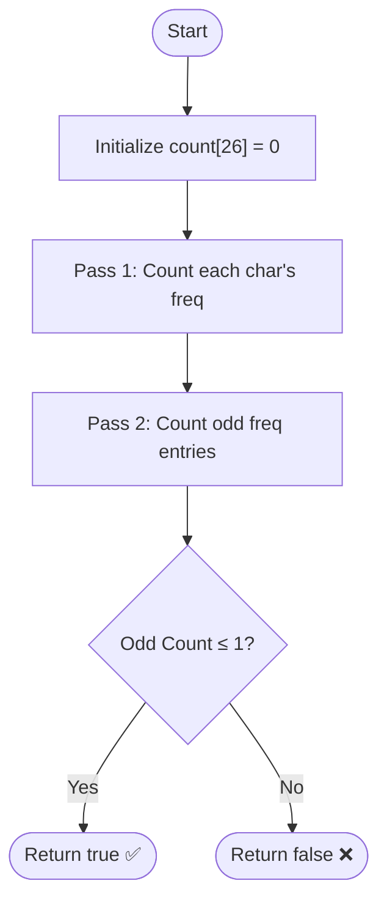

# [Anagram Palindrome](https://www.geeksforgeeks.org/problems/anagram-palindrome4720/1)

---

## 🏷️ Problem Info

| Field         | Details                                                                                              |
| :------------ | :--------------------------------------------------------------------------------------------------- |
| 🌐 Platform   |  |
| 📌 Difficulty |                                       |
| 📂 Topic      | Strings / Frequency Array                                                                            |
| 🔗 Link       | [Anagram Palindrome – GFG](https://www.geeksforgeeks.org/problems/anagram-palindrome4720/1)          |
| ⏱️ Avg Time   | 10 minutes                                                                                           |
| 🎯 Accuracy   | 44.28%                                                                                               |

---

## 📝 Overview

Determine if a string can be rearranged into a palindrome.

### Palindrome Character Distribution

```
┌──────────────────────────────────────────────────────────────┐
│   Condition for Palindrome Rearrangement:                    │
│                                                              │
│                                                              │
│   1. Even Length: ALL characters must have EVEN frequency.   │
│   2. Odd Length:  Exactly ONE character has ODD frequency.   │
│                                                              │
│  ➜ Rule: Total characters with ODD frequency must be ≤ 1    │
└──────────────────────────────────────────────────────────────┘
```

---

## 💡 Approach: Frequency Array (Optimized)

Using a fixed-size array of 26 integers is more efficient than a Hash Map for lowercase English letters.

### 🔍 Step-by-Step Algorithm

1. **Initialize** an array `count[26]` with zeros.
2. **Traverse** the string and increment `count[s[i] - 'a']`.
3. **Iterate** through the `count` array and count how many characters have an odd frequency.
4. **Return** `true` if the count of odd frequencies is less than or equal to 1.

---

### 🧠 Control-Flow Diagram



---

### 💻 Code Implementation (C++)

```cpp
class Solution {
public:
    int canFormPalindrome(string s) {
        int count[26] = {0};
        
        // Count frequencies using fixed-size array
        for (char c : s) {
            count[c - 'a']++;
        }
        
        // Count characters with odd frequency
        int odd = 0;
        for (int i = 0; i < 26; i++) {
            if (count[i] & 1) odd++;
        }
        
        return odd <= 1;
    }
};
```

---

### 📊 Complexity Analysis

| Metric              | Value              | Reason                                                      |
| :------------------ | :----------------- | :---------------------------------------------------------- |
| ⏰ Time Complexity  | $\mathcal{O}(N)$   | Single pass over string + constant pass over array (26)     |
| 💾 Space Complexity | $\mathcal{O}(1)$   | Fixed-size array (26 integers) regardless of string length  |

---

### 🎨 Visual Dry-Runs

#### Example: `s = "baba"`
1. `count`: `a:2, b:2` (all others 0)
2. `odd`: 0
3. Result: `0 ≤ 1` ➜ **True**

#### Example: `s = "geeksforgeeks"`
1. `count`: `g:2, e:4, k:2, s:2, f:1, o:1, r:1`
2. `odd`: 3 (`f, o, r`)
3. Result: `3 > 1` ➜ **False**
