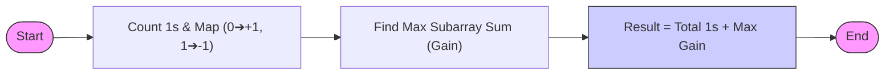

# [Flip Bits (Flip to Maximize 1's) - Approach](https://www.geeksforgeeks.org/problems/flip-bits0240/1)

---
## 📝 Problem Overview
The goal is to maximize the number of 1s in a binary array by flipping (0 → 1, 1 → 0) at most one contiguous subarray.

---

## 💡 Key Intuition
To solve this problem efficiently, we need to understand the effect of a flip on the total count of 1s.

1. Let the original array have $N_1$ ones.
2. Suppose we flip a subarray containing $Z$ zeros and $O$ ones.
3. After the flip:
   - The $Z$ zeros becomes $Z$ ones.
   - The $O$ ones becomes $O$ zeros.
4. **Net change in ones** = $Z - O$.
5. **New Total Ones** = $N_1 + (Z - O)$.

To maximize the total ones, we simply need to maximize the **Net Change** $(Z - O)$.

---     

## 🛠️ Logic Flow



---

## 🚀 The Algorithm: Kadane's Transformation
We can transform this problem into the classic **Maximum Subarray Sum** (Kadane's Algorithm) by mapping the array elements:
- If `arr[i] == 0`, treat it as **+1** (potential gain).
- If `arr[i] == 1`, treat it as **-1** (potential loss).

### Step-by-Step Process:
1. Initialize `total_ones = 0`.
2. Iterate through the array to count initial ones.
3. Simultaneously, maintain `max_ending_here` and `max_so_far` for Kadane's algorithm using the mapped values (+1 for 0, -1 for 1).
4. If `max_ending_here` becomes negative, reset it to 0.
5. The result is `total_ones + max_so_far`.

---

## 📊 Visual Walkthrough
**Input:** `[1, 0, 0, 1, 0]`

| Step | Element | Mapped Value | `max_ending_here` | `max_so_far` | Total 1s |
| :--- | :---: | :---: | :---: | :---: | :---: |
| Start | - | - | 0 | 0 | 0 |
| 1 | 1 | -1 | 0 (reset from -1) | 0 | 1 |
| 2 | 0 | +1 | 1 | 1 | 1 |
| 3 | 0 | +1 | 2 | **2** | 1 |
| 4 | 1 | -1 | 1 | 2 | 2 |
| 5 | 0 | +1 | 2 | 2 | 2 |

**Final Result:** $2 (\text{Initial 1s}) + 2 (\text{Max Gain}) = 4$

---

## 🛠️ Code Implementation

```cpp
int maxOnes(vector<int>& arr) {
    int n = arr.size();
    int total_ones = 0;
    int max_ending_here = 0;
    int max_so_far = 0;

    for (int i = 0; i < n; i++) {
        if (arr[i] == 1) total_ones++;

        // Map 0 -> 1, 1 -> -1
        int val = (arr[i] == 0) ? 1 : -1;

        max_ending_here += val;
        if (max_ending_here < 0) max_ending_here = 0;
        if (max_so_far < max_ending_here) max_so_far = max_ending_here;
    }

    return total_ones + max_so_far;
}
```

---

## 📈 Complexity Analysis

| Type | Complexity | Explanation |
| :--- | :--- | :--- |
| **Time Complexity** | $O(N)$ | Single pass through the array of size $N$. |
| **Space Complexity** | $O(1)$ | Used constant extra space for variables. |

---

> [!TIP]
> This approach works because Kadane's algorithm finds the subarray that gives the maximum possible sum. By treating zeros as gains and ones as losses, we find the subarray whose flip yields the maximum increase in the number of 1s.
