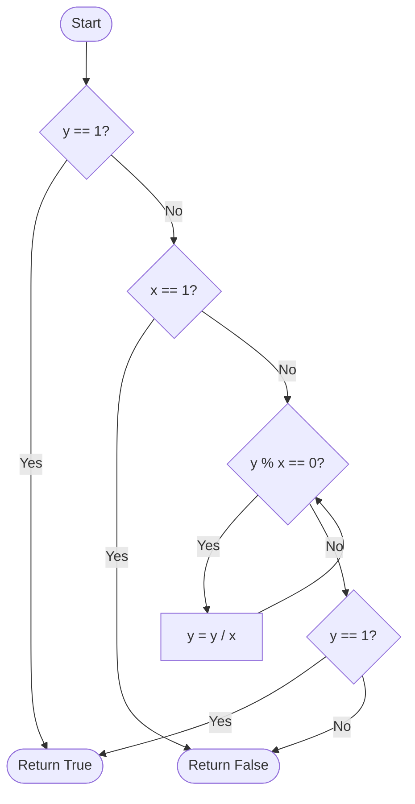

# 🚀 Approach - Check if a Number is a Power of Another

## 💡 Intuition
To determine if $y$ is a power of $x$ (i.e., $x^n = y$ for some integer $n \ge 0$):
1. **Base Case ($y=1$):** Every positive integer raised to the power of 0 is 1. Thus, if $y=1$, the answer is always `true`.
2. **Special Case ($x=1$):** If $x=1$ and $y \ne 1$, it can never be a power because $1^n = 1$.
3. **General Case ($x > 1$):** If $y$ is a power of $x$, then $y$ must be divisible by $x$ repeatedly until it becomes 1.

---

## 🛠️ Step-by-Step Logic

1.  **Check if $y=1$**: Return `true`.
2.  **Check if $x=1$**: Since $y \ne 1$, return `false`.
3.  **Iteration**: Use a loop to divide $y$ by $x$ as long as $y$ is divisible by $x$ ($y \% x == 0$).
4.  **Final Check**: After the loop, if $y$ is 1, return `true`. Otherwise, return `false`.

---

## 📊 Visual Representation



---

## 💻 Implementation snippet

```cpp
bool isPower(int x, int y) {
    if (y == 1) return true;
    if (x == 1) return false;
    while (y % x == 0) {
        y /= x;
    }
    return y == 1;
}
```

---

## ⏱️ Complexity Analysis

| Type | Complexity | Explanation |
| :--- | :--- | :--- |
| **Time** | $O(\log_x y)$ | We divide $y$ by $x$ in each iteration. |
| **Space** | $O(1)$ | No extra space used besides variables. |

---

## 🌟 Key Takeaways
- Always handle edge cases like $x=1$ or $y=1$ separately to avoid infinite loops or incorrect results.
- The iterative approach is very efficient given the constraints ($x \le 10^3, y \le 10^9$).

---
**Source Link:** [ GeeksforGeeks - Check for Power](https://www.geeksforgeeks.org/problems/check-if-a-number-is-power-of-another-number5442/1)