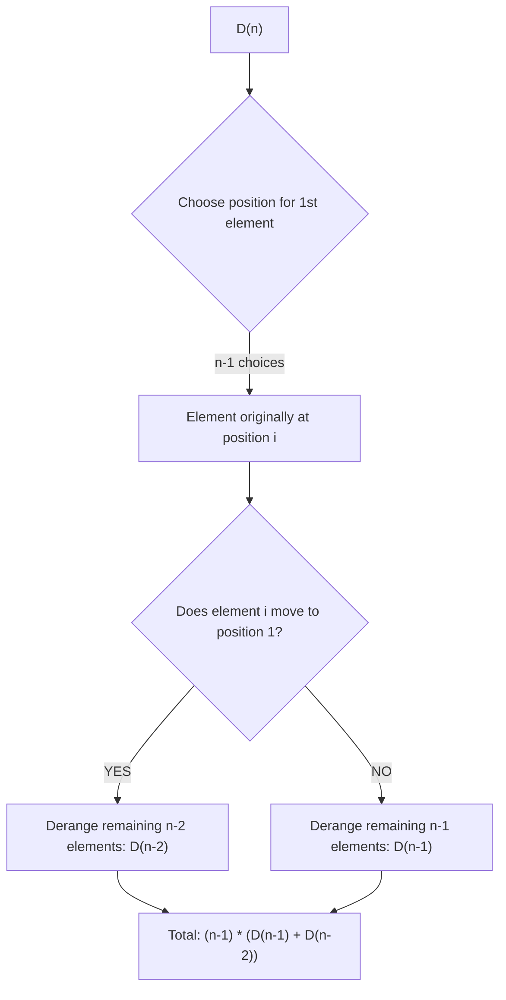

# 🧠 Count Derangements - Premium Approach

## 🌟 Introduction

A **Derangement** is a permutation of $n$ elements where **no element** is in its original position. 
The problem asks us to find the total number of such permutations for a given $n$.

---

## 🛠️ Logic & Recurrence Relation

To find $D(n)$, let's consider the first element (originally at position 1). It must go to one of the other $n-1$ positions. Suppose it goes to position $i$.

Now, for the element originally at position $i$, there are two possibilities:

### Case 1: element $i$ goes to position 1
- Position 1 and $i$ are swapped.
- We are left with $n-2$ elements to derange.
- Ways: $D(n-2)$

### Case 2: element $i$ does NOT go to position 1
- Element $i$ has $n-2$ available positions (excluding position 1 and its own original position $i$).
- This is equivalent to deranging $n-1$ elements (where element $i$ is effectively forbidden from position 1).
- Ways: $D(n-1)$

### Final Formula
Since there are $n-1$ choices for $i$, the total number of derangements is:
> [!IMPORTANT]
> **$D(n) = (n - 1) \times [D(n - 1) + D(n - 2)]$**

---

## 📊 Visual Representation



---

## 🚀 Algorithm (Iterative DP)

1. **Base Cases:**
   - If $n = 1$: Return $0$.
   - If $n = 2$: Return $1$.
2. **State Transition:**
   - Maintain `prev2` ($D(i-2)$) and `prev1` ($D(i-1)$).
   - Loop from $3$ to $n$:
     - `current = (i - 1) * (prev1 + prev2)`
     - Update `prev2 = prev1`, `prev1 = current`.
3. **Complexity:**
   - **Time:** $O(n)$ — Single pass calculation.
   - **Space:** $O(1)$ — Only a few variables used.

---

## 💻 Implementation Snippet

```cpp
int derangeCount(int n) {
    if (n == 1) return 0;
    if (n == 2) return 1;

    long long prev2 = 0, prev1 = 1, current;
    for (int i = 3; i <= n; i++) {
        current = (long long)(i - 1) * (prev1 + prev2);
        prev2 = prev1;
        prev1 = current;
    }
    return (int)current;
}
```

---

## 📈 Performance Profile

| Metric | Complexity |
| :--- | :--- |
| **Time Complexity** | $O(n)$ |
| **Space Complexity** | $O(1)$ |
| **Constraint Limit** | $n \le 12$ |
| **Data Type** | 32-bit Integer |

---
**Problem Link:** [Count Derangements](https://www.geeksforgeeks.org/problems/dearrangement-of-balls0918/1)