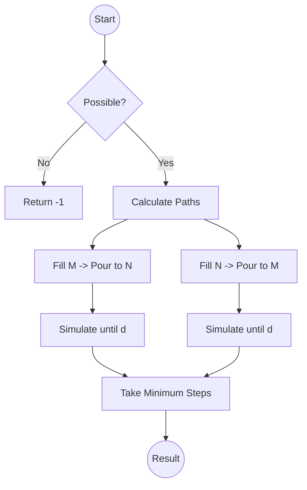

# Two Water Jug Problem - Optimized Approach

The Two Water Jug problem can be solved efficiently using **Greatest Common Divisor (GCD)** for feasibility checks and a **Greedy Simulation** (also known as the Two-Path Simulation) for finding the minimum steps.

## Problem Analysis

Given two jugs of capacity **m** and **n**, we need to measure exactly **d** litres. While BFS is a valid choice for small constraints, it fails with large inputs ($m, n \approx 10^6$) due to memory and time limits.

### Conditions for Feasibility:
- **d** must be less than or equal to the maximum of **m** and **n** (`d <= max(m, n)`).
- **d** must be a multiple of the Greatest Common Divisor (GCD) of **m** and **n** (`d % gcd(m, n) == 0`).

## Optimized Strategy - Greedy Simulation

Instead of exploring all possible combinations of jug states, we observe that the shortest path always follows one of two greedy strategies:
1. **Strategy 1**: Continually fill Jug 1, pour it into Jug 2, and empty Jug 2 whenever it becomes full.
2. **Strategy 2**: Continually fill Jug 2, pour it into Jug 1, and empty Jug 1 whenever it becomes full.

We calculate the steps for both strategies and return the minimum.

### Algorithm Steps
1. Fill the source jug.
2. While neither jug contains the target amount:
   - Pour water from the source jug to the destination jug.
   - Increment step count.
   - If the source jug becomes empty, refill it (Increment step count).
   - If the destination jug becomes full, empty it (Increment step count).

## Logic Flowchart



## Solution Code

```cpp
class Solution {
public:
    int minSteps(int m, int n, int d) {
        if (d > max(m, n) || d % gcd(m, n) != 0) return -1;
        return min(solve(m, n, d), solve(n, m, d));
    }
private:
    int gcd(int a, int b) { return b == 0 ? a : gcd(b, a % b); }
    
    int solve(int fillCap, int otherCap, int target) {
        int currFill = fillCap, currOther = 0, steps = 1;
        while (currFill != target && currOther != target) {
            int amount = min(currFill, otherCap - currOther);
            currOther += amount;
            currFill -= amount;
            steps++;
            if (currFill == target || currOther == target) break;
            if (currFill == 0) { currFill = fillCap; steps++; }
            else if (currOther == otherCap) { currOther = 0; steps++; }
        }
        return steps;
    }
};
```


---
#### Problem Link: [Two water Jug problem](https://www.geeksforgeeks.org/problems/two-water-jug-problem3402/1)


