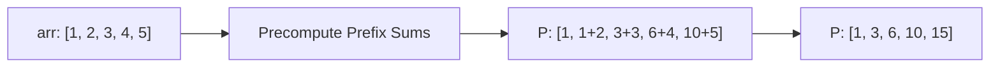
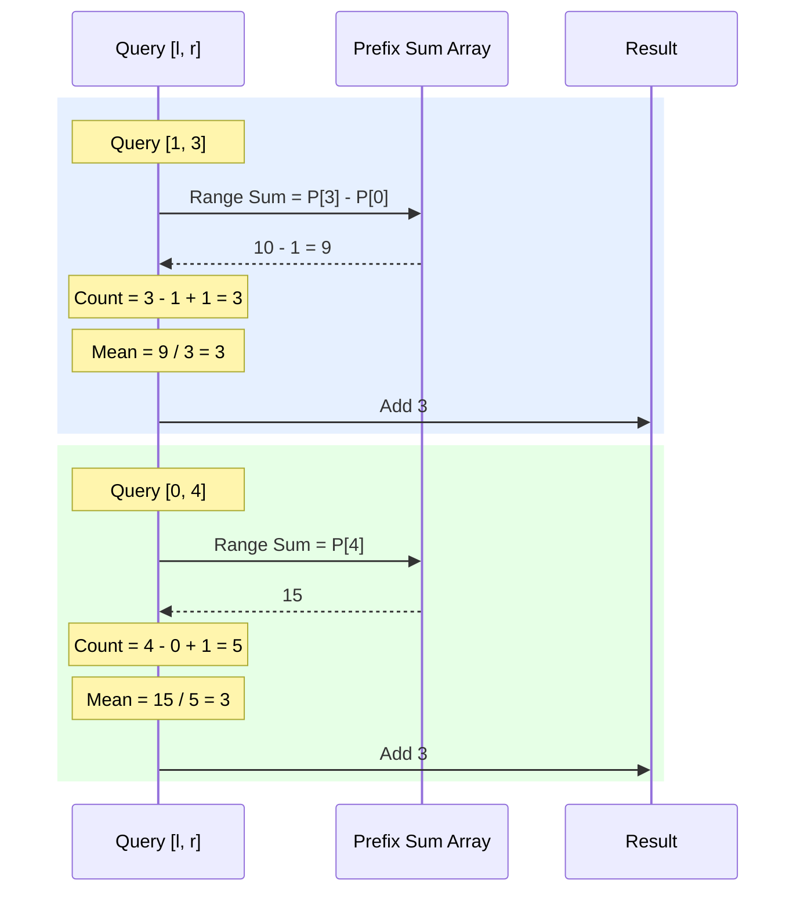

# Approach - Mean of Range in Array

The problem asks to find the floor value of the mean for several subarrays defined by given queries. A naive approach would involve iterating through each range for every query, leading to a time complexity of $O(Q \times N)$, which is inefficient given the constraints ($10^5$ for both $N$ and $Q$).

## Intuition
To calculate the mean of a range `[l, r]`, we need:
1.  **Sum of elements** in the range `[l, r]`.
2.  **Count of elements** in the range `[l, r]`.

The count is simply `r - l + 1`. The challenge is computing the sum efficiently.

**Prefix Sum Array** is the perfect candidate here. It allows us to compute the sum of any subarray in $O(1)$ time after an initial $O(N)$ preprocessing step.

## Algorithm

1.  **Pre-processing (Prefix Sum):**
    -   Create a prefix sum array `P` of size `N`.
    -   `P[i]` will store the sum of all elements from `arr[0]` to `arr[i]`.
    -   `P[0] = arr[0]`
    -   `P[i] = P[i-1] + arr[i]` (for $i > 0$)

2.  **Processing Queries:**
    -   For each query `[l, r]`:
        -   Calculate `Range Sum`:
            -   If `l == 0`, `Sum = P[r]`
            -   Else, `Sum = P[r] - P[l-1]`
        -   Calculate `Count`: `num_elements = r - l + 1`
        -   Calculate `Mean`: `mean = Sum / num_elements`
        -   Append the `mean` (standard integer division in C++ performs floor) to the result list.

3.  **Result:** Return the collected results.

## Visual Representation

### Prefix Sum Logic


### Dry Run (Example 1)
| Query [l, r] | Range Sum (P[r] - P[l-1]) | Count (r - l + 1) | Mean (Sum / Count) | result |
| :--- | :--- | :--- | :--- | :--- |
| **[0, 2]** | P[2] = 6 | 2 - 0 + 1 = 3 | 6 / 3 = 2 | **2** |
| **[1, 3]** | P[3] - P[0] = 10 - 1 = 9 | 3 - 1 + 1 = 3 | 9 / 3 = 3 | **3** |
| **[0, 4]** | P[4] = 15 | 4 - 0 + 1 = 5 | 15 / 5 = 3 | **3** |

### Range Query Visual


## Complexity Analysis

- **Time Complexity:** 
  - Preprocessing: $O(N)$ to build the prefix sum array.
  - Query Processing: $O(Q \times 1)$, as each query takes constant time.
  - Total: $O(N + Q)$, where $N$ is the size of the array and $Q$ is the number of queries.
  
- **Space Complexity:**
  - $O(N)$ for storing the prefix sum array.
  - $O(Q)$ for storing the results of each query.
  - Total: $O(N + Q)$.

## Solution Implementation (C++)

```cpp
class Solution {
  public:
    vector<int> findMean(vector<int>& arr, vector<vector<int>>& queries) {
        int n = arr.size();
        // Use long long for prefix sums to avoid overflow (though not strictly needed here given constraints)
        vector<long long> prefixSum(n);
        prefixSum[0] = arr[0];
        for (int i = 1; i < n; i++) {
            prefixSum[i] = prefixSum[i - 1] + arr[i];
        }

        vector<int> results;
        for (auto& q : queries) {
            int l = q[0];
            int r = q[1];
            
            long long rangeSum;
            if (l == 0) {
                rangeSum = prefixSum[r];
            } else {
                rangeSum = prefixSum[r] - prefixSum[l - 1];
            }
            
            int count = r - l + 1;
            results.push_back(rangeSum / count);
        }
        return results;
    }
};
```
**Note:** The prefix sum array should be of size `n+1` to handle the case where `l=0` more cleanly. This avoids the `if (l == 0)` check inside the loop.

**Problem link:**[Mean of range in array](https://www.geeksforgeeks.org/problems/mean-of-range-in-array2123/1)