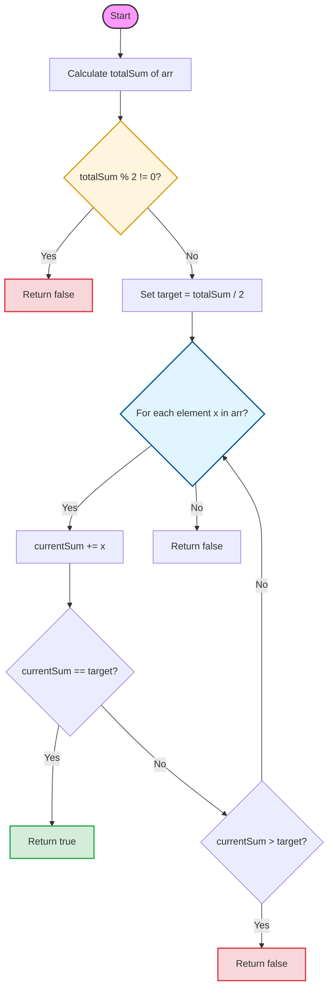

# [Approach - Split Array into Equal Sum Subarrays](Solution.cpp)

## Intuition
The goal is to find a point in the array such that the sum of elements to its left (including itself) equals the sum of elements to its right. Since we cannot reorder elements, this is a classic **Prefix Sum** problem.

If a split exists, then:
$$\text{Sum}_{\text{left}} = \text{Sum}_{\text{right}}$$
$$\text{Sum}_{\text{total}} = \text{Sum}_{\text{left}} + \text{Sum}_{\text{right}}$$
$$\text{Sum}_{\text{total}} = 2 \times \text{Sum}_{\text{left}}$$

This implies two things:
1. The total sum must be **even**.
2. There must exist a prefix sum equal to $\frac{\text{Total Sum}}{2}$.

## Logic Flow



## Visual Representation
Let `arr = [1, 2, 3, 4, 5, 5]`
- **Total Sum:** $1+2+3+4+5+5 = 20$
- **Target:** $20 / 2 = 10$

| Step | Element | currentSum | Comparison (Target=10) |
| :--- | :--- | :--- | :--- |
| 1 | 1 | 1 | $1 < 10$ |
| 2 | 2 | 3 | $3 < 10$ |
| 3 | 3 | 6 | $6 < 10$ |
| 4 | 4 | 10 | **$10 == 10$ (Found!)** |

## Implementation

```cpp
#include <vector>
using namespace std;

class Solution {
  public:
    bool canSplit(vector<int>& arr) {
        long long totalSum = 0;
        for (int x : arr) totalSum += x;

        if (totalSum % 2 != 0) return false;

        long long currentSum = 0;
        long long target = totalSum / 2;

        for (int x : arr) {
            currentSum += x;
            if (currentSum == target) return true;
            if (currentSum > target) return false;
        }
        return false;
    }
};
```

## Test Harness (Main.cpp)

To verify the solution, we use a driver script that tests multiple scenarios, including edge cases.

```cpp
#include <iostream>
#include <vector>
#include "Solution.cpp"

void runTest(int caseNum, std::vector<int> arr, bool expected) {
    Solution sol;
    bool result = sol.canSplit(arr);
    std::cout << "Test Case " << caseNum << ": " << (result == expected ? "PASSED" : "FAILED") << std::endl;
}

int main() {
    runTest(1, {1, 2, 3, 4, 5, 5}, true);
    runTest(2, {4, 3, 2, 1}, false);
    runTest(3, {1, 1, 1, 1}, true);
    return 0;
}
```

## Complexity Analysis

- **Time Complexity:** $O(n)$, where $n$ is the size of the array. We traverse the array twice (once for total sum, once for prefix check).
- **Space Complexity:** $O(1)$, as we only use a few variables for tracking sums.

---
### Key Highlights
- **Edge Case:** Total sum is odd $\rightarrow$ Immediate `false`.
- **Optimization:** Since all elements are positive ($arr[i] \ge 1$), if `currentSum` exceeds `target`, we can stop early.
- **Data Types:** Used `long long` for sums to prevent overflow (max sum $\approx 10^{11}$).
---
**Problem Link:** [Split Array into Equal Sum Subarrays](https://www.geeksforgeeks.org/problems/split-array-into-two-equal-sum-subarrays/0)
**Difficulty:** Easy