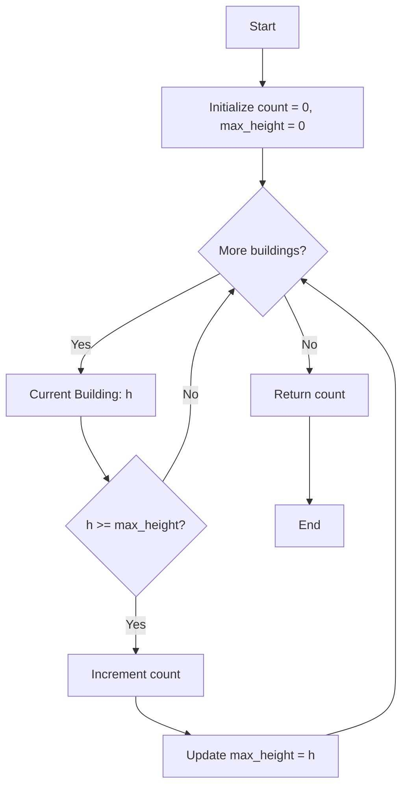

# Approach - Buildings Receiving Sunlight

## Problem Intuition
The core idea is to identify buildings that can "see" the sun coming from the left. A building at index `i` is visible if it is not obstructed by any building to its left (`0` to `i-1`). This means its height must be greater than or equal to the maximum height encountered so far.

---

## 🛠️ Algorithm Logic

1.  **Initialize**:
    *   `count` to `0` (tracks buildings receiving sunlight).
    *   `max_height_so_far` to `0` (tracks the tallest building seen from the left).
2.  **Iterate**: Loop through each building height `h` in the array.
    *   **Check Condition**: If current height `h >= max_height_so_far`:
        *   Increment `count`.
        *   Update `max_height_so_far = h`.
3.  **Return**: The final `count`.

---

## 📊 Visual Flow (Mermaid Diagram)



---

## 📈 Step-by-Step Example
**Input**: `arr = [6, 2, 8, 4, 11, 13]`

| Index | Height | Max So Far | `Height >= Max?` | Count | Action |
| :--- | :--- | :--- | :--- | :--- | :--- |
| 0 | 6 | 0 | ✅ Yes | 1 | Update Max to 6 |
| 1 | 2 | 6 | ❌ No | 1 | Blocked |
| 2 | 8 | 6 | ✅ Yes | 2 | Update Max to 8 |
| 3 | 4 | 8 | ❌ No | 2 | Blocked |
| 4 | 11 | 8 | ✅ Yes | 3 | Update Max to 11 |
| 5 | 13 | 11 | ✅ Yes | 4 | Update Max to 13 |

**Result**: `4`

---

## 💻 Implementation (C++)

```cpp
class Solution {
public:
    int visibleBuildings(vector<int>& arr) {
        int count = 0;
        int max_height = 0;

        for (int h : arr) {
            if (h >= max_height) {
                count++;
                max_height = h;
            }
        }
        return count;
    }
};
```

---

## ⏳ Complexity Analysis

*   **Time Complexity**: $O(N)$ where $N$ is the number of buildings. We traverse the array exactly once.
*   **Space Complexity**: $O(1)$ as we only use a few integer variables regardless of the input size.

---

## 🔗 Related Resources
- [GeeksForGeeks Problem Link](https://www.geeksforgeeks.org/problems/buildings-receiving-sunlight3032/1)
- [Similar Problem: Max in Sliding Window](https://leetcode.com/problems/sliding-window-maximum/)

---

## 📁 Project Files
- [Problem Statement](Problem.md)
- [Solution Implementation](Solution.cpp)
- [Main / Driver Code](Main.cpp)
