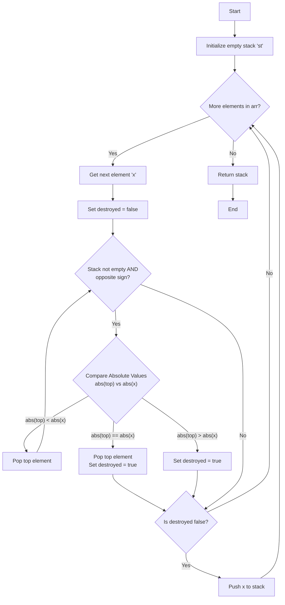

# Approach - Opposite Sign Pair Reduction (Asteroid Collision)

## Problem Intuition
The problem requires us to simulate collisions between elements. A collision occurs strictly when two adjacent elements have **opposite signs**. The element with the larger absolute value survives. If both have the same absolute value, both are destroyed. Since we need to repeatedly process collisions from left to right, and any newly formed adjacent elements can also collide, a **Stack** data structure is perfectly suited. It allows us to process the current element against the most recently surviving elements efficiently.

---

## 🛠️ Algorithm Logic

1. **Initialize**:
   - Create an empty `vector<int> st` which will act as our stack to hold the surviving elements.

2. **Iterate**: Loop through each element `x` in the given array `arr`.
   - Set a flag `destroyed = false` for the current element `x`.
   - **Collision Check (While Loop)**: While the stack is not empty AND the top element `st.back()` has an **opposite sign** to `x`:
     - **Case 1: Top element is smaller** (`abs(st.back()) < abs(x)`):
       - The top element is destroyed (`st.pop_back()`).
       - The current element `x` continues to the next iteration of the while loop to check against the new top element.
     - **Case 2: Both elements are equal in size** (`abs(st.back()) == abs(x)`):
       - Both elements are destroyed. Pop the top element (`st.pop_back()`) and set `destroyed = true`. Break the loop.
     - **Case 3: Top element is larger** (`abs(st.back()) > abs(x)`):
       - The current element `x` is destroyed. Set `destroyed = true` and break the loop.

3. **Push to Stack**:
   - If `destroyed` is `false` after the collision loop, push `x` onto the stack (`st.push_back(x)`).

4. **Return**: The stack `st` now contains the final state of the elements.

---

## 📊 Visual Flow (Mermaid Diagram)



---

## 📈 Step-by-Step Example

**Input**: `arr = [10, -5, -8, 2, -5]`

| Element `x` | Action & Collision Logic | Stack State After Step |
| :--- | :--- | :--- |
| `10` | Stack empty. Push `10`. | `[10]` |
| `-5` | `10` and `-5` (opposite sign). `\|10\| > \|-5\|`, so `-5` destroyed. | `[10]` |
| `-8` | `10` and `-8` (opposite sign). `\|10\| > \|-8\|`, so `-8` destroyed. | `[10]` |
| `2` | `10` and `2` (same sign). Push `2`. | `[10, 2]` |
| `-5` | `2` and `-5` (opposite). `\|2\| < \|-5\|`, `2` destroyed.<br>Now `10` and `-5` (opposite). `\|10\| > \|-5\|`, `-5` destroyed. | `[10]` |

**Result**: `[10]`

---

## 💻 Implementation (C++)

```cpp
class Solution {
public:
    /**
     * Reduces the array by removing adjacent pairs with opposite signs.
     * The element with the greater absolute value remains.
     * If both have the same absolute value, both are removed.
     *
     * @param arr The input vector of integers.
     * @return A vector containing the elements after all possible reductions.
     */
    vector<int> reducePairs(vector<int>& arr) {
        vector<int> st;
        
        for (int x : arr) {
            bool destroyed = false;
            
            // While the stack is not empty and elements have opposite signs
            while (!st.empty() && ((st.back() > 0 && x < 0) || (st.back() < 0 && x > 0))) {
                if (abs(st.back()) < abs(x)) {
                    // Top element is smaller in magnitude; it is destroyed.
                    // The current element x continues checking against the new top.
                    st.pop_back();
                } else if (abs(st.back()) == abs(x)) {
                    // Both elements have the same magnitude; both are destroyed.
                    st.pop_back();
                    destroyed = true;
                    break;
                } else {
                    // Top element is larger in magnitude; current element x is destroyed.
                    destroyed = true;
                    break;
                }
            }
            
            // If the current element survived all collisions, add it to the stack
            if (!destroyed) {
                st.push_back(x);
            }
        }
        
        return st;
    }
};
```

---

## ⏳ Complexity Analysis

* **Time Complexity**: $\mathcal{O}(N)$ where $N$ is the number of elements in the array. Every element is pushed to the stack at most once and popped at most once. Therefore, the total number of stack operations is strictly linear.
* **Space Complexity**: $\mathcal{O}(N)$ in the worst-case scenario (e.g., all elements have the same sign and no collisions happen), where the stack will store all $N$ elements.

---

## 🔗 Related Resources
- **GeeksForGeeks:** [Opposite Sign Pair Reduction / Asteroid Collision](https://www.geeksforgeeks.org/problems/asteroid-collision/1)
- **LeetCode Equivalent Concept:** [Asteroid Collision](https://leetcode.com/problems/asteroid-collision/) *(Note: LeetCode only collides positive going right and negative going left)*

---

## 📁 Project Files
- [Problem Statement](Problem.md)
- [Solution Implementation](Solution.cpp)
- [Main / Driver Code](Main.cpp)
