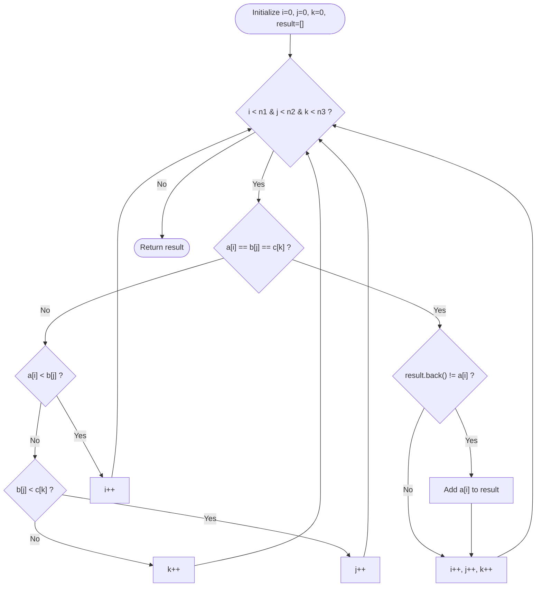

# Approach: Three Pointers Algorithm

---

## Intuition
Since the three arrays are given sorted in non-decreasing order, we can efficiently find the common elements by iterating through the arrays simultaneously using three pointers. By comparing the elements at the current pointers, we can determine which pointer(s) to increment to move towards finding a common element or resolving the mismatch.

## Algorithm:
1. Initialize three pointers `i = 0`, `j = 0`, and `k = 0` to iterate through arrays `a`, `b`, and `c` respectively.
2. Create an empty list `result` to store the common elements.
3. Run a loop while `i < a.size()`, `j < b.size()`, and `k < c.size()`:
   - **Condition 1:** If `a[i] == b[j] == c[k]`: 
     - Check if the element is already in the `result` to avoid duplicates (using `result.empty() || result.back() != a[i]`).
     - Add `a[i]` to `result` and increment all three pointers (`i++`, `j++`, `k++`).
   - **Condition 2:** If `a[i] < b[j]`, it means `a[i]` is too small to match `b[j]` and possibly `c[k]`. Increment `i` to move to a larger element in `a`.
   - **Condition 3:** Else if `b[j] < c[k]`, increment `j` for similar reasons.
   - **Condition 4:** Otherwise, `c[k]` is the smallest among the three, so increment `k`.
4. Return the `result` array.

## Time and Space Complexity:
- **Time Complexity:** $\mathcal{O}(n_1 + n_2 + n_3)$ where $n_1$, $n_2$, and $n_3$ are the sizes of arrays `a`, `b`, and `c`. In the worst-case scenario, we traverse all elements of the three arrays once.
- **Space Complexity:** $\mathcal{O}(1)$ auxiliary space. The `result` vector is strictly used for returning the output, and no extra data structures are employed.

## Visual Workflow:

### Navigation:
- [Problem Statement](Problem.md)
- [Solution](Solution.cpp)
- [Driver Code](Main.cpp)

---
