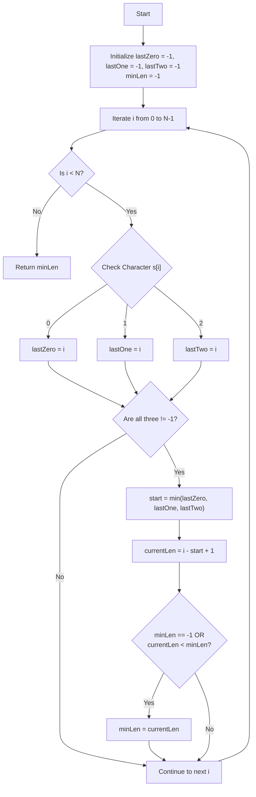

# Smallest Window Containing 0, 1, and 2 - Approach

## Problem Overview
We need to find the length of the smallest substring in a string `s` that contains the characters `'0'`, `'1'`, and `'2'` at least once. If no such substring exists, we return `-1`.

## Approach: Tracking Last Seen Indices (Sliding Window / Greedy)
Instead of finding all possible substrings and checking their contents (which would be $\mathcal{O}(N^2)$ or $\mathcal{O}(N^3)$), we can iterate through the string once and keep track of the most recent indices where we saw a `'0'`, a `'1'`, and a `'2'`.

### Algorithm Steps
1. Initialize three variables `lastZero`, `lastOne`, and `lastTwo` to `-1` to track the last seen index of each character.
2. Initialize `minLen` to `-1` to track the minimum window size found.
3. Iterate through the string `s` using an index `i`:
   - Update `lastZero`, `lastOne`, or `lastTwo` to `i` depending on whether `s[i]` is `'0'`, `'1'`, or `'2'`.
   - If all three characters have been seen (i.e., none of the last seen indices are `-1`):
     - The current smallest valid window ending at `i` starts at the minimum of the three indices: `start = min({lastZero, lastOne, lastTwo})`.
     - The length of this window is `i - start + 1`.
     - Update `minLen` with the minimum of `minLen` and this current length (handle `-1` initially).
4. Return `minLen` after the loop finishes.

### Complexity Analysis
- **Time Complexity:** $\mathcal{O}(N)$, where $N$ is the length of the string `s`. We iterate through the string exactly once, performing constant-time operations at each step.
- **Space Complexity:** $\mathcal{O}(1)$, as we only use a few integer variables (`lastZero`, `lastOne`, `lastTwo`, `minLen`, `start`) regardless of the string size.

## Visual Diagram
Below is a Mermaid flowchart illustrating the algorithm's decision-making process during iteration:

## Links
- [Problem](./Problem.md)
- [Solution](./Solution.cpp)
- [Main](./main.cpp)
