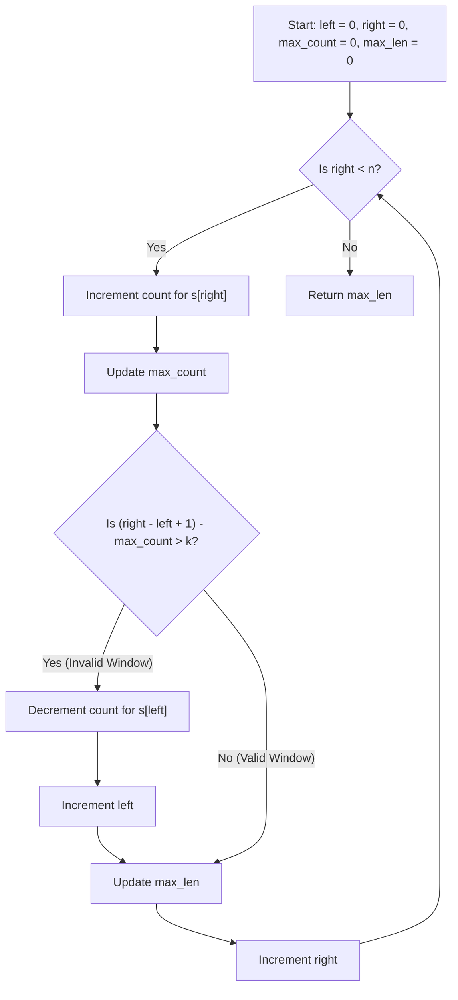

# Longest Repeating Character Replacement - Approach & Explanation

## Approach: Sliding Window

This problem can be efficiently solved using the **Sliding Window** technique. We want to find the longest window (substring) such that the number of characters that need to be replaced is at most `k`.

### Intuition
1. We maintain a window `[left, right]` that expands by moving `right`.
2. We keep track of the frequency of characters in the current window using an array or hash map `count`.
3. We also keep track of `max_count`, which is the count of the most frequent character in the current window.
4. The number of characters that need to be replaced in the current window to make all characters identical is `(window_size) - max_count`.
5. If this number of replacements exceeds `k` (i.e., `(right - left + 1) - max_count > k`), the current window is invalid. We then shrink the window from the left by incrementing `left` and updating the frequency of the character at `s[left]`.
6. At each valid step, we update our maximum window size `max_len`.

Notice that we don't strictly need to recalculate `max_count` when shrinking the window because we are only interested in finding a *longer* valid window than what we have already found. A longer valid window would inherently require a larger `max_count`.

### Visualization

### Complexity Analysis
- **Time Complexity:** $O(N)$, where $N$ is the length of the string `s`. The `right` pointer iterates through the string exactly once. The `left` pointer only moves forward. The operations inside the loop are $O(1)$.
- **Space Complexity:** $O(1)$. The `count` array requires a fixed size of 26 to store the frequencies of the uppercase English letters.

## Related Files
- [Problem Statement](Problem.md)
- [C++ Solution](Solution.cpp)
- [Test Driver](Main.cpp)
