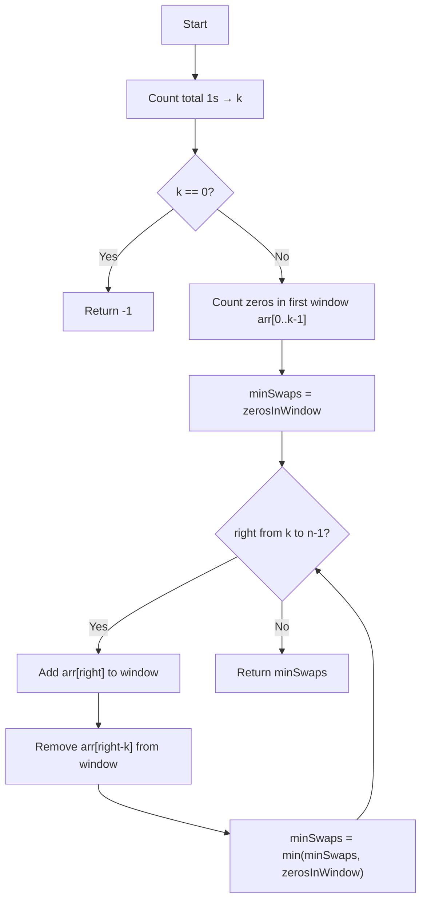

# Min Swaps to Group All 1s Together — Approach & Explanation

---

## 🔗 Related Files

| File | Description |
|:-----|:------------|
| [Problem.md](Problem.md) | Full problem statement & constraints |
| [Solution.cpp](Solution.cpp) | Optimized C++ sliding window solution |
| [Main.cpp](Main.cpp) | Test driver with sample test cases |

---

## 💡 Core Intuition

> **Key Insight:** The final grouped block of 1s must have a fixed length equal to the **total count of 1s** in the array. We slide a window of exactly that size across the array and find the position where the **fewest 0s** appear inside — each 0 inside the window represents one swap needed.

---

## 🪟 Algorithm: Fixed-Size Sliding Window

### Step-by-Step

1. **Count total 1s** → call it `k`. This is the required window size.
2. **Edge case:** If `k == 0`, return `-1` (no 1s to group).
3. **Initialize:** Count zeros in the first window `arr[0..k-1]`. This is our initial swap count.
4. **Slide the window** from index `k` to `n-1`:
   - **Add** `arr[right]` entering the window (if 0, increment zero count).
   - **Remove** `arr[right - k]` leaving the window (if 0, decrement zero count).
   - Track the **minimum zero count** across all positions.
5. Return the **minimum** zeros found — that is the answer.

---

## 📊 Visualization

```
arr[] = [1, 0, 1, 0, 1]
Total 1s (k) = 3  →  Window size = 3

Position 0: [1, 0, 1] 0, 1  →  zeros in window = 1  ← min = 1
Position 1:  1 [0, 1, 0] 1  →  zeros in window = 2
Position 2:  1, 0 [1, 0, 1] →  zeros in window = 1

Minimum swaps = 1  ✅
```

---

## 🔄 Mermaid Flowchart



---

## 🔍 Dry Run — Example 2

```
arr[] = [1, 0, 1, 0, 1, 1],  total 1s = 4,  window size = 4

Window [0..3] = [1, 0, 1, 0]  →  zeros = 2  (minSwaps = 2)
Window [1..4] = [0, 1, 0, 1]  →  zeros = 2  (minSwaps = 2)
Window [2..5] = [1, 0, 1, 1]  →  zeros = 1  (minSwaps = 1) ✅

Answer: 1
```

---

## ⚙️ Complexity Analysis

| Metric | Value | Reason |
|:-------|:------|:--------|
| **Time** | `O(N)` | Single pass with two-pointer sliding window |
| **Space** | `O(1)` | Only a few integer variables used |

---

## 🆚 Approach Comparison

| Approach | Time | Space | Notes |
|:---------|:-----|:------|:------|
| Brute Force (all pairs) | O(N²) | O(1) | TLE on large inputs |
| **Sliding Window (optimal)** | **O(N)** | **O(1)** | ✅ Chosen approach |

---

## 🧩 Why Sliding Window Works

- The **destination** for all 1s is always a contiguous block of exactly `k` cells.
- Every 0 inside the window of size `k` must be swapped with a 1 outside.
- So minimizing zeros inside the window = minimizing swaps.
- Sliding the fixed window in O(N) finds this minimum efficiently.
