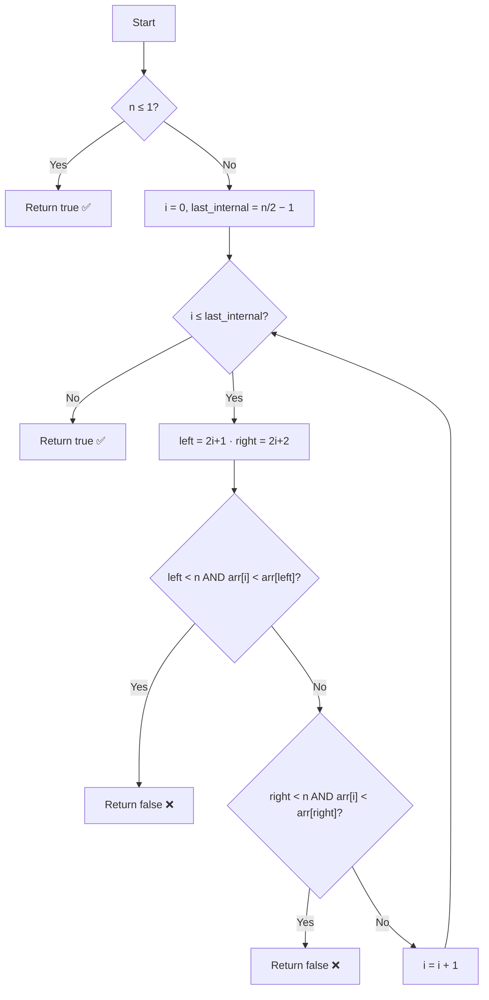

# Check if an Array is Max Heap — Approach & Explanation

---

## 🔗 Related Files

| File | Description |
|:-----|:------------|
| [Problem.md](Problem.md) | Full problem statement & constraints |
| [Solution.cpp](Solution.cpp) | Optimized O(N) C++ linear scan solution |
| [Main.cpp](Main.cpp) | Test driver with sample test cases |

---

## 💡 Core Intuition

> **Key Insight:** In a 0-indexed array representing a complete binary tree, the node at index `i` has:
> - **Left child** at `2*i + 1`
> - **Right child** at `2*i + 2`
>
> The **max-heap property** simply requires `arr[i] >= arr[child]` for every internal node.  
> We only need to check **internal (non-leaf) nodes** — the last one sits at index `n/2 - 1`.

---

## 🌳 Heap as Array — Visual Mapping

```
Index:   0    1    2    3    4    5
Array: [90,  15,  10,   7,  12,   2]

                  90  (i=0)
                /      \
           15  (i=1)   10  (i=2)
           /  \         /
         7(i=3) 12(i=4) 2(i=5)

Internal nodes (have children): i = 0, 1, 2   → (n/2 - 1) = 2
Leaf nodes (no children)      : i = 3, 4, 5
```

---

## 🪜 Algorithm: Linear Scan of Internal Nodes

### Step-by-Step

1. **Edge case:** If `n ≤ 1`, the heap is trivially valid → return `true`.
2. **Iterate** over all internal nodes from `i = 0` to `i = n/2 - 1`:
   - Compute `left  = 2*i + 1`
   - Compute `right = 2*i + 2`
   - If `left  < n` and `arr[i] < arr[left]`  → **return `false`**
   - If `right < n` and `arr[i] < arr[right]` → **return `false`**
3. If no violation found → **return `true`**

---

## 📊 Visualization

```
arr[] = [90, 15, 10, 7, 12, 2]   →   n = 6

i = 0:  arr[0]=90  vs  arr[1]=15  ✅  (90 ≥ 15)
         arr[0]=90  vs  arr[2]=10  ✅  (90 ≥ 10)

i = 1:  arr[1]=15  vs  arr[3]=7   ✅  (15 ≥  7)
         arr[1]=15  vs  arr[4]=12  ✅  (15 ≥ 12)

i = 2:  arr[2]=10  vs  arr[5]=2   ✅  (10 ≥  2)
         right child at index 6 → out of bounds, skip

No violations found → return true ✅


arr[] = [9, 15, 10, 7, 12, 11]   →   n = 6

i = 0:  arr[0]=9  vs  arr[1]=15  ❌  (9 < 15)  → return false immediately
```

---

## 🔄 Mermaid Flowchart



---

## 🔍 Dry Run — Example 2 (Invalid Heap)

```
arr[] = [9, 15, 10, 7, 12, 11]   n = 6

Step 1 → i = 0
  left  = 1,  arr[0]=9  vs arr[1]=15  → 9 < 15  ❌  VIOLATION!
  → return false  (short-circuit, no further checks needed)

Answer: false ✅
```

---

## ⚙️ Complexity Analysis

| Metric    | Value  | Reason                                          |
|:----------|:-------|:------------------------------------------------|
| **Time**  | `O(N)` | Visit every internal node exactly once          |
| **Space** | `O(1)` | Only index variables used — no extra structures |

---

## 🆚 Approach Comparison

| Approach | Time | Space | Notes |
|:---------|:-----|:------|:------|
| Brute Force (re-build heap) | O(N log N) | O(N) | Unnecessary overhead |
| **Linear Scan (optimal)**   | **O(N)**   | **O(1)** | ✅ Chosen approach |

---

## 🧩 Why This Works

- A **complete binary tree** stored in an array always places the node at index `i` with its children at `2i+1` and `2i+2`.
- The **leaf nodes** (indices `≥ n/2`) have no children → no check needed.
- By only verifying that every **parent ≥ its children**, we confirm the max-heap property in a **single O(N) pass**.
- The check **short-circuits** on the first violation, making it very efficient in practice.
