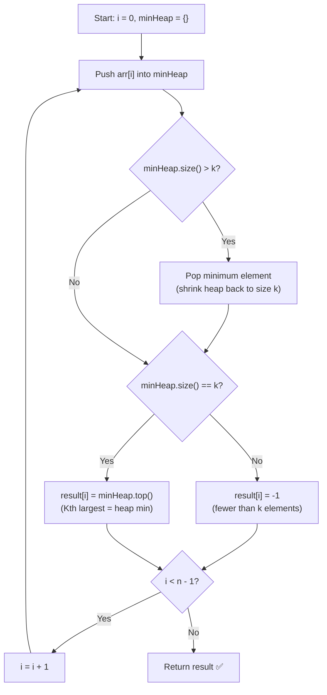

# Kth Largest Element in a Stream — Approach & Explanation

---

## 🔗 Related Files

| File | Description |
|:-----|:------------|
| [Problem.md](Problem.md) | Full problem statement & constraints |
| [Solution.cpp](Solution.cpp) | Optimized O(N log K) Min-Heap C++ solution |
| [Main.cpp](Main.cpp) | Test driver with sample test cases |

---

## 💡 Core Intuition

> **Key Insight:** To efficiently track the **Kth largest** element in a growing stream, maintain a **min-heap of size k**.
>
> - The **top of the min-heap** is always the **smallest among the top-k elements** — which is exactly the **Kth largest** in the entire stream seen so far.
> - When the heap has **fewer than k elements**, the Kth largest doesn't exist yet → return `-1`.

---

## 🗂️ Data Structure — Min-Heap of Size K

```
Stream so far (k = 4): [1, 2, 3, 4, 5, 6]

After inserting 4:
  Min-Heap = {1, 2, 3, 4}   (size == k)
  Heap top = 1  →  4th largest = 1  ✅

After inserting 5:
  Push 5, size becomes 5 > k → pop min (1)
  Min-Heap = {2, 3, 4, 5}
  Heap top = 2  →  4th largest = 2  ✅

After inserting 6:
  Push 6, size becomes 5 > k → pop min (2)
  Min-Heap = {3, 4, 5, 6}
  Heap top = 3  →  4th largest = 3  ✅
```

---

## 🪜 Algorithm: Min-Heap of Fixed Size K

### Step-by-Step

1. **Initialize** an empty `min-heap`.
2. **For each element** `arr[i]` in the stream:
   - **Push** `arr[i]` into the heap.
   - If `heap.size() > k` → **pop** the minimum element (evict the smallest).
   - If `heap.size() < k` → Kth largest doesn't exist yet → append **`-1`** to result.
   - Else → append **`heap.top()`** (Kth largest) to result.
3. **Return** the result array.

---

## 📊 Visualization — Example 1 (k = 4, arr = [1, 2, 3, 4, 5, 6])

```
Step │ Insert │  Heap State (min at top)  │ Heap Size │ Output
─────┼────────┼───────────────────────────┼───────────┼────────
  1  │   1    │  {1}                      │    1 < 4  │  -1
  2  │   2    │  {1, 2}                   │    2 < 4  │  -1
  3  │   3    │  {1, 2, 3}                │    3 < 4  │  -1
  4  │   4    │  {1, 2, 3, 4}             │    4 = 4  │   1   ← heap.top()
  5  │   5    │  push→{1,2,3,4,5}         │    5 > 4  │
     │        │  pop 1→{2, 3, 4, 5}       │    4 = 4  │   2   ← heap.top()
  6  │   6    │  push→{2,3,4,5,6}         │    5 > 4  │
     │        │  pop 2→{3, 4, 5, 6}       │    4 = 4  │   3   ← heap.top()

Final output: [-1, -1, -1, 1, 2, 3]  ✅
```

---

## 📊 Visualization — Example 2 (k = 2, arr = [3, 2, 1, 3, 3])

```
Step │ Insert │  Heap State (min at top)  │ Heap Size │ Output
─────┼────────┼───────────────────────────┼───────────┼────────
  1  │   3    │  {3}                      │    1 < 2  │  -1
  2  │   2    │  {2, 3}                   │    2 = 2  │   2   ← heap.top()
  3  │   1    │  push→{1,2,3}             │    3 > 2  │
     │        │  pop 1→{2, 3}             │    2 = 2  │   2   ← heap.top()
  4  │   3    │  push→{2,3,3}             │    3 > 2  │
     │        │  pop 2→{3, 3}             │    2 = 2  │   3   ← heap.top()
  5  │   3    │  push→{3,3,3}             │    3 > 2  │
     │        │  pop 3→{3, 3}             │    2 = 2  │   3   ← heap.top()

Final output: [-1, 2, 2, 3, 3]  ✅
```

---

## 🔄 Mermaid Flowchart



---

## 🔍 Dry Run — Example 1 Step by Step

```
arr = [1, 2, 3, 4, 5, 6],  k = 4

i=0: push(1) → heap={1}         size=1 < 4  → result[0] = -1
i=1: push(2) → heap={1,2}       size=2 < 4  → result[1] = -1
i=2: push(3) → heap={1,2,3}     size=3 < 4  → result[2] = -1
i=3: push(4) → heap={1,2,3,4}   size=4 = 4  → result[3] = top = 1
i=4: push(5) → heap={1,2,3,4,5} size=5 > 4  → pop(1)
               heap={2,3,4,5}   size=4 = 4  → result[4] = top = 2
i=5: push(6) → heap={2,3,4,5,6} size=5 > 4  → pop(2)
               heap={3,4,5,6}   size=4 = 4  → result[5] = top = 3

Answer: [-1, -1, -1, 1, 2, 3]  ✅
```

---

## 🔑 Why the Min-Heap Top = Kth Largest

```
Heap maintains the K LARGEST elements seen so far:

  All stream elements:   [....... SMALL ....... │ K LARGEST ......]
                                                 ↑
                                         minHeap.top()
                                         = smallest of the K largest
                                         = Kth largest overall  ✅
```

- Elements **below** the threshold are **evicted** (popped) when heap exceeds size k.
- The **minimum of the top-k** is the Kth largest by definition.

---

## ⚙️ Complexity Analysis

| Metric    | Value        | Reason                                              |
|:----------|:-------------|:----------------------------------------------------|
| **Time**  | `O(N log K)` | Each of N insertions does a push/pop in O(log K)    |
| **Space** | `O(K)`       | The min-heap holds at most K elements at any moment |

---

## 🆚 Approach Comparison

| Approach | Time | Space | Notes |
|:---------|:-----|:------|:------|
| Brute Force (sort each step) | O(N² log N) | O(N) | Re-sort entire stream every step — too slow |
| Partial Sort / nth_element   | O(N²)       | O(N) | Still O(N) per insertion |
| **Min-Heap of size K (optimal)** | **O(N log K)** | **O(K)** | ✅ Chosen approach — efficient & online |

---

## 🧩 Why This Works

- A **min-heap of size k** acts as a sliding window over the **top-k largest** values.
- Every new element is pushed in `O(log K)`. If the heap exceeds size k, we evict the current minimum in `O(log K)`, maintaining the invariant: *heap contains exactly the k largest elements seen so far*.
- The **top** of the min-heap is always the **k-th largest** because it is the smallest among those k large values.
- This approach is **online** — it processes each element as it arrives, perfect for streaming scenarios.
