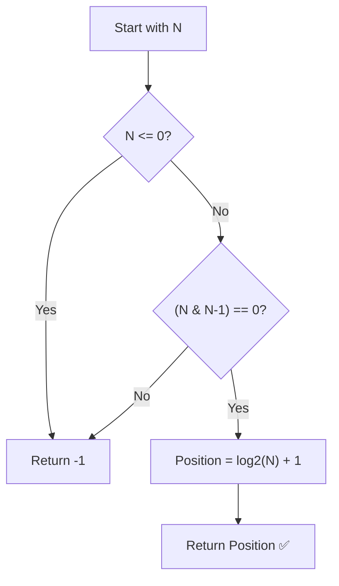

# Find Position of Set Bit — Approach & Explanation

---

## 🔗 Related Files

| File | Description |
|:-----|:------------|
| [Problem.md](Problem.md) | Full problem statement & constraints |
| [Solution.cpp](Solution.cpp) | Optimized O(1) Bitwise solution |
| [Main.cpp](Main.cpp) | Test driver with sample test cases |

---

## 💡 Core Intuition

> **Key Observation:** A number has **exactly one set bit** if and only if it is a **power of 2**.
>
> - `1` (binary `0001`) → `2^0`
> - `2` (binary `0010`) → `2^1`
> - `4` (binary `0100`) → `2^2`
> - `8` (binary `1000`) → `2^3`
>
> If a number `N` is a power of 2, its position from the LSB is `log2(N) + 1`.

---

## 🗂️ Bitwise Trick: Power of 2 Check

To check if `N` is a power of 2 in `O(1)`:
- `N & (N - 1)` should be `0` (for `N > 0`).
- **Example (N=4):**
  - `4` in binary: `100`
  - `3` in binary: `011`
  - `4 & 3`: `100 & 011 = 000` (True)
- **Example (N=6):**
  - `6` in binary: `110`
  - `5` in binary: `101`
  - `6 & 5`: `110 & 101 = 100` (Non-zero, False)

---

## 🪜 Algorithm

1. **Edge Case:** If `N <= 0`, return `-1`.
2. **Step 1:** Check if `N` has exactly one set bit using `(N & (N - 1)) == 0`.
3. **Step 2:** If it has more than one set bit (or zero), return `-1`.
4. **Step 3:** If it has exactly one set bit:
   - Calculate position using `log2(N) + 1`.
   - Alternatively, use a loop or `__builtin_ctz(N)` to find the trailing zeros.
5. **Step 4:** Return the calculated position.

---

## 📊 Visualization — Binary Representation

| Decimal (N) | Binary | Set Bits | Position |
|:-----------:|:------:|:--------:|:--------:|
| 1           | `0001` | 1        | 1        |
| 2           | `0010` | 1        | 2        |
| 3           | `0011` | 2        | -1       |
| 4           | `0100` | 1        | 3        |
| 5           | `0101` | 2        | -1       |
| 8           | `1000` | 1        | 4        |

---

## 🔄 Mermaid Flowchart

---

## ⚙️ Complexity Analysis

| Metric    | Value  | Reason                                      |
|:----------|:-------|:--------------------------------------------|
| **Time**  | `O(1)` | Bitwise check and log2 take constant time.  |
| **Space** | `O(1)` | No extra space used.                        |

---

## 🆚 Approach Comparison

| Approach | Time | Space | Notes |
|:---------|:-----|:------|:------|
| Loop/Shift | O(log N) | O(1) | Count shifts until N becomes 0. |
| **Bitwise + log2** | **O(1)** | **O(1)** | ✅ Efficient and clean. |
| Hash Map (for all powers of 2) | O(1) | O(31) | Precompute positions for 2^0 to 2^30. |

---

## 🧩 Why This Works

- The property `N & (N-1)` is a classic bitwise trick to remove the rightmost set bit. If after removing the rightmost set bit the result is 0, it means there was only one set bit to begin with.
- Using `log2(N)` is mathematically sound because if `N = 2^x`, then `x = log2(N)`. Since the position is 1-based, we add 1.
