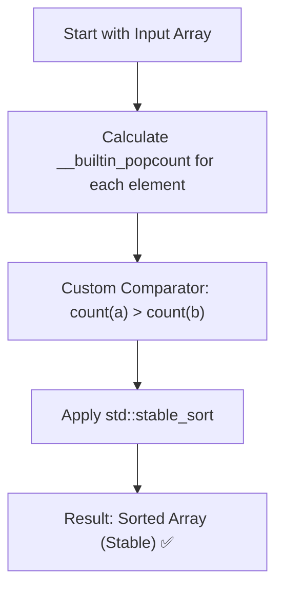

# Sort by Set Bit Count — Approach & Explanation

---

## 🔗 Related Files

| File | Description |
|:-----|:------------|
| [Problem.md](Problem.md) | Full problem statement & constraints |
| [Solution.cpp](Solution.cpp) | Implementation using std::stable_sort |
| [Main.cpp](Main.cpp) | Test driver for verification |

---

## 💡 Core Intuition

The goal is to sort an array based on the **population count** (number of set bits). However, standard sorting algorithms like `std::sort` are not stable, meaning they might swap the relative order of elements that have the same number of set bits.

> **Key Requirement:** If two numbers have the same count of set bits, their **relative order from the original array** must be preserved. This is a classic use case for **Stable Sorting**.

---

## 🪜 Algorithm

1. **Count Set Bits:** For each integer, calculate the number of bits set to `1`.
   - Use `__builtin_popcount(n)` for $O(1)$ efficiency.
2. **Stable Sort:** Use `std::stable_sort` with a custom comparator.
3. **Comparator Logic:**
   - If `count(A) > count(B)`, then `A` comes before `B` (Descending Order).
   - If `count(A) == count(B)`, `std::stable_sort` ensures their relative position is unchanged.
4. **Result:** The array is now sorted as per the requirements.

---

## 📊 Visualization — Bit Count & Sorting

| Decimal | Binary | Set Bits | Original Index |
|:-------:|:------:|:--------:|:--------------:|
| 5       | `0101` | 2        | 0              |
| 2       | `0010` | 1        | 1              |
| 3       | `0011` | 2        | 2              |
| 15      | `1111` | 4        | 7              |

**After Stable Sort (Descending Bits):**
1. 15 (4 bits)
2. 5 (2 bits, index 0)
3. 3 (2 bits, index 2)
4. 2 (1 bit)

---

## 🔄 Mermaid Flowchart

---

## ⚙️ Complexity Analysis

| Metric | Value | Reason |
|:-------|:------|:-------|
| **Time** | $O(N \log N)$ | `std::stable_sort` takes $O(N \log N)$. |
| **Space** | $O(N)$ | `std::stable_sort` may require extra buffer for stable merge. |

---

## 🧩 Why Stable Sort?

- If we used `std::sort`, the elements `[5, 3, 9, 6]` (all have 2 set bits) might end up in a different order, e.g., `[9, 6, 5, 3]`.
- `std::stable_sort` guarantees they remain `[5, 3, 9, 6]` if that was their original sequence.
