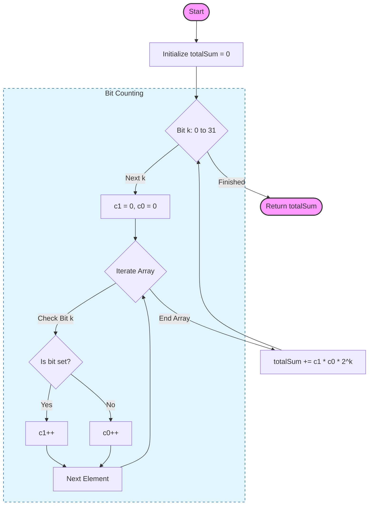

# 🚀 Approach: Sum of XOR of All Pairs

## 🔗 Quick Links
| [Problem Statement](./Problem.md) | [Solution Code](./Solution.cpp) | [Test Driver](./Main.cpp) |
| :--- | :--- | :--- |

---

## 💡 Intuition
The core idea is to realize that the **sum of XOR values** can be calculated **bit by bit**. 

Instead of computing XOR for every pair (which is $O(N^2)$), we calculate how many times each bit position contributes to the final sum.

### The Bitwise Rule:
For any bit position $k$:
- A pair of numbers $(A, B)$ contributes $2^k$ to the total XOR sum **if and only if** their $k$-th bits are different (one is `1`, the other is `0`).
- If both bits are `1` or both are `0`, the XOR is `0` at that position.

---

## 🛠️ Step-by-Step Logic

1.  **Initialize** `totalSum = 0`.
2.  **Iterate** through each bit position $k$ from `0` to `31`.
3.  **Count** for each position $k$:
    - `count1`: Number of elements in the array where the $k$-th bit is **Set (1)**.
    - `count0`: Number of elements in the array where the $k$-th bit is **Unset (0)**.
4.  **Calculate Contributions**:
    - The number of distinct pairs $(i, j)$ that have different $k$-th bits is exactly `count1 * count0`.
    - Each such pair adds $2^k$ to the sum.
    - `totalSum += (count1 * count0) * 2^k`.
5.  **Return** `totalSum`.

---

## 🔍 Dry Run Example
**Input**: `arr = [7, 3, 5]`
Binary representations:
- `7` -> `111`
- `3` -> `011`
- `5` -> `101`

| Bit Position ($k$) | Elements with Bit $k=1$ | `count1` | `count0` | Contribution ($count1 \times count0 \times 2^k$) |
| :--- | :--- | :--- | :--- | :--- |
| **0** (Value 1) | `7(1), 3(1), 5(1)` | 3 | 0 | $3 \times 0 \times 1 = \mathbf{0}$ |
| **1** (Value 2) | `7(1), 3(1), 5(0)` | 2 | 1 | $2 \times 1 \times 2 = \mathbf{4}$ |
| **2** (Value 4) | `7(1), 3(0), 5(1)` | 2 | 1 | $2 \times 1 \times 4 = \mathbf{8}$ |
| **Total Sum** | | | | **12** |

---

## 📊 Visual Flow

---

## 📉 Complexity Analysis

### ⏱️ Time Complexity: $O(N \times 32)$
- We process 32 bits for each of the $N$ elements.
- Since 32 is a constant, the complexity is effectively **$O(N)$**.

### 空间 Complexity: $O(1)$
- We use a fixed amount of extra space regardless of the input size $N$.

---

## 🏆 Key Takeaway
Bitwise problems often become much simpler when you look at each bit position independently. This "contribution-to-sum" technique is a powerful pattern for XOR-related problems.
