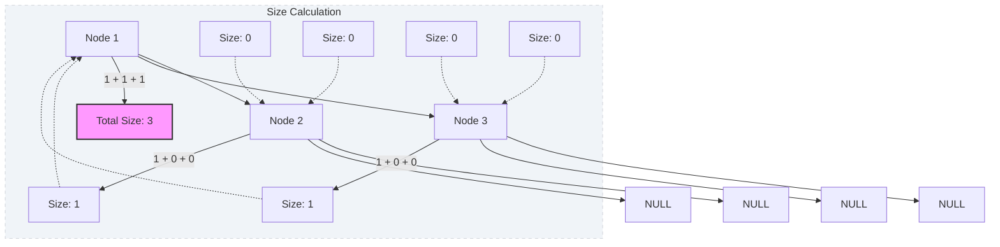

# 🚀 Approach: Size of Binary Tree

<div align="center">

| 📄 [Problem](./Problem.md) | 💡 [Approach](./Approach.md) | 🧩 [Solution](./Solution.cpp) | 🚀 [Main](./Main.cpp) |
|:--------------------------:|:-----------------------------:|:------------------------------:|:---------------------:|

</div>

## 💡 Intuition
The size of a binary tree can be defined recursively:
1.  If the tree is empty (root is `NULL`), its size is **0**.
2.  If the tree is not empty, its size is **1** (for the root node) plus the **size of the left subtree** and the **size of the right subtree**.

This follows a **Post-order Traversal** pattern where we process the children before finalizing the result for the parent.

---

## 🛠️ Step-by-Step Logic

1.  **Base Case**: 
    - Check if the current `node` is `NULL`.
    - If yes, return `0`.
2.  **Recursive Calls**:
    - Calculate the size of the left child: `leftSize = getSize(node->left)`.
    - Calculate the size of the right child: `rightSize = getSize(node->right)`.
3.  **Combine Results**:
    - Return `1 + leftSize + rightSize`.

---

## 🔍 Dry Run Example
**Input Tree**:
```
      1
    /   \
   2     3
```

1.  `getSize(1)` calls `getSize(2)` and `getSize(3)`.
2.  `getSize(2)` calls `getSize(NULL)` (left) and `getSize(NULL)` (right).
    - `getSize(NULL)` returns 0.
    - `getSize(2)` returns $1 + 0 + 0 = \mathbf{1}$.
3.  `getSize(3)` calls `getSize(NULL)` (left) and `getSize(NULL)` (right).
    - `getSize(NULL)` returns 0.
    - `getSize(3)` returns $1 + 0 + 0 = \mathbf{1}$.
4.  `getSize(1)` returns $1 + 1 + 1 = \mathbf{3}$.

---

## 📊 Visual Flow



---

## ⌛️ TimeComplexity Analysis

### ⏱️ Time Complexity: $O(N)$
- We visit each node exactly once during the recursive traversal. $N$ is the total number of nodes.

### 空间 Complexity: $O(H)$
- In the worst case (skewed tree), the recursion stack can go up to $N$ levels.
- In the best case (balanced tree), the stack depth is $O(\log N)$.
- $H$ represents the height of the tree.

---

## 🏆 Key Takeaway
Recursion is the most natural way to traverse tree structures. The "Divide and Conquer" strategy allows us to solve the problem for sub-problems (subtrees) and combine them easily.


<div align="center">
Happy Coding! 🚀
Happy Coding! 🚀 <br>
<a href="https://x.com/PankajB42550" target="_blank">
  
</a>
</div>
