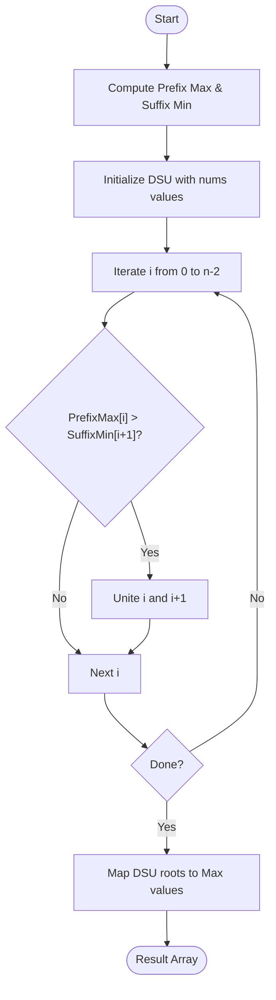

<!-- markdownlint-disable MD033 -->
# [Approach - Jump Game IX](Problem.md)

---

| [📝 Problem](Problem.md) | [💡 Approach](Approach.md) | [💻 Solution](Solution.cpp) | [🚀 Main](Main.cpp) |
| :---: | :---: | :---: | :---: |

---

> [!IMPORTANT]
> "Graph symmetry is the secret to simplifying complex connectivity problems. If you can go forward and backward under symmetric conditions, you're likely dealing with components."

---

## Logic Breakdown

The problem asks for the maximum reachable value from each index $i$ in an array `nums`.

### 1. Identifying the Graph Type

The jump rules are:

- **Forward:** $i \to j$ if $j > i$ and $nums[j] < nums[i]$.
- **Backward:** $j \to i$ if $i < j$ and $nums[i] > nums[j]$.

Notice that the condition for a forward jump from $i$ to $j$ is identical to the condition for a backward jump from $j$ to $i$. This means that if you can jump from $i$ to $j$, you can always jump back from $j$ to $i$.

**Conclusion:** The graph of reachable nodes is undirected. The maximum value reachable from index $i$ is simply the maximum value in its connected component.

### 2. Finding Components Efficiently

Building a full adjacency list could result in $O(N^2)$ edges. However, we can use a more global observation about connectivity:

- An edge $(a, b)$ exists if $a < b$ and $nums[a] > $nums[b]$.
- Any such edge "bridges" all indices between $a$ and $b$. That is, $a, a+1, \dots, b$ all end up in the same component.
- A boundary (cut) between index $i$ and $i+1$ is bridged if there exists **any** $a \le i$ and **any** $b > i$ such that $nums[a] > nums[b]$.
- This "bridging" condition is equivalent to checking if the **maximum** value to the left of the cut is greater than the **minimum** value to the right of the cut:
    $$\text{prefix\_max}(i) > \text{suffix\_min}(i+1)$$

### 3. Algorithm Steps

1. Precompute `prefix_max` and `suffix_min` arrays for the entire array.
2. Initialize a **Disjoint Set Union (DSU)** to manage components.
3. Iterate from $i = 0$ to $n-2$:
    - If $\text{prefix\_max}(i) > \text{suffix\_min}(i+1)$, unite index $i$ and $i+1$.
4. For each index, query the DSU for the maximum value in its component.

---

## Visual Representation

### Logic Overview

### Logic Flow

### Component Example (nums = [2, 1, 3])

- **Index 0 (2):** suffix\_min(1..2) is 1. Since $2 > 1$, 0 is connected to 1.
- **Index 1 (1):** prefix\_max(0) is 2. Since $1 < 2$, 1 is connected to 0.
- **Index 2 (3):** No right jumps. prefix\_max(0..1) is 2. Since $3 \nless 2$, no left jump.
**Components:** `{0, 1}` (Max: 2), `{2}` (Max: 3).

---

## Complexity Analysis

- **Time Complexity:** $O(N \cdot \alpha(N))$
  - $O(N)$ to compute prefix/suffix arrays.
  - $O(N \cdot \alpha(N))$ for DSU unite and find operations, where $\alpha$ is the inverse Ackermann function (nearly constant).
- **Space Complexity:** $O(N)$
  - Storing `prefix_max_idx`, `suffix_min_idx`, and DSU arrays (`parent`, `max_val`).

---

> [!WARNING]
> "Character is like a tree and reputation like its shadow. The shadow is what we think of it; the tree is the real thing." — **Abraham Lincoln**

---
